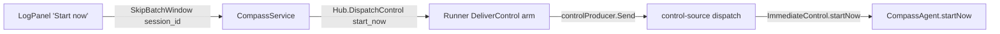

# Batch inbound messages to an agent

Tracker: RIG-4127. Freezes on merge.

Builds on: [settle turn order](../../infra/runtime/compass-managed-settle-turn-order/design.md)
(DL-382), [notification delivery](../../server/compass-notification-delivery/design.md).

Ledger-impact: appends DL-399..DL-403 for idle batching, steer handling, the
agent-owned queue, batch rendering, and the per-agent start-now control.

## Problem / Intent

Each inbound item (a thread reply, a CI result, a PR comment) that reaches an
idle agent starts its own turn. When a user answers many threads at once, the
first reply starts turn 1 and the rest wait for turn 2, so the agent pays two
turns and re-reads its context twice. We want an idle agent to wait a short
window so a burst lands in one turn, and a UI control to skip that wait.

The saving is unmeasured. Turn 2's context re-read is likely a prompt-cache hit
(Q1), so most of the saving is per-turn overhead and output tokens, not input.
OQ-7 asks for a measurement once T1 ships.

## Approach

### What exists today

The working case is already built. `CompassAgent.deliver` and
`CompassAgent.forgeNotification` (`packages/compass-agent/src/agent.ts`) push
onto `#deliverQueue` and `#forgeQueue`. Mid-turn they wait for `agent_end`
(`#trackTurn`), and `#flushTurnEnd` drains BOTH queues into ONE prompt:

```ts
if (delivers.length > 0)
	sections.push(
		formatDeliversForPrompt(delivers, this.#deliverSourceNames),
	);
if (forges.length > 0)
	sections.push(
		formatForgeNotifications(forges.map((e) => e.notification)),
	);
const input = sections.join("\n\n");
```

The idle case is the gap. Both methods flush at once when idle:

```ts
if (!this.#turnActive && !this.#session.isStreaming) {
	this.#flushTurnEnd();
} else if (!this.#turnActive) {
	this.#armStrandRecovery();
}
```

So a burst to an idle agent gives turn 1 = the first item, turn 2 = the rest.

### The change: an idle batching window in the agent

Replace the idle `this.#flushTurnEnd()` call in `deliver` and
`forgeNotification` with `this.#armBatch()`. The mid-turn path, the strand
recovery path, and `#flushTurnEnd` itself do not change.

`#armBatch` is a quiet-period debounce with a hard cap:

- The first item into an empty, idle agent records `#batchFirstAt = now`.
- Each item (re)sets one timer to
  `min(quietMs, #batchFirstAt + maxMs - now)`.
- When the timer fires, `#fireBatch` clears the window and re-runs today's
  idle test: idle → `#flushTurnEnd()`; streaming with no tracked turn →
  `#armStrandRecovery()`; a tracked turn → nothing, because its `agent_end`
  flush takes the queue.
- `#fireBatch` is a no-op once `#closed` is set, the same guard
  `#armStrandRecovery` uses, so no turn starts past the terminal frame.
- `#flushTurnEnd` and every other turn start (`steer`'s idle prompt, a control
  `prompt` in `#applyControl`) call `#cancelBatch()`. Once a turn starts, the
  `agent_end` flush owns whatever is queued.
- An idle `steer` with either queue non-empty calls `#flushTurnEnd(tail)`
  instead of its own `prompt`. `tail` carries the steer's rendered content, id,
  author handle and traceparent. `#flushTurnEnd` appends the content last, acks
  the steer and emits its STEER injection in the same microtask as the batch
  acks, and un-dedups its id with the delivers when the prompt is rejected. The
  steer counts as one more message for trace topology, so steer plus anything
  queued is the N>1 shape: links, no 1:1 parent. With nothing queued, `steer`
  keeps today's path.

The window is an option: `CompassAgentOptions.batchWindow`. Absent, `#armBatch`
flushes at once (today's behaviour), so existing `agent.test.ts` assertions such
as "an idle deliver starts a turn immediately" hold; `cli.ts` passes
`DEFAULT_BATCH_WINDOW`. The timer is an injected `BatchTimer` seam that tests
drive by hand. Its real implementation is the one `setTimeout`, under a
`biome-ignore` (precedent `session-tee.ts`; `biome.json` denies the global).

### Q1: window length

Quiet period 3 s, hard cap 15 s, fixed, not adaptive.

A person answering several threads posts every few seconds, so a 3 s quiet
period closes most bursts. The 15 s cap bounds latency when items keep
trickling in. Both values sit far under the prompt-cache lifetime. pi-ai's
Anthropic provider defaults to the five-minute entry and only sends the
one-hour TTL on an explicit override (`getCacheControl`,
`pi-ai/src/providers/anthropic.ts`):

```ts
const retention = resolveCacheRetention(cacheRetention, "short");
// …
const ttl = retention === "long" && model.compat.supportsLongCacheRetention ? "1h" : undefined;
```

An idle agent's cache is warm at the end of its last turn. A window of at most
15 s spends at most 5% of a 300 s entry, so timing the window against the TTL
gains nothing today. Adapting it is OQ-1.

### Q2: which sources batch

Batch: everything on the deliver lane and the forge lane. That is user thread
replies, peer DMs and other agent-authored posts (already held to the author's
settle edge by `fireHeld`, `go/internal/delivery/settle.go`), CI and bot posts
in channels, in-sweep ask answers, and forge notifications (PR comments,
checks, reviews, state).

Go through at once: steers (@-mentions, out-of-sweep ask answers, addressed to
this agent) and control prompts (direct operator or Runner input). Neither
calls `#armBatch`. An idle steer during a window does not wait and does not
leave the burst behind: it drains both queues into its own prompt, steer last
(OQ-2). A control prompt cancels the window, and the queue flushes at its
`agent_end`.

### Q3: how a batch is shown

No new renderer. The batch is the existing `#flushTurnEnd` input:

- Delivers first, rendered by `formatDeliversForPrompt`. It groups by
  (channel, topic) in first-seen order under a
  `Channel <name> › topic <name>:` header, keeps arrival order inside a group,
  and ends with one reply cue.
- Then forge notifications, rendered by `formatForgeNotifications`, one
  section per notification in arrival order, ending with one re-read cue.

Arrival order is the server's dispatch order: `sweepSession` and live fan-out
dispatch under the per-session gate (`gateFor`), and held agent-authored
messages fire in turn-sequence order (DL-382). The window keeps that order
within a lane. The prompt reads delivers, then forge (today's flush order),
then a draining steer. So a reply that arrived before a mention is still read
before it, as today, where the reply starts turn 1 and the mention steers in.
The steer's own section adds a second reply cue.

### Q4: where the queue lives

In `CompassAgent`, in memory. There is no new server or Runner state.

The queue is not durable, and it does not need to be. Nothing is acked until
injection, and both upstream lanes already redeliver un-acked items:

- Delivers: the delivery cursor advances only on the agent's `DeliveryAck`
  (`Hub.deliverAck`, `go/internal/runnerhub/hub.go`). A restarted or stopped
  session's successor gets `OnSessionStarted` → `sweepSession`, which
  redelivers `UndeliveredMessages` in seq order. The control-seq ack at decode
  (`dispatch` in `transport/control-source.ts`) retires only the Runner's copy
  of the op, not the message.
- Forge: the control source defers the control-seq ack to `ackRail`, which runs
  at flush, and the Runner retains the op until then (`controlProducer.Send`).
  A reconnect redelivers it, and so does a Reload: `controlProducer.Restart`
  re-sends every unacked op. A Stop does not. `agentHost.Stop` calls
  `listener.RetireSession`, and `controlProducer.Retire` sets `s.ops = nil`.
  A forge item queued in the window when the agent stops comes back only when
  the reconcile sweep re-notifies a subscriber whose `delivered_revision`
  trails (`SynthesizeUpdate`), on `defaultBackstop = 30 * time.Minute`
  (`go/internal/ingest/notify_reconcile.go`).

That Stop case is an accepted cost: the forge item is still delivered, up to 30
minutes late, and a forge item queued mid-turn has the same exposure today. A
floor-tick sweep (`sweepAllLive`) inside the window redelivers a queued
message; `deliver` drops it as a duplicate without re-acking.

### Q5: the skip control

Per agent. "Start now" ends the agent's open window and flushes everything
queued in one turn. If no window is open, it does nothing. It names no message,
so it cannot split a batch. Per-message skip is OQ-3.

The wire path reuses the control relay that delivers and forge notifications
already ride:



- Proto: `StartNowControl start_now = 10` in the `AgentControl` oneof
  (`proto/compass/v1/agent.proto`). Tag 4 is unused but carries no `reserved`,
  so its history is unknown. 10 is the next fresh tag.
- Runner: no code. `representable` (`go/internal/runner/gateway/control.go`)
  admits every variant except Replay, Config and nil, and the `DeliverControl`
  arm relays any `AgentControl`. That is how forge notifications needed "zero
  new Runner dispatch code" (`go/internal/runner/dispatch_test.go`).
- Server: a new `CompassService.SkipBatchWindow(session_id)`, shaped like
  `StopAgentSession` because the UI already holds the observed session id
  (`store.ts` `stopAgent`). It authorizes with a new owner-or-admin check,
  `Store.RequireAgentSessionOwner`: one `EXISTS` statement, so an unknown or
  foreign session is one indistinguishable `NotFound` (OQ-4). Then it calls
  `Hub.DispatchControl`. `session_id` is not an account field, so DL-269 handle
  typing does not apply.
- Agent: `dispatch` gets a `startNow` case. It is barrier-refused before
  ReplayComplete like steer/deliver, else it calls `immediate.startNow()`. It
  is acked at decode in both cases.

A `start_now` sent while the agent is disconnected or reloading is retained
(`controlProducer.Send`) and re-sent by `Restart`, so it can reach the new
process and end that process's first window early. Accepted: a stale skip only
moves a flush earlier.

## Alternatives considered

- **Window in the server delivery consumer.** It would hold per-session timers
  in `gatedDispatch`. But the forge lane dispatches through a separate path
  (`forgeNotifyDispatcher`, `go/server/serve.go`), so it would need two windows
  or a merge. The server also sees "idle" only through derived presence, not
  through the agent's `#turnActive`/`isStreaming` test. Rejected: more state, a
  worse idle signal, and the agent already coalesces.
- **Window in the Runner control producer.** The Runner relays ops without
  reading their payloads, and it would have to classify steers to exempt them.
  Holding ops also stalls the ack cursor it owns. Rejected.
- **Skip via an empty `PromptControl`.** `#applyControl` would call
  `agent.prompt("")` and start a turn on empty text even when nothing is
  queued. Rejected: an explicit variant says what it means.
- **No window: steer later items into the running turn.** Start turn 1 on the
  first item and inject items 2..N with `agent.steer`, as `steer`'s mid-turn
  branch does (`steering: true`, drained at the loop's next injection
  boundary). No added latency, no timer, no RPC or UI. But every deliver-lane
  item could then interrupt a running turn, which breaks today's rule that a
  deliver waits for `agent_end`. Not chosen (OQ-6).

## Plan

### Global Constraints

- Steers and control prompts never wait. Only `deliver` and
  `forgeNotification` arm the window. An idle steer drains anything queued into
  its own prompt, steer last.
- "Ack means injected" is unchanged. No new ack, frame, or cursor.
- No new server or Runner state. The queue lives only in `CompassAgent`.
- An absent `CompassAgentOptions.batchWindow` means today's behaviour, so
  existing tests in `agent.test.ts` stay unmodified.
- The only `setTimeout` is `realBatchTimer.set`, under
  `// biome-ignore lint/style/noRestrictedGlobals: <reason>`.
- Window values: `quietMs: 3000`, `maxMs: 15000` (OQ-1).
- Proto: the new oneof tag is 10. Never reuse 4. Regenerate with
  `moon run compass-proto:gen` and commit the generated output; the proto
  check task diffs it.
- `SkipBatchWindow` is `authenticatedOpen` with the in-body owner-or-admin
  check (OQ-4). A refused call on an unknown or foreign session returns
  `connect.CodeNotFound` with `agent session %q`, byte-identical to
  `SubscribeAgentSession`'s refusal.
- Public repo: name no private repo, path, or PR.

### T1: idle batching window in `CompassAgent` (lane compass-agent)

Add `packages/compass-agent/src/batch-window.ts` with the window types, the
default, and the real timer. In `agent.ts`, add the option, the private window
state, and `#armBatch` / `#fireBatch` / `#cancelBatch`. Swap the idle flush in
`deliver` and `forgeNotification`, and add `#cancelBatch()` to `#flushTurnEnd`,
the idle branch of `steer`, and the `prompt` case of `#applyControl`. Give
`#flushTurnEnd` the optional `tail`, and call it from `steer`'s idle branch
when either queue is non-empty. In `cli.ts`, pass
`batchWindow: DEFAULT_BATCH_WINDOW`.

Tests (new cases in `agent.test.ts`, with a hand-driven fake `BatchTimer`):

- Two idle delivers inside the quiet period → no prompt before it elapses,
  then one prompt that contains both. Acks follow the prompt.
- Arrivals every `quietMs - 1` → the flush fires at `maxMs`.
- An idle deliver plus a forge notification in one window → one prompt with
  both sections.
- Deliver D, then idle steer S inside the window → one prompt with D's section
  before S's. The timer is cancelled. D and S are each acked once, with
  DELIVER and STEER injections.
- The same, with the prompt rejected → D and S are both un-deduped and neither
  is acked.
- The window fires while an untracked stream holds `isStreaming` → strand
  recovery flushes after `waitForIdle`.
- The window fires after `run()` ends → no prompt.
- A duplicate deliver of a queued id during the window → no ack.

Interfaces:

```ts
// batch-window.ts
export interface BatchTimer {
	now(): number;
	/** Schedule fire after ms; returns a cancel thunk. */
	set(ms: number, fire: () => void): () => void;
}
export interface BatchWindow {
	readonly quietMs: number;
	readonly maxMs: number;
	readonly timer?: BatchTimer; // default realBatchTimer
}
export const DEFAULT_BATCH_WINDOW: BatchWindow; // { quietMs: 3000, maxMs: 15000 }
export const realBatchTimer: BatchTimer;

// agent.ts
export interface CompassAgentOptions {
	// …existing fields unchanged
	readonly batchWindow?: BatchWindow;
}
// CompassAgent private
interface SteerTail {
	readonly msg: Message;
	readonly content: string; // formatDeliversForPrompt([msg], …)
	readonly fromHandle: string;
	readonly traceparent: string;
}
#batchFirstAt: number | undefined;
#batchCancel: (() => void) | undefined;
#armBatch(): void;
#fireBatch(): void;
#cancelBatch(): void;
#flushTurnEnd(tail?: SteerTail): void;
```

### T2: proto and the `SkipBatchWindow` RPC (lane compass-server)

Add `StartNowControl` and the oneof arm to `agent.proto`, and the RPC with its
messages to `compass.proto`. Regenerate. Add the `RequireAgentSessionOwner`
query to `go/internal/store/queries/agent_sessions.sql` and its wrapper to
`agent_sessions.go`, beside `RequireAgentSessionSubscriber` and in the same
not-found-merge shape. Implement the handler next to `StopAgentSession` in
`go/server/service.go`: caller from `auth.CallerFrom`,
`RequireAgentSessionOwner`, then `s.hub.DispatchControl`. A dispatch error (no
Runner, no live stream, send queue full) maps to `connect.CodeUnavailable`. A
server with no Runner hub answers `Unavailable`, like `StopAgentSession`.
Classify the procedure `authenticatedOpen` in `classifyProcedure`
(`go/internal/auth/admin_gate.go`), and add its row to `admin_gate_test.go`.

Tests: the owner's call and an admin's call each dispatch exactly one
`start_now` op for the session. A home-channel member who is not the owner, a
caller from another owner, and an unknown session all get the same `NotFound`.
An empty `session_id` is `InvalidArgument`; a dispatch error is `Unavailable`.

Interfaces:

```proto
// agent.proto
// Ends the agent's idle batching window now (RIG-4127). Empty: it names no
// message. It starts a turn on whatever is queued, or does nothing.
message StartNowControl {}
// in message AgentControl, oneof control:
StartNowControl start_now = 10;

// compass.proto, service CompassService
rpc SkipBatchWindow(SkipBatchWindowRequest) returns (SkipBatchWindowResponse);
message SkipBatchWindowRequest { string session_id = 1; }
message SkipBatchWindowResponse {}
```

```sql
-- name: RequireAgentSessionOwner :one
-- role 1 = UserRoleAdmin (store/types.go).
SELECT EXISTS (
         SELECT 1
           FROM agent_sessions se
           JOIN agent_accounts ag ON ag.account_id = se.agent_account_id
          WHERE se.session_id = $1
            AND (ag.owner_user_id = $2
                 OR EXISTS (SELECT 1 FROM user_accounts u
                             WHERE u.account_id = $2 AND u.role = 1)));
```

```go
// go/internal/store/agent_sessions.go
func (s *Store) RequireAgentSessionOwner(ctx context.Context, caller AccountID, sessionID string) error

func (s *service) SkipBatchWindow(
	ctx context.Context,
	req *connect.Request[compassv1.SkipBatchWindowRequest],
) (*connect.Response[compassv1.SkipBatchWindowResponse], error)

// dispatched op
&compassv1internal.AgentControl{
	Control: &compassv1internal.AgentControl_StartNow{
		StartNow: &compassv1internal.StartNowControl{},
	},
}
```

### T3: Runner relay regression test (lane compass-runner)

No production code. Add a case next to the forge regression test in
`go/internal/runner/dispatch_test.go`: a `DispatchControl` carrying `start_now`
reaches `host.Deliver` unchanged, and `representable` returns true for it.

Interfaces: consumes `compassv1internal.AgentControl_StartNow` from T2.

### T4: route `start_now` to the agent (lane compass-agent)

Add `startNow` to `ImmediateControl` and a `startNow` case to `dispatch` in
`transport/control-source.ts`. Before ReplayComplete it is counted with
`live start-now before ReplayComplete — refused by replay barrier`, else it
calls `immediate.startNow()`. It is acked at decode in both cases. Add the
public `CompassAgent.startNow()`: if a window is open, cancel it and run
`#fireBatch()`; otherwise do nothing. Forward it in `cli.ts`'s
`createSocketControlSource` call.

Tests: in `control-source` tests, a decoded `start_now` calls `startNow` once
and acks, and a pre-barrier one is counted and acked without calling it. In
`agent.test.ts`, `startNow()` during an open window prompts at once with the
queue, and `startNow()` with no window prompts nothing.

Interfaces:

```ts
// transport/control-source.ts
export interface ImmediateControl {
	// …steer, deliver, forgeNotification unchanged
	startNow(): void;
}
// agent.ts
startNow(): void;
// cli.ts
createSocketControlSource(transport, {
	// …existing forwards
	startNow: () => agent?.startNow(),
});
```

### T5: "Start now" in the observation pane (lane compass-ui)

Mirror `stopAgent` in `apps/ui/src/store.ts`: refuse a fixture session and a
store with no compass client locally, else call
`client.skipBatchWindow({ sessionId })`, and route a refusal to `skipError` and
`onCommsError`. In `LogPanel.tsx`, add a "Start now" button beside Stop, shown
for a running session and disabled with a reason for a fixture session.

Tests: a click on a live session issues one `skipBatchWindow` with the observed
session id; a fixture session is refused without a call; a server refusal sets
`skipError`.

Interfaces:

```ts
// AppStore
skipBatchWindow: () => Promise<void>;
skipError: Accessor<string | undefined>;
```

### T6: docs (lane compass-agent)

In `docs/concepts/comms-model.md`, section "The session log is read-only — you
never prompt into a session": say that an idle agent waits a few seconds so a
burst of thread posts lands in one turn, that a mention still goes through at
once, and add "Start now" next to Stop as a control. Update "exactly three
ways" to match.

Interfaces: none.

Order: T1 first. T2 next (T3 and T4 need its generated code). T3, T4 and T5
can run in parallel after T2. T6 last.

## Tasks

- [ ] T1: idle batching window in `CompassAgent`, `batch-window.ts`,
  `cli.ts` default, tests.
- [ ] T2: `StartNowControl` and `SkipBatchWindow` proto, codegen, server
  handler, door classification, tests.
- [ ] T3: Runner relay regression test for `start_now`.
- [ ] T4: `start_now` route in the control source, `CompassAgent.startNow`,
  `cli.ts` forward, tests.
- [ ] T5: UI "Start now" button and store action, tests.
- [ ] T6: comms-model doc update.

## Open Questions

Each one is designed against the recommendation. The plan changes only where
noted. OQ-1..OQ-6 are load-bearing; OQ-7 is not.

- **OQ-1: window values and adaptivity.**
  - (A) Fixed 3 s quiet / 15 s cap. This is simple and far under the 300 s
    cache entry.
  - (B) Fixed but longer, for example 10 s / 60 s. This gives bigger batches
    but a slower answer to a lone reply.
  - (C) Adaptive: shrink the cap as the time since the last turn approaches the
    cache TTL. This is only worth it with a long window, and it adds state.
  - Recommendation: (A). Changing the numbers later is a one-line change to
    `DEFAULT_BATCH_WINDOW`.
- **OQ-2: an idle steer while a window is open.**
  - (A) Steer alone, batch at `agent_end`. This reorders the burst (a reply
    sent before the mention is read a turn after it) and costs two turns.
  - (B) The steer drains both queues into its own prompt, steer last. One turn,
    order kept; acks, dedup, and un-dedup on rejection keep their meaning.
  - (C) The steer waits in the window too. This batches best but delays a
    direct mention by up to 15 s.
  - Recommendation: (B).
- **OQ-3: skip control granularity, and whether to ship it now.**
  - (A) Per agent: flush everything queued now.
  - (B) Per message: start now with only the chosen item. This needs an id on
    the control and a split queue.
  - (C) No control yet: ship T1 alone and defer T2-T5 until users ask for it.
    That removes OQ-4, OQ-5, and the stale-skip case in Q5.
  - Recommendation: (A). Matt's sketch asks for the control.
- **OQ-4: who may call `SkipBatchWindow`.**
  - (A) `authenticatedOpen` with `RequireAgentSessionSubscriber`, "the
    read-path authorization primitive" for `SubscribeAgentSession`. A read
    grant (home-channel membership) would cause a write (a turn start),
    against DL-396, which gates cross-owner reach at delivery, not by
    membership.
  - (B) `adminOnly`, like `StopAgentSession` and `ReloadAgentSession`. An owner
    who is not the admin sees a dead button.
  - (C) `authenticatedOpen` with owner-or-admin: `RequireAgentSessionOwner`, one
    `EXISTS` statement in the same not-found-merge shape, true only when the
    session exists and the caller is the agent's `owner_user_id` or a
    `UserRoleAdmin` user. Every other caller gets the same `NotFound`.
  - Recommendation: (C). This is a door-class decision, so it needs Matt's
    sign-off.
- **OQ-5: tell the UI that a window is open.**
  - (A) No signal. The button is live for any running session and is a no-op
    when nothing waits.
  - (B) The agent emits a pending-count session event, so the button shows
    only when something waits. That needs a new `SessionEvent` arm and Runner
    and UI plumbing.
  - Recommendation: (A) for this record. A window lasts at most 15 s, so a
    pending signal would mostly flicker.
- **OQ-6: window, or steer later items into the running turn.**
  - (A) The window (this record). It adds up to 15 s to a lone reply and keeps
    the rule that a deliver never interrupts a turn.
  - (B) No window: start on item 1 and inject items 2..N with `agent.steer`.
    No latency, and no RPC or UI (T2-T5 drop). But any deliver-lane item can
    interrupt a turn mid-work, for all traffic, not only bursts.
  - Recommendation: (A). It matches Matt's sketch.
- **OQ-7 (not load-bearing): measure the saving.** After T1 ships, compare
  turns and tokens (cached input, uncached input, output) per inbound burst
  against today, from the LLM usage data. If the saving is small, shorten
  `DEFAULT_BATCH_WINDOW` or drop it from `cli.ts`. The window is the knob.
