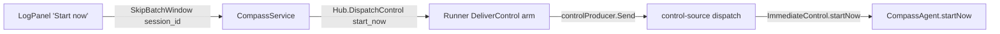

# Batch inbound messages to an agent

Tracker: RIG-4127. Freezes on merge.

Builds on: [settle turn order](../../infra/runtime/compass-managed-settle-turn-order/design.md)
(DL-382), [notification delivery](../../server/compass-notification-delivery/design.md).

Ledger-impact: appends DL-401..DL-405 for idle batching, steer handling, the
agent-owned queue, batch rendering, and the per-agent start-now control.

## Problem / Intent

Each inbound item (a thread reply, a CI result, a PR comment) that reaches an
idle agent starts its own turn. A burst costs two turns: the first item starts
turn 1 and the rest wait for turn 2. We want an idle agent to wait a short
window so a burst lands in one turn, and a UI control to skip that wait.

The saving is unmeasured. Turn 2's context re-read is likely a prompt-cache
hit, so the saving is mostly per-turn overhead and output tokens (OQ-7).

## Approach

### What exists today

`CompassAgent.deliver` and `CompassAgent.forgeNotification`
(`packages/compass-agent/src/agent.ts`) push onto `#deliverQueue` and
`#forgeQueue`. Mid-turn, `agent_end` (`#trackTurn`) runs `#flushTurnEnd`, which
drains both queues into one prompt. When idle, both methods flush at once:

```ts
if (!this.#turnActive && !this.#session.isStreaming) {
	this.#flushTurnEnd();
} else if (!this.#turnActive) {
	this.#armStrandRecovery();
}
```

### The change

Replace that idle `this.#flushTurnEnd()` with `this.#armBatch()`. The mid-turn
path and strand recovery do not change.

The window is a quiet-period debounce with a hard cap. A window is open exactly
when `#batchCancel` is set. Queue contents do not define it.

- `#armBatch`: if no window is open, set `#batchFirstAt = now`, whatever the
  queue holds. Cancel any armed timer, then arm one for
  `min(quietMs, #batchFirstAt + maxMs - now)`.
- `#fireBatch`: clear `#batchCancel` and `#batchFirstAt`, then re-run today's
  idle test: idle → `#flushTurnEnd()`; untracked stream →
  `#armStrandRecovery()`; tracked turn → nothing (its `agent_end` flushes).
  No-op once `#closed`.
- `#cancelBatch`: cancel the timer and clear both fields. `#flushTurnEnd`,
  `steer`'s idle branch, and the `prompt` case of `#applyControl` call it, so a
  started turn's `agent_end` owns the queue.
- An idle `steer` with either queue non-empty calls `#flushTurnEnd(tail)`
  instead of its own `prompt`, steer content last. It is acked, and its STEER
  injection emitted, in the batch's ack microtask; a rejected prompt un-dedups
  it with the delivers. It counts toward the N>1 trace shape: links, no parent,
  trigger cleared. With nothing queued, `steer` is unchanged.

If `CompassAgentOptions.batchWindow` is absent, the agent flushes at once
(today's behaviour). `run()`'s `finally` calls `#cancelBatch()`. `cli.ts`
`main` takes `MainDeps.batchWindow`: absent selects `DEFAULT_BATCH_WINDOW`;
`"off"` passes none. The timer is an injected `BatchTimer`; the real one is the
single `setTimeout` under a `biome-ignore` (`noRestrictedGlobals`, precedent
`session-tee.ts`).

### Q1: window length

3 s quiet, 15 s cap, fixed. A person answering threads posts every few seconds,
and the cap bounds latency when items trickle in. pi-ai's Anthropic provider
defaults to the five-minute cache entry (`getCacheControl`,
`pi-ai/src/providers/anthropic.ts`):

```ts
const retention = resolveCacheRetention(cacheRetention, "short");
```

A 15 s window uses at most 5% of that entry, so adapting to the TTL gains
nothing (OQ-1).

### Q2: which sources batch

Batched: the deliver lane (user replies, peer DMs, agent and CI posts, in-sweep
ask answers) and the forge lane (PR comments, checks, reviews, state).
Immediate: steers (@-mentions, out-of-sweep ask answers) and control prompts.
An idle steer drains any queued items into its own prompt (OQ-2). A control
prompt cancels the window, and the queue flushes at its `agent_end`.

### Q3: how a batch is shown

No new renderer. The prompt has three parts in order:

1. Delivers, via `formatDeliversForPrompt`: grouped by channel and topic, in
   first-seen order.
2. Forge items, via `formatForgeNotifications`, in arrival order.
3. A draining steer's own section.

Arrival order is the server's dispatch order under the per-session gate
(`gateFor`). Held agent-authored posts fire in turn-sequence order (DL-382). A
reply that arrived before a mention is still read before it, as today.

### Q4: where the queue lives

The queue lives in `CompassAgent` memory, with no new server or Runner state.
Nothing is acked before injection, so a live process loses nothing. If the
process ends with items queued in the window:

| Event | Queued delivers | Queued forge ops |
| --- | --- | --- |
| Stop, later Start | `OnSessionStarted` → `sweepSession` | Dropped (`agentHost.Stop` → `RetireSession` → `controlProducer.Retire`); recovered after the next start, see below |
| ERRORED exit | `drainLost` wakes only on owed work (repeat wakes back off from `erroredWakeBaseDelay`, 30 s, to `erroredWakeMaxDelay`, 15 min) → start sweep | Dropped (`markErrored` → `RetireSession`); recovered after the next start, see below |
| Server Reload (`Hub.Reload`) | `notifySessionStarted` → sweep | `controlProducer.Restart` re-sends |
| Runner config refresh (`refreshOneContainer` → `reloadLocked`) | No start edge; floor sweep within `recoveryFloorInterval`, 5 min | `controlProducer.Restart` re-sends |

Restart does not resend delivers because a deliver's control-seq is acked when
it is decoded (`dispatch`, `transport/control-source.ts`).

A dropped forge op recovers weakly:

- `forgeNotifyDispatcher.Notify` (`go/server/serve.go`) returns
  `errNoLiveSession` with no live session. So the reconcile sweep (every
  `defaultBackstop`, 30 min) re-notifies only after the agent next starts.
- Forge items alone never wake an ERRORED agent: `hasOwedWork` checks only
  `UndeliveredMessages` and `OwedMentions`.
- The re-notify is `SynthesizeUpdate`'s payload-free
  `FORGE_NOTIFICATION_KIND_UPDATE`, a re-read cue, not the original COMMENT,
  CHECKS, REVIEW, or STATE payload.
- A later notification for the same artifact, delivered and acked first,
  advances `delivered_revision`. `reconcileTarget` then sees no lag and sends
  no UPDATE. That item's own re-read cue covers the gap.

Accepted: the agent re-reads the artifact on its next live turn, and mid-turn
forge items share this exposure today. OQ-8 would remove only this forge
exposure. The 5-minute deliver bound is accepted on its own.

### Q5: the skip control

The control is per agent. "Start now" fires the agent's open window at once.
With no window open, it does nothing (OQ-3).



A `start_now` retained across a reload (`controlProducer.Restart`) can end the
new process's first window early. Accepted: it only moves a flush earlier.

## Alternatives considered

- **Window in the server delivery consumer.** Forge uses a separate path
  (`forgeNotifyDispatcher`), and the server cannot see `#turnActive`.
  Rejected.
- **Window in the Runner control producer.** The Runner would have to
  classify steers, and held ops stall its ack cursor. Rejected.
- **Skip via an empty `PromptControl`.** It starts a turn on empty text.
  Rejected.
- **No window: steer items 2..N into turn 1** via `agent.steer`. No latency,
  RPC, or UI, but any deliver could interrupt a turn (OQ-6).

## Plan

### Global Constraints

- Only `deliver` and `forgeNotification` arm the window. Steers and control
  prompts never wait.
- "Ack means injected" is unchanged. There is no new ack, frame, cursor, or
  server/Runner state.
- Existing test assertions stay unmodified. Existing harnesses change only to
  compile or to opt out of the window:
  - `turnSpanFor` in `cli.test.ts` passes `batchWindow: "off"` to `main`.
  - T4 adds `startNow` to the `ImmediateControl` fixtures.
- There is one `setTimeout`, in `realBatchTimer.set`, under
  `// biome-ignore lint/style/noRestrictedGlobals: <reason>`.
- Window values: `quietMs: 3000`, `maxMs: 15000`.
- The proto tag is 10; never reuse 4. Regenerate with
  `moon run compass-proto:gen` and commit the output.
- No tracker ids in source comments, and no private-repo names (public repo).

### T1: idle batching window (lane compass-agent)

- Add `batch-window.ts`.
- In `agent.ts`, add:
  - the option;
  - the window state and methods;
  - the idle swaps in `deliver` and `forgeNotification`;
  - the `#cancelBatch()` calls;
  - the steer tail.
- In `cli.ts`, add `MainDeps.batchWindow`, resolved with `=== "off"` (never
  `??` or truthiness).
- In `cli.test.ts`, `turnSpanFor` passes `"off"` and still gets its turn span. A
  new case omits `batchWindow` and gets no span, proving the default is on.

New `agent.test.ts` cases, with a hand-driven fake `BatchTimer`:

- Two idle delivers inside `quietMs` → no prompt until it elapses, then one
  prompt with both, then the acks.
- Arrivals every `quietMs - 1` → flush at `maxMs`.
- An idle deliver plus a forge item in one window → one prompt with both
  sections.
- A forge item alone, idle → no prompt, no `ForgeNotificationAck`, and no
  `ackRail` call before the timer fires. After it fires: one prompt, one
  `ForgeNotificationAck`, and the `ackRail` call.
- Deliver D, then idle steer S → one prompt with D before S. The timer is
  cancelled and each item is acked once (DELIVER, STEER).
- The same, with the prompt rejected → D and S are un-deduped and neither is
  acked.
- Traced: a prior single-deliver turn sets a non-empty turn trigger and ends.
  Then D and S arrive with distinct traceparents. The turn span has no parent
  and links both, the stamped ids are `D,S`, and the fake tracer's trigger is
  empty.
- A deliver, then a control prompt → no injection when the timer would have
  fired; at `agent_end`, one flush and one ack.
- The window fires during an untracked stream → strand recovery flushes after
  `waitForIdle`.
- Strand interleave: the same, plus a second deliver after the stream ends and
  before `waitForIdle` resolves → it arms with `#batchFirstAt` set (delay
  `quietMs`), and one prompt carries both items.
- The window is open when `run()` returns → the fake timer's cancel thunk has
  run, and firing the stale callback prompts nothing.
- A duplicate deliver of a queued id during the window → no ack.

Interfaces:

```ts
// batch-window.ts
export interface BatchTimer {
	now(): number;
	/** Schedule fire after ms; returns a cancel thunk. */
	set(ms: number, fire: () => void): () => void;
}
export interface BatchWindow {
	readonly quietMs: number;
	readonly maxMs: number;
	readonly timer?: BatchTimer; // default realBatchTimer
}
export const DEFAULT_BATCH_WINDOW: BatchWindow; // { quietMs: 3000, maxMs: 15000 }
export const realBatchTimer: BatchTimer;

// agent.ts
export interface CompassAgentOptions {
	// …existing fields unchanged
	readonly batchWindow?: BatchWindow;
}
interface SteerTail {
	readonly msg: Message;
	readonly content: string; // formatDeliversForPrompt([msg], …)
	readonly fromHandle: string;
	readonly traceparent: string;
}
#batchFirstAt: number | undefined;
#batchCancel: (() => void) | undefined; // set ⇔ window open
#armBatch(): void;
#fireBatch(): void;
#cancelBatch(): void;
#flushTurnEnd(tail?: SteerTail): void;

// cli.ts
export interface MainDeps {
	// …existing fields unchanged
	/** Absent → DEFAULT_BATCH_WINDOW; "off" → no window. Resolve with === "off". */
	readonly batchWindow?: BatchWindow | "off";
}
```

### T2: proto and `SkipBatchWindow` (lane compass-server)

- Add `StartNowControl` and the oneof arm to `agent.proto`.
- Add `\bStartNowControl\b` to the `gen-fence` symbol list and comment in
  `proto/moon.yml`.
- Add the RPC to `compass.proto`, then regenerate.
- Add `RequireAgentSessionOwner` beside `RequireAgentSessionSubscriber`
  (`queries/agent_sessions.sql`, `agent_sessions.go`), in the same
  single-statement not-found-merge shape.
- Add the handler beside `StopAgentSession` in `go/server/service.go`, with
  checks in this order:
  1. `s.hub == nil` → `Unavailable` (`errNoRunnerHub`);
  2. no `auth.CallerFrom` caller → `Unauthenticated` (`errNoCaller`);
  3. empty `session_id` → `InvalidArgument`, so it never reads as `NotFound`;
  4. `RequireAgentSessionOwner` false → `NotFound`;
  5. `s.hub.DispatchControl` error → `Unavailable`.
- Classify the handler `authenticatedOpen` in `classifyProcedure` and add its
  `admin_gate_test.go` row.

Tests:

- The owner and an admin each dispatch one `start_now`.
- A non-owner member, another owner, and an unknown session get the same
  `NotFound`.
- No hub → `Unavailable`; no caller → `Unauthenticated`; empty `session_id` →
  `InvalidArgument`. None of these reads the store or dispatches.
- A dispatch error → `Unavailable`.

Interfaces:

```proto
// agent.proto
// Ends the agent's idle batching window now. Empty: it names no message. It
// starts a turn on whatever is queued, or does nothing.
message StartNowControl {}
// in message AgentControl, oneof control:
StartNowControl start_now = 10;

// compass.proto, service CompassService
rpc SkipBatchWindow(SkipBatchWindowRequest) returns (SkipBatchWindowResponse);
message SkipBatchWindowRequest { string session_id = 1; }
message SkipBatchWindowResponse {}
```

```sql
-- name: RequireAgentSessionOwner :one
-- role 1 = UserRoleAdmin (store/types.go).
SELECT EXISTS (
         SELECT 1
           FROM agent_sessions se
           JOIN agent_accounts ag ON ag.account_id = se.agent_account_id
          WHERE se.session_id = $1
            AND (ag.owner_user_id = $2
                 OR EXISTS (SELECT 1 FROM user_accounts u
                             WHERE u.account_id = $2 AND u.role = 1)));
```

```go
// go/internal/store/agent_sessions.go
func (s *Store) RequireAgentSessionOwner(ctx context.Context, caller AccountID, sessionID string) error

func (s *service) SkipBatchWindow(
	ctx context.Context,
	req *connect.Request[compassv1.SkipBatchWindowRequest],
) (*connect.Response[compassv1.SkipBatchWindowResponse], error)

// dispatched op
&compassv1internal.AgentControl{
	Control: &compassv1internal.AgentControl_StartNow{
		StartNow: &compassv1internal.StartNowControl{},
	},
}
```

### T3: Runner relay test (lane compass-runner)

This task adds no production code. Next to the forge regression test in
`go/internal/runner/dispatch_test.go`, add a case: a `DispatchControl` carrying
`start_now` reaches `host.Deliver` unchanged, and `representable` returns true
for it.

Interfaces: consumes `compassv1internal.AgentControl_StartNow` from T2.

### T4: route `start_now` to the agent (lane compass-agent)

- Add `startNow` to `ImmediateControl` and to each implementation:
  - the `cli.ts` composition, which forwards to `agent?.startNow()`;
  - `recordingImmediate` in `control-source.test.ts`;
  - `noopImmediate` in `control-metrics.test.ts`.
- Add a `startNow` case to `dispatch`. Before ReplayComplete it is counted with
  `live start-now before ReplayComplete — refused by replay barrier`;
  otherwise it calls `immediate.startNow()`. It is acked at decode either way.
- Add `CompassAgent.startNow()`: if a window is open, cancel it and run
  `#fireBatch()`; otherwise do nothing.

Tests:

- A decoded `start_now` calls `startNow` once and acks.
- A pre-barrier `start_now` is counted and acked without calling `startNow`.
- `startNow()` during an open window prompts at once with the queue.
- `startNow()` with no window prompts nothing.

Interfaces:

```ts
// transport/control-source.ts
export interface ImmediateControl {
	// …steer, deliver, forgeNotification unchanged
	startNow(): void;
}
// agent.ts
startNow(): void;
```

### T5: "Start now" in the observation pane (lane compass-ui)

- Mirror `stopAgent` in `apps/ui/src/store.ts`:
  - refuse locally for a fixture session or a store with no compass client;
  - otherwise call `client.skipBatchWindow({ sessionId })`;
  - route a refusal to `skipError` and `onCommsError`.
- In `LogPanel.tsx`, add the button beside Stop. Show it for a running session,
  and disable it with a reason for a fixture session.

Tests:

- One click issues one `skipBatchWindow` with the observed session id.
- A fixture session is refused without a call.
- A store with no compass client is refused locally without a call, and sets
  `skipError`.
- A server refusal sets `skipError` and calls `onCommsError` with the error.

Interfaces:

```ts
// AppStore
skipBatchWindow: () => Promise<void>;
skipError: Accessor<string | undefined>;
```

### T6: docs (lane compass-agent)

In `docs/concepts/comms-model.md`, section "The session log is read-only — you
never prompt into a session":

- An idle agent waits a few seconds so a burst of posts lands in one turn.
- Mentions still go through at once.
- Add "Start now" beside Stop, and update "exactly three ways" to match.

Interfaces: none.

### T7: product spec (lane compass-server)

In `docs/specs/product/compass.md`:

- Add `SkipBatchWindow` to the "`CompassService` exposes" list.
- Under "Agent sessions", add a requirement shaped like the
  `SubscribeAgentSession` one. Only the owner or an admin is admitted. Unknown
  and refused sessions get the identical `NotFound`. An empty id is
  `InvalidArgument`, no caller is `Unauthenticated`, and no Runner seam is
  `Unavailable`. Scenarios: the owner skips; a non-owner member and a missing
  session get the same `NotFound`.

Interfaces: none.

Order: T1 first, then T2. T3, T4, T5, and T7 can run in parallel after T2. T6
is last.

## Tasks

- [ ] T1: idle window, `batch-window.ts`, `MainDeps.batchWindow`, tests.
- [ ] T2: `StartNowControl`, gen-fence, `SkipBatchWindow`, owner check, tests.
- [ ] T3: Runner relay test for `start_now`.
- [ ] T4: `start_now` route, `ImmediateControl` fixtures, `startNow`, tests.
- [ ] T5: UI "Start now" button and store action, tests.
- [ ] T6: comms-model doc update.
- [ ] T7: product spec update for `SkipBatchWindow`.

## Open Questions

The plan follows each recommendation. OQ-1 to OQ-6 are load-bearing; OQ-7 and
OQ-8 are not.

- **OQ-1: window values.**
  - (A) Fixed 3 s / 15 s.
  - (B) Longer, such as 10 s / 60 s: bigger batches, slower lone replies.
  - (C) Adapt the cap to the cache TTL: more state, pays off only when long.
  - Recommendation: (A). Changing it is one line in `DEFAULT_BATCH_WINDOW`.
- **OQ-2: an idle steer while a window is open.**
  - (A) Steer alone, with the batch at `agent_end`. This reorders the burst (a
    reply sent before the mention is read a turn after it) and costs two turns.
  - (B) The steer drains both queues into its own prompt, steer last. One turn,
    order kept. Acks, dedup, and un-dedup on rejection keep their meaning.
  - (C) The steer waits too, which delays a direct mention by up to 15 s.
  - Recommendation: (B).
- **OQ-3: skip granularity, and whether to ship it now.**
  - (A) Per agent.
  - (B) Per message, which needs an id on the control and a split queue.
  - (C) Ship T1 alone and defer T2–T5. That removes OQ-4, OQ-5, and the
    stale-skip case.
  - Recommendation: (A). Matt's sketch asks for the control.
- **OQ-4: who may call `SkipBatchWindow`.**
  - (A) Any member, via `RequireAgentSessionSubscriber`, "the read-path
    authorization primitive". A read grant would then cause a write (a turn
    start). That conflicts with DL-396, which gates cross-owner reach at
    delivery, not by membership.
  - (B) `adminOnly`, like `StopAgentSession`. A non-admin owner sees a dead
    button.
  - (C) Owner or `UserRoleAdmin`, via `RequireAgentSessionOwner`: one `EXISTS`
    statement in the not-found-merge shape.
  - Recommendation: (C). This is a door-class call and needs Matt's sign-off.
- **OQ-5: tell the UI a window is open.**
  - (A) No signal: the button is a no-op when nothing is waiting.
  - (B) A pending-count `SessionEvent`, which needs Runner and UI plumbing.
  - Recommendation: (A). A 15 s window would mostly flicker.
- **OQ-6: window, or steer later items into the running turn** (see
  Alternatives).
  - (A) The window: up to 15 s on a lone reply, no interrupted turns.
  - (B) Steer items 2..N into turn 1.
  - Recommendation: (A). It matches Matt's sketch.
- **OQ-7 (not load-bearing): measure the saving.** After T1 ships, compare
  turns and tokens per burst against today in the LLM usage data. If the saving
  is small, shorten `DEFAULT_BATCH_WINDOW` or drop it.
- **OQ-8 (not load-bearing): keep forge items immediate when idle.** Only the
  deliver lane would batch. That removes Q4's forge exposure, but a CI or PR
  burst would cost extra turns. This record batches both lanes.
