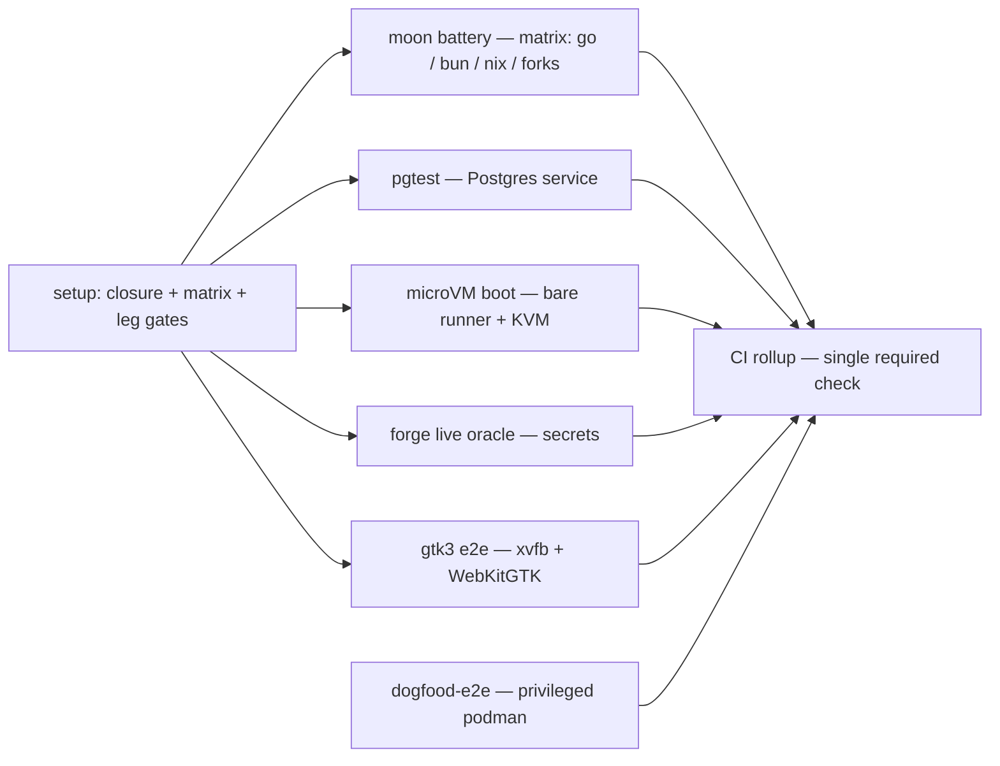

# Compass CI job decomposition — dissolving the one-job gate

Status: Draft

> **Design record.** Reverses the `ONE JOB, NOT A MATRIX` decision documented at
> the head of `.github/workflows/ci.yml` (lines 1–44) and decomposes the
> monolithic `gates` job into parallel peer jobs — a moon-owned concern matrix
> for the moon battery plus dedicated jobs for the special-infrastructure legs
> (pgtest, microVM, forge oracle, gtk3 e2e) — without reintroducing the
> hand-maintained YAML project list the original decision rejected. Directed by
> Matt on PR #574 (2026-08-25): "we can split these out i think, like we did
> for the e2e tests … we have the rollup CI job now for branch protection so we
> can split out more", escalated to option B ("also concern-split the moon
> battery") with "can we use moon to path affect the individual CI jobs?".
> The e2e split it cites is `dogfood-e2e` (ci.yml:777–812); the enabler is the
> `CI` rollup (ci.yml:1208–1258).

## Problem / Intent

The single `gates` job (ci.yml:101; ~20 min real wall-clock on main, under a
`timeout-minutes: 90` ceiling sized for the forks' nix worst case — see the
cost section) runs the moon battery, pgtest, the microVM suites, the forge
live-contract oracle, and the gtk3 e2e gate strictly in sequence, so
wall-clock is the sum of every leg even though the legs are independent.
Matt has directed the reversal:
split the job into parallel peers behind the existing `CI` rollup, using moon
itself to drive per-job affected detection so the split never recreates the
stale-YAML-enumeration failure the one-job decision was built to prevent.

## Approach

### The crux: reverse the decision without recreating its enemy

The one-job rationale rejected a matrix on exactly one decisive ground
(ci.yml:6–18): a matrix "can only be built by enumerating projects (or tasks)
in YAML, and a project list in a workflow is a second source of truth for
something `.moon/workspace.yml` already owns" — with a documented real
incident, a vendored fork shipping a functional-CI registration with no
project-map entry that "read as covered and gated nothing" (the same incident
`.moon/workspace.yml:107–113` warns about).

That premise is no longer true in moon 2.5.3 (the pinned version, verified this
session). The matrix does not have to be hand-enumerated: moon can *generate*
it. Two mechanisms exist, both verified live against this workspace:

1. **Native sharding** — `moon ci --job <i> --job-total <n>` (confirmed in
   `moon ci --help`, "Parallelism options"): moon computes the affected task
   set itself and distributes it across N identical jobs.
2. **A generated concern matrix** — a small setup job computes the affected
   closure once with `moon query projects --affected --upstream deep
   --downstream direct`, partitions the members into concern groups by an
   explicit `ci-group` project tag, and emits a JSON matrix; each downstream
   matrix leg runs `moon run <its members' :ci targets>` — the pre-computed
   explicit set, unconditionally.

In both, project discovery and affected-closure computation stay solely with
moon: the `projects:` map (`.moon/workspace.yml:10–117`) owns which projects
exist, and moon's own query engine owns which of them a change reaches — the
workflow never names a project id. In the concern matrix, the generator owns
only the *grouping* of moon's answer, and that grouping is guarded by
fail-loud coverage, disjointness, and zero-untagged assertions (below). A
newly registered project is picked up by the very next `moon query`, exactly
as the one-job design demanded. The decisive ground is answered, so the
decision can be reversed on its own terms.

**Chosen mechanism: the generated concern matrix (option 2)** (ruled
2026-08-25; see Resolved decisions). The deciding axis is per-concern
check-name attribution plus special-infra alignment:

- Native shards produce check names like `moon (shard 1/4)` whose membership
  is opaque and shifts run-to-run with the affected set — a red shard names
  nothing, so attribution regresses to log-diving, which is what the split is
  supposed to fix. Matt's B explicitly asks for concern-level splits (Go / UI
  / docs / forks), which shards cannot name.
- Shards cannot be aligned with infrastructure: the nix builds want the
  substituter-configured runner and are the reason the current job's timeout
  ceiling is 90 minutes (ci.yml:26–27, 118–120) — a ceiling sized for the
  vendored forks' nix worst case, not a runtime (see the cost section); a
  shard boundary can land them anywhere.
- The matrix costs one small generation script; native sharding costs zero
  code. That is the whole price, and it buys named checks and infra alignment.

### Concern groups — declared by an explicit `ci-group` tag, never by project id in ci.yml

Each project declares exactly one `ci-group.<name>` tag in its `moon.yml`, so
group membership is data on the project itself — colocated with the project
registration the vendored-fork incident showed can otherwise drift — never a
filter expression in the workflow. moon 2.5.3 tag ids forbid a colon (only
alnum / `-` / `_` / `/` / `.` are allowed), so the group delimiter is a DOT,
not the colon this record first drafted. Membership as of `main@fc835ca6` (live
`moon query projects` this session):

| Group | Tag (declared per project) | Members today |
| --- | --- | --- |
| `go` | `ci-group.go` | `compass-go`, `compass-proto` |
| `bun` | `ci-group.bun` | 13 first-party projects (plus `root`; see below, for 14 total): `compass-agent`, `compass-client`, `compass-ui`, `compass-eng-docs`, the gate tools (`toolchain-parity`, `stamp-gate`, `design-ledger-gate`, `orion-ref-gate`, `cx-token-gate`, `agent-image-env-gate`), `renovate`, `renovate-preflight`, `forge-linear-token` |
| `nix` | `ci-group.nix` | `compass-agent-image`, `compass-guest-image`, `compass-app-bundle` — the heavy nix builds (agent-image/moon.yml:45, guest-image/moon.yml:46, app-bundle/moon.yml:32) |
| `forks` | `ci-group.forks` | **Transient** (see below) — `oh-my-pi-fork` (workspace.yml:117; TypeScript but deliberately not `bun`-tagged — its ci is upstream's own check, forks/oh-my-pi/moon.yml:52–92) |

Plus `root` (workspace.yml:16, the lint/format sweeps): tagged `ci-group.bun`
(it owns the single bun install the bun projects' `install` no-op depends on,
workspace.yml:11–15).

**The forks group is transient — and it is the reason the 90-minute ceiling
exists.** These are one fact, not two: the vendored forks build through nix
(devenv's Rust crates via its flake's fenix pin), which is both the "dominant
cost" the ci.yml header names (ci.yml:26–27) and the worst case the `gates`
job's `timeout-minutes: 90` was sized for (ci.yml:118–120). The frozen forks
reversal (`docs/designs/platform/compass-forks-reversal/design.md`) removes
all three vendored forks; when `oh-my-pi-fork` is deleted, its
`ci-group.forks` tag vanishes with its `moon.yml`, and the group empties
cleanly — no untagged project is left behind, so the zero-untagged and
coverage assertions still pass over the remaining groups — while the
dominant-cost worst case departs with it. Nothing in this design is premised
on the forks staying: the tag mechanism absorbs the removal without a
workflow edit, and the per-leg timeout ceilings shrink to post-forks reality
(see the cost section).

**The affected closure is moon's, not the generator's.** On `pull_request`,
`setup` computes the affected set once with
`moon query projects --affected --upstream deep --downstream direct`. The
`--upstream deep --downstream direct` pair is the closure contract: it
reproduces exactly the closure `moon ci` itself pre-fills — deep upstream
dependencies plus direct downstream dependents. Verified live this session
(moon 2.5.3, `main@fc835ca6`) by perturbing `proto/compass/v1/comms.proto`:
a bare `moon query projects --affected` returns only
`{compass-proto, oh-my-pi-fork, root}`, while the closure query additionally
returns `{compass-go, compass-client}` — the dependents a proto change must
re-test, which the bare query would silently skip. On `push`/`schedule`, the
same query runs *without* `--affected` (the full project set).

**Why the legs run `moon run`, not `moon ci`:** `moon ci` re-applies its own
affected filter even to explicit targets — verified this session:
`moon ci compass-proto:lint` on a clean tree resolves zero targets ("No tasks
affected by changed files"), while `moon run compass-proto:lint` runs
unconditionally. `setup` has already computed the closure, so a leg that
re-filtered would double-filter and run nothing; each matrix leg therefore
runs `moon run <its members' :ci targets>` on the pre-computed explicit set,
with no re-filter.

**The anti-stale-enumeration guard, made structural:** moon owns discovery
and the affected closure; the generator owns grouping — and the grouping is
guarded by three assertions, each failing the setup job loud with the
offending project id named in one line:

- **coverage** — every closure member lands in exactly one group;
- **disjointness** — no project carries two `ci-group` tags;
- **zero-untagged** — a project carrying no `ci-group` tag fails setup by
  name, independently of whether the coverage set-diff would have caught it.

No project id literal appears in ci.yml, and a new project without a
`ci-group` tag fails setup loud rather than silently dropping out of the
gate. This is strictly stronger than today's posture: the one-job design
prevents a *forgotten matrix entry*; the generator additionally detects a
*forgotten group assignment* at run time instead of shipping a quiet gap.

Isolating the nix-heavy groups (`nix` and, while it lasts, `forks`) is the
biggest wall-clock win: today a PR touching both Go and an image closure
serializes them behind one verdict. The scale of that win is smaller than
the 90-minute timeout suggests — that figure is a ceiling, not a runtime
(see the cost section) — but the shape improvement is real: the Go/bun
verdicts stop waiting on any nix build at all.

### The generator — a pure translation, in TypeScript under `tools/`

The setup generator is a bun-run TypeScript script under `tools/`
(rule://scripts-ts-over-bash — it has set logic, assertions, and JSON
output), and its translation core is deliberately shaped after a proven
pattern: a pure-function generator that turns moon's affected-task graph into
a per-task CI fan-out (the same discipline a sibling Rigel repo already runs
for its own CI). One distinction must be stated before anything is borrowed:
**that reference generator drives a Woodpecker configuration-extension
service, and compass CI is GitHub Actions, not Woodpecker.** Compass has no
`.woodpecker` config; every gate in this record is GHA
(`.github/workflows/ci.yml`), a posture its sibling records state repeatedly
(compass-renovate-migration.md:13–14, compass-dogfood-e2e/design.md:735–737),
and Woodpecker-on-compass exists only as a documented, never-adopted KVM
fallback (compass-elastic-session-runtime/microvm-ci-dev-enablement.md:190).
Borrowing the pattern therefore means adopting its *translation discipline*
inside a GHA matrix generator — never migrating compass to Woodpecker. The
target stays `.github/workflows/ci.yml`.

The borrowed discipline, adapted to GHA job/matrix semantics:

- **The translation is a pure function.** Closure members + tag map in,
  matrix JSON out — no I/O, no moon invocation, no clock. The `moon query`
  call and the `$GITHUB_OUTPUT` write sit at the edges. This makes the
  grouping exhaustively unit-testable and byte-identical local vs CI.
- **Skipped placeholders keep check names stable.** The generator emits a
  matrix entry for *every* group that exists in the workspace, not just the
  affected ones: an unaffected group's entry carries `run: 'false'` and
  empty targets, and every step in its leg is gated on
  `matrix.run == 'true'`, so the leg completes as a seconds-long green
  no-op. All four `Moon battery (…)` check names therefore report on every
  PR — a docs-only PR shows `Moon battery (go)` as a fast placeholder, not
  a missing check — so check names never churn with the affected set. (The
  group *set* changes only when the workspace does: when the forks reversal
  deletes `oh-my-pi-fork`, the `forks` group and its check name disappear
  once, with the workspace change that removes them.)
- **The placeholders are the running anchor.** Because every existing group
  is always emitted, the matrix is never empty — which dissolves the
  empty-matrix hazard outright: `strategy.matrix.include: fromJSON(...)`
  over an empty array is a workflow **error** ("Matrix vector does not
  contain any values"), not a skipped job. The reference pattern solves the
  analogous nothing-guaranteed-to-run case by prepending a running no-op
  anchor workflow; in the GHA adaptation the always-present placeholder legs
  *are* that anchor. The `moon` job therefore needs no work-dependent `if:` and
  the rollup needs no skip carve-out for it: the job always runs, a
  no-moon-work PR runs fast no-ops, and the rollup's plain
  `result == success` check applies unmodified.
- **Deterministic output; throw on collision.** Groups are emitted in a
  fixed sort order (by group name), so the same closure always produces
  byte-identical matrix JSON. If two groups would ever map to one check
  name, the generator throws rather than silently dropping a leg — the same
  fail-loud posture as the coverage/disjointness/zero-untagged assertions.
- **No cross-group dependency edges.** Group legs carry no `needs:` edges to
  each other: `moon run` resolves a member target's upstream task deps
  inside the leg (the reference pattern's dropped-dep rule — an edge to
  not run is omitted, and the dependency resolves inside the dependent's own
  job, at the cost of only cross-job parallelism).

### Target job graph

1. **`setup`** — fetch-depth-0 checkout (the forge path-pattern and gtk3
   diff detections below need history) + phase-one toolchain bootstrap (moon
   on PATH), runs the generator: on `pull_request`, the closure query
   (`moon query projects --affected --upstream deep --downstream direct`);
   on `push`/`schedule`, the same query *without* `--affected` (the full
   project set). Partitions the members by `ci-group` tag, runs the
   coverage/disjointness/zero-untagged assertions, and emits to
   `$GITHUB_OUTPUT`: `matrix` — one entry per group existing in the
   workspace (each `{group, run, targets[]}`, unaffected groups as
   `run: 'false'` placeholders) — plus one affected flag per gated special
   leg: `pgtest_affected` (true iff the closure contains `compass-go` —
   `go test -tags pgtest ./...` is entirely go/ code) and `microvm_affected`
   (true iff the closure contains `compass-go` **or** `compass-guest-image` —
   the microVM leg boots the guest image the latter builds, and
   `compass-guest-image` carries no moon `dependsOn` edge to `compass-go`, so a
   guest-image-only PR — kernel pin, rootfs `default.nix`, `devenv.lock`,
   `tools/toolchain/**` — would not otherwise pull the boot test in),
   `forge_affected` (the ci.yml:466–506
   path-pattern detection, hoisted), and `gtk3_affected` (the
   ci.yml:671–692 diff logic, hoisted). Carries the same no-op-`edited`
   guard as today's `gates` (ci.yml:113–117).
2. **`moon` (matrix over every group)** — the matrix always materializes:
   it contains every existing group, so it is never empty (the placeholder
   anchor; see the generator section) and the job needs no `if:` beyond the
   `edited` guard. A `run: 'true'` leg does the full two-phase bootstrap
   (ci.yml:181–235), toolchain parity first (ci.yml:237–241), then
   `moon run <group targets>` — unconditional on the pre-computed set, on
   every event — then the Retrospect step (ci.yml:760–775). A `run:
   'false'` leg gates every step on `matrix.run == 'true'` and completes as
   a seconds-long green placeholder, keeping the check name reporting.
   `continue-on-error` is banned on every leg (below); `timeout-minutes` is
   a realistic per-group ceiling (the forks leg alone carries a
   forks-nix-sized ceiling, which leaves with the group), never an
   inherited blanket 90. Check names: `Moon battery (go)`,
   `Moon battery (bun)`, `Moon battery (nix)`, `Moon battery (forks)`.
3. **`pgtest`** — the Real-Postgres steps lifted verbatim (ci.yml:267–337),
   including the pinned-digest service container (ci.yml:133–153) and the
   assert-ran-not-skipped guard (ci.yml:295–337). Needs only the phase-one
   bootstrap (plain `go test -tags pgtest`, no moon battery tools).
   Job-level gate: runs on `push`/`schedule` unconditionally, and on PRs
   only when `needs.setup.outputs.pgtest_affected == 'true'` — today it
   runs unconditionally on every gate event, and this design ends that: an
   unaffected PR pays zero for it.
4. **`microvm`** — Enable KVM (ci.yml:339–360) + the microVM suites and
   their guard lifted verbatim (ci.yml:362–464), on a **bare
   `ubuntu-latest` runner** with `COMPASS_REQUIRE_MICROVM=1` (ci.yml:369).
   Resolved (see Resolved decisions): this leg does **not** need a
   privileged container — bare runner + passwordless sudo + the udev/sysctl
   toggle is the minimal rootless fix; privileged stays scoped to
   `dogfood-e2e`. Job-level gate: `microvm_affected`, with the same
   push/schedule carve-through as pgtest.
5. **`forge-oracle`** — the forge-affected detection, token mint, oracle,
   and guard lifted verbatim (ci.yml:466–644) with their
   tri-event/fork-guard `if:` conditions intact (ci.yml:525–530, 559–564).
   Job-level gate: `forge_affected` from setup, so an unaffected PR never
   starts the job (rather than paying checkout + nix + bootstrap just to
   reach the in-step detection and skip); the in-job detection stays
   verbatim as defense-in-depth and still governs the secrets-bearing
   oracle steps whenever the job does run.
6. **`gtk3-e2e`** — the multi-window gate lifted verbatim (ci.yml:646–758).
   Job-level gate: `gtk3_affected` from setup; its in-step affected guard
   (ci.yml:671–692) stays verbatim as defense-in-depth.
7. **`dogfood-e2e`** — unchanged (ci.yml:777–1206); already the established
   split pattern Matt cited.
8. **`CI` rollup** — `needs:` extended from `[gates, dogfood-e2e]`
   (ci.yml:1252) to the full new set; stays the single required check. Its
   own header already promises this exact move: "the set of jobs can be split
   or renamed without touching branch protection — a new tier just joins
   `needs`" (ci.yml:1210–1213).

### Rollup semantics under the split

The rollup's `!cancelled()` + `workflow_dispatch` + no-op-`edited` gate
(ci.yml:1253–1258) survives unchanged; its assertion step extends to every new
job. Three split-specific points:

- **A matrix job's `needs.<job>.result`** aggregates over all matrix legs —
  any red leg fails the whole `needs` entry, so the rollup's
  `!= success → exit 1` logic (ci.yml:1274–1281) works unmodified. This holds
  only with `fail-fast: false` and **no `continue-on-error`** on any leg: a
  `continue-on-error: true` leg counts as success for `needs`, which would
  turn the rollup vacuously green for that leg. `continue-on-error` is
  therefore banned in the moon matrix.
- **No empty-matrix hazard, no moon skip carve-out.** The generator emits
  every existing group — unaffected ones as placeholder legs — so the
  matrix is never empty and the `moon` job always runs (an empty
  `fromJSON(...)` matrix would be a workflow **error**, "Matrix vector does
  not contain any values", not a skipped job; the always-present
  placeholders are the GHA form of the reference pattern's running no-op
  anchor). The rollup therefore requires plain `success` from `moon`, with
  no skip acceptance.
- **The gated special legs use computed skips.** For each of `pgtest`,
  `microvm`, `forge-oracle`, and `gtk3-e2e`, the rollup accepts
  `result == 'skipped'` only when that job's paired setup output (e.g.
  `needs.setup.outputs.pgtest_affected == 'false'`) proves the skip was
  decided — never as a blanket skipped-is-green rule, which is the
  vacuous-pass hazard ci.yml:1216–1219 exists to prevent. The carve-out is
  fail-safe against a broken setup: a failed setup leaves every output
  empty, and `'' != 'false'`, so the rollup reds.

### What survives per-job (load-bearing pieces, stated)

- **Affected-on-PRs / full-on-main + nightly** — preserved structurally,
  and extended to every leg. PRs: `moon run` of the setup-computed
  affected-closure targets per group, placeholder no-ops for unaffected
  groups, and setup-output job gates on the special legs; push + nightly
  `schedule` (ci.yml:62–66): `moon run` of every group's full target set,
  plus every special-leg job running unconditionally exactly as today's
  push/schedule arms do (ci.yml:256–264; forge event arms ci.yml:559–564;
  gtk3 `run_it` logic ci.yml:671–692). The full-sweep
  backstop that makes affected safe (ci.yml:31–36) stays intact.
- **Concurrency group** (ci.yml:93–95) — workflow-level, untouched; a
  superseded run still cancels all its jobs.
- **The no-op-`edited` guard** (ci.yml:113–117) — carried by `setup`, every
  new work job, and the rollup (as `dogfood-e2e` already carries it,
  ci.yml:815–819).
- **`TMPDIR: /tmp`** (ci.yml:121–132) — carried by every job that runs Go
  tests (moon `go` group, pgtest, microvm, forge, gtk3): the AF_UNIX
  108-byte `sun_path` budget is per-process, not per-job-shape.
- **The two-phase nix toolchain bootstrap** (ci.yml:161–235) — repeated per
  job, phase-scoped: moon-battery legs need both phases; setup, pgtest,
  microvm, and forge need only phase one (go/bun); gtk3 needs phase one as
  well (its gate runs `go test`, and gtk-e2e-env.nix provides no `go`) on
  top of its own out-of-band closure realization (ci.yml:694–722). This
  duplication is the split's accepted cost (below).
- **The pinned Postgres digest** (ci.yml:144) — moves *with* the pgtest job's
  `services:` block, never deleted: `toolchain-parity`'s test asserts the
  digest in ci.yml equals `pgtest.go`'s (tools/toolchain/parity-core.test.ts:40–48,
  wired as a moon input at tools/toolchain/moon.yml:26–30). The test greps the
  whole file, so relocation within ci.yml is safe; removal is not.
- **All three assert-ran-not-skipped guards** (pgtest ci.yml:295–337, microVM
  ci.yml:424–464, forge ci.yml:593–644) — move verbatim with their suites,
  keeping their derive-from-source discipline.
- **Retrospect** (ci.yml:760–775) — runs in each moon-matrix job (it reads
  the job-local `.moon/cache/{ci,run}Report.json`).

### The cost, weighed

First, the baseline stated honestly: the monolithic `gates` job's real
wall-clock on main today is about **20 minutes** (two consecutive main runs
on 2026-08-25: 14:08:54→14:29:13 and 13:10:28→13:30:38). Its
`timeout-minutes: 90` is a *ceiling*, not a runtime — sized for the
vendored forks' nix-build worst case (ci.yml:26–27, 118–120), the same
transient cost the forks reversal removes (see the concern-groups section).
Any wall-clock arithmetic in this design starts from ~20m, not 90m, and
per-job `timeout-minutes` in the split are realistic per-leg ceilings — the
forks leg alone inherits a forks-sized ceiling, and loses it when the group
goes — never a blanket 90.

Each split job that actually runs re-pays checkout + nix install +
toolchain bootstrap. In the worst case — a PR whose closure touches every
group and every special leg — that is up to **nine** such cycles (setup,
four matrix legs, pgtest, microvm, forge-oracle, gtk3-e2e) against one
today, so total runner-minutes roughly triple. The win is wall-clock shape,
not compute: worst-case wall-clock drops from Σ(all legs) to
max(slowest leg) + setup + bootstrap, and on the dominant case — a PR
touching an image closure plus Go — the nix builds no longer gate the
Go/bun verdicts at all.

The affected gating keeps the typical case far from that worst case: an
unaffected group is a seconds-long placeholder leg, and a special leg whose
setup output says unaffected never starts, so an unaffected PR pays
**zero** for pgtest, microvm, forge-oracle, and gtk3-e2e — where today
pgtest runs unconditionally and forge/gtk3 pay a full bootstrap just to
reach an in-step guard and skip. What a small PR cannot avoid is `setup`
itself: one bootstrap of pure serial latency before any leg starts. A
docs-only PR therefore runs setup + one real `bun` leg + three placeholder
no-ops — comparable latency to today's single job on the same change, not
strictly better, and honest to name.

This is also exactly why the split stops at **concern** granularity: 20
one-project jobs would pay 20 bootstraps to shave minutes off
already-small groups, while four groups isolate the nix-heavy work at
minimal fixed-cost multiplication.

## Alternatives considered

### Native `moon ci --job/--job-total` sharding

Zero generation code; moon owns distribution end to end. Rejected as the
primary mechanism: shard check-names carry no concern semantics (a red
`shard 2/4` names nothing), shard membership is opaque and shifts with the
affected set, and shards cannot be pinned to special infrastructure. It
remains available *inside* a group later (e.g. sharding the bun group in two)
without changing this design's shape — noted as a non-load-bearing deferral.

### A static YAML concern matrix

Enumerate the four groups' project ids in ci.yml. Rejected outright: this is
verbatim the failure ci.yml:6–18 documents and `.moon/workspace.yml:107–113`
warns about — the stale second source of truth. Any reviewer seeing a project
id literal in ci.yml under this design should treat it as a defect.

### Keep one job, tune it

Reorder steps, cache harder. Rejected by the directive: Matt is explicitly
reversing the one-job decision, and RIG-2675's standing posture is that
nothing in Compass is frozen — the heavily documented header records a
decision, it does not bind against reversal.

### A slim residual `gates` (peel specials only, keep the moon battery whole)

Matt's option A. Superseded by his explicit escalation to B ("also
concern-split the moon battery"). The A shape survives inside this plan as
tasks T1–T4, which land value even before T5.

## Global Constraints

- **No project id may appear in ci.yml.** Grouping is declared as exactly one
  explicit `ci-group.<name>` tag per project in its moon.yml; membership is
  computed at run time. The setup generator MUST fail loud — naming the
  offending project id in one line — on any coverage gap, double membership,
  or untagged project.
- **Affected-on-PRs / full-on-main + nightly is preserved in every job.** PRs
  run affected scope; every push to main and the nightly schedule run the
  full, unfiltered scope of every job (ci.yml:25–36 posture).
- **The `CI` rollup stays the single required branch-protection check**
  (ci.yml:1208–1213). No branch-protection settings change at any step.
- **Skips must be computed, never assumed:** a rollup-accepted `skipped`
  result is legal only when paired with an explicit setup output proving the
  skip was decided (the ci.yml:1216–1219 anti-vacuous-green posture).
- **The assert-ran-not-skipped guards move with their suites, verbatim**, and
  the Postgres digest stays in ci.yml (parity-core.test.ts:40–48 coupling).
- **Every job carrying Go tests sets `TMPDIR: /tmp`** (ci.yml:121–132).
- **Per-job `timeout-minutes` are realistic per-leg ceilings**, sized to
  each leg's own worst case — never the monolith's inherited 90, which is a
  forks-nix artifact (see the cost section).
- **Fork-PR secret boundaries are unchanged:** the forge oracle keeps its
  same-repo guard (ci.yml:546–558).
- **One ci.yml change per task/PR**, each independently green, each updating
  the header prose *and any job `name:` field* it invalidates — the `gates`
  display name `Gates (moon + pgtest)` (ci.yml:102) goes stale the moment T1
  peels pgtest, and the ONE-JOB header is rewritten in T5, the step that
  actually dissolves it.
- **Design-ledger governance (post-#576).** `tools/design-ledger-gate` now
  governs every bucket in `GOVERNED_ROOTS` (`ui, agent, server, meta, infra,
  repo, product`) under `docs/designs/`, so this record at
  `docs/designs/infra/ci/` is governed. Two consequences the gate enforces:
  the record lands as a **directory** —
  `docs/designs/infra/ci/compass-ci-job-decomposition/design.md` — because
  `touchesRecord` only governs a bucket record as `<name>/design.md` or a flat
  `<name>.md` at the bucket root; a flat `.md` under the `ci/` subgroup has a
  `/` in the remainder and reads as ungoverned. And a PR touching a governed
  record must also touch `DECISIONS.md` or declare `Ledger-impact:` in the PR
  body; this record freezes no DL-numbered decision, so its PR carries a
  `Ledger-impact:` trailer rather than a ledger row.

## Plan

### T1 — peel pgtest into a peer job

**Pre-flight (confirmed — a one-line re-check before the T1 PR):** the `main`
branch is governed by a repo ruleset (id 20090117, enforcement active) whose
`required_status_checks` rule requires exactly one context — `CI`, the rollup
(verified this session via the repo ruleset API). No stale by-name
`Gates (moon + pgtest)` requirement exists, so no job rename can strand a PR
un-mergeable. Re-confirm the ruleset still lists only `CI` immediately before
the T1 PR (the check is free) and proceed.

Move the Postgres `services:` block (ci.yml:133–153), the Real-Postgres step
(ci.yml:267–293), and its guard (ci.yml:295–337) verbatim into a new `pgtest`
job: bare `ubuntu-latest`, the no-op-`edited` guard, `TMPDIR: /tmp`, and
checkout + nix install + phase-one bootstrap only (go on PATH; no moon battery
tools needed). At this step it still runs unconditionally on every gate
event, as today; T5's setup output then gates it on the go closure, so an
unaffected PR pays zero. Extend the rollup:
`needs: [gates, dogfood-e2e, pgtest]` + a third result assertion.
Update the header's pgtest paragraph (ci.yml:38–44) and the `gates` job's
display `name:` (`Gates (moon + pgtest)`, ci.yml:102), both of which this
task invalidates.

Interfaces: consumes nothing from other jobs. Produces the `pgtest` check +
its `needs.pgtest.result` for the rollup. The `gates` job loses its
`services:` block and two steps; nothing else in `gates` changes.

### T2 — peel the microVM boot suite into a peer job

Move Enable KVM (ci.yml:339–360), the microVM suites step (ci.yml:362–422),
and the guard (ci.yml:424–464) verbatim into a `microvm` job: bare
`ubuntu-latest` (resolved: no privileged container), the `edited` guard,
`TMPDIR: /tmp`, phase-one bootstrap, `COMPASS_REQUIRE_MICROVM=1` retained.
The nix guest-image + VMM realizations stay inside the step (they already use
absolute `-f $GITHUB_WORKSPACE/...` paths, ci.yml:376–378). Rollup gains
`microvm`. Like pgtest, this leg runs unconditionally at this step and
gains its setup-output gate (`microvm_affected`) in T5.

Interfaces: consumes nothing from other jobs; produces the `microvm` check.
`gates` loses three steps.

For the T5 `microvm_affected` gate to be closure-honest, the VMM-env
realization the leg builds (`tools/toolchain/microvm-vmm-env.nix`,
ci.yml:410–412) must be reachable from the moon graph: today it is tracked
by no project's `inputs`, so a PR that changes only it would leave
`compass-guest-image` (and the whole closure) unaffected and silently skip
the boot test. Add `microvm-vmm-env.nix` to `compass-guest-image`'s `inputs`
(guest-image/moon.yml:60) as part of this peel, so the moon graph — not a
hand-maintained path list in the generator — carries the microVM leg's true
build closure.

### T3 — peel the forge live-contract oracle into a peer job

Move the forge-affected detection (ci.yml:466–506), the Linear token mint
(ci.yml:508–534), the oracle (ci.yml:536–591), and the guard (ci.yml:593–644)
verbatim into a `forge-oracle` job with the fetch-depth-0 checkout the diff
needs (ci.yml:155–159), nix install, and the phase-one toolchain bootstrap:
the mint runs `bun run tools/forge-linear-token/index.ts` (ci.yml:534) and
the oracle runs `go test -tags livegithub`, so both bun and go must be on
PATH (the mint script imports only `node:fs/promises`, so no root
`bun install` is needed). The tri-event + same-repo-head `if:` conditions
are preserved, and the step-level guards stay steps as defense-in-depth. At
this step the job still pays its bootstrap to reach the in-step detection
on an unaffected PR; T5 hoists that detection into `setup` and adds the
job-level `forge_affected` gate, after which the rollup accepts the job's
computed skip. Rollup gains `forge-oracle`.

Named cost: every task in this plan touches ci.yml, so once this job exists,
the forge-affected detection's `.github/workflows/ci.yml$` path pattern fires
a secrets-bearing live oracle run on every subsequent infra PR in the series.
That is correct — each run re-proves the wiring the PR just changed — but it
is a real cost in live Linear/GitHub calls, named here so it is not mistaken
for a defect.

Interfaces: consumes repo Actions secrets (`LIVEGITHUB_*`,
`LINEAR_FORGE_CLIENT_ID/SECRET`, `LINEAR_FORGE_TEAM`); produces the
`forge-oracle` check.

### T4 — peel the gtk3 e2e gate into a peer job

Move the multi-window gate (ci.yml:646–758) verbatim into a `gtk3-e2e` job:
`edited` guard, `TMPDIR: /tmp`, and the fetch-depth-0 checkout its
`git -C ..` affected diff needs. The job needs the phase-one toolchain
bootstrap in addition to the nix install: gtk-e2e-env.nix provides
xvfb-run/pkg-config/cc only — no `go` — while the gate runs `go test`, and
the step realizes its own WebKitGTK/xvfb closure out of band
(ci.yml:694–722). Its in-step affected guard (ci.yml:671–692) is retained
as defense-in-depth, so the job result stays `success` on an unaffected PR
that reaches it; T5 adds the job-level `gtk3_affected` gate so such a PR
never starts the job at all. Rollup gains `gtk3-e2e`.

Interfaces: consumes nothing from other jobs; produces the `gtk3-e2e` check.
After T4, `gates` holds only checkout, bootstrap, parity, the two moon steps,
and Retrospect.

### T5 — the moon-owned concern matrix; dissolve `gates`; gate every leg

Tag every project: add exactly one `ci-group.<name>` tag to each project's
moon.yml (go/bun/nix/forks per the membership table above; `root` gets
`ci-group.bun`).

Add a `setup` job (fetch-depth-0 checkout, nix install, phase-one
bootstrap, `edited` guard) running the generator — a bun-run TypeScript
script under `tools/` (rule://scripts-ts-over-bash: loops, JSON output, set
logic) whose translation core is a pure function per the generator section:

- PR events: computes the affected closure once with
  `moon query projects --affected --upstream deep --downstream direct` (the
  `moon ci` closure contract: deep upstream dependencies, direct downstream
  dependents); push/schedule: the same query without `--affected` (the full
  set).
- Partitions the members into groups by their `ci-group` tag and asserts —
  each failure exiting 1 with the offending project id named in one line:
  coverage (every member in exactly one group), disjointness (no project
  carrying two `ci-group` tags), and zero-untagged (a project carrying no
  `ci-group` tag fails by name). Output ordering is deterministic (groups
  sorted by name), and a check-name collision throws rather than dropping
  a leg.
- Emits to `$GITHUB_OUTPUT`: `matrix` = JSON array with one entry per
  existing group — `{group, run, targets}` (targets = each affected
  member's `:ci` target; every group member defines a `ci` task, including
  `oh-my-pi-fork`, forks/oh-my-pi/moon.yml:88; unaffected groups get
  `run: 'false'` and empty targets) — plus `pgtest_affected` (closure
  contains `compass-go`) and `microvm_affected` (closure contains
  `compass-go` **or** `compass-guest-image`; the guest-image half is what the
  microVM leg boots and it has no moon edge to `compass-go`),
  `forge_affected` (the ci.yml:466–506
  path-pattern detection, hoisted), and `gtk3_affected` (the
  ci.yml:671–692 diff logic, hoisted). On push/schedule every flag is
  `'true'` and every group carries its full target set.

Replace `gates` with a matrix job `moon` (`needs: setup`,
`strategy.matrix.include: ${{ fromJSON(needs.setup.outputs.matrix) }}`,
`fail-fast: false`, no `continue-on-error` on any leg, per-group
`timeout-minutes`): every step gated on `matrix.run == 'true'`; a running
leg does the full two-phase bootstrap, parity step, then
`moon run ${{ matrix.targets }}` — unconditional on the pre-computed
explicit set, on every event — then Retrospect; a placeholder leg completes
in seconds. The matrix is never empty (every existing group is always
emitted), so the empty-`fromJSON` workflow error cannot occur and the job
needs no work-dependent `if:`. Delete the `gates` job. Wire the special-leg
gates: `pgtest`, `microvm`, `forge-oracle`, and `gtk3-e2e` each gain
`needs: setup` and a job-level `if:` letting push/schedule through
unconditionally and PRs through only when their setup flag is `'true'`.
Rewrite the ci.yml header (ci.yml:1–44): the ONE-JOB section becomes the
record of this reversal — the closure-query mechanism, why the
stale-enumeration ground no longer applies, and the assertions that replace
it — and the `gates` display `name:` disappears with the job. Rollup:
replace `gates` in `needs` with `[setup, moon]`, keep all T1–T4 entries,
require plain success from `moon`, and accept a gated special leg's
`skipped` only when its paired setup flag is `'false'`.

Interfaces: `setup` produces `outputs.matrix` (JSON `[{group: string,
run: 'true' | 'false', targets: string[]}]`) and four affected flags
(`pgtest_affected`, `microvm_affected`, `forge_affected`, `gtk3_affected`,
each `'true' | 'false'`); `moon` and the four gated legs consume them; the
rollup consumes every job result plus the four flags for its computed-skip
acceptance. The generator consumes
`moon query projects [--affected] --upstream deep --downstream direct` JSON
on stdout (including each member project's `ci-group` tag) plus the changed
paths its hoisted forge/gtk3 detections inspect; its translation core is
pure (members + tags + changed paths in, outputs out) and exhaustively
unit-tested.

### Task sizing note

T1 is deliberately first and smallest: it proves the peel-and-extend-rollup
pattern with the least novel machinery (the service container already
exists). T5 is last and largest; T1–T4 each land independent wall-clock
wins before T5 lands.

## Tasks

- [ ] T1 pre-flight branch-protection audit (only `CI` required, no stale by-name check); pgtest → peer job (service container + guard verbatim; rollup `needs` + assertion extended; header pgtest paragraph + `gates` `name:` updated; unconditional until T5's gate)
- [ ] T2 microVM → peer job (bare runner, Enable KVM, `COMPASS_REQUIRE_MICROVM=1`, guard verbatim; unconditional until T5's gate)
- [ ] T3 forge oracle → peer job (tri-event guards + mint + guard verbatim, fetch-depth-0, phase-one bootstrap for bun+go)
- [ ] T4 gtk3 e2e → peer job (in-step affected guard retained, own closure realization, phase-one bootstrap for go)
- [ ] T5 `ci-group` tags on every project; setup generator (closure query + assertions, pure-function core, placeholder matrix) + moon concern matrix (`moon run`, per-group timeouts); setup-output gates on pgtest/microvm/forge-oracle/gtk3-e2e; delete `gates`; rewrite ci.yml header; rollup computed-skip acceptance per gated leg

## Resolved decisions

- **Sharding mechanism — the generated concern matrix** (Matt, 2026-08-25):
  generated matrix over native `moon ci --job/--job-total` sharding, with
  the generator a bun-run TypeScript script under `tools/` whose
  translation is modeled on a proven affected-graph-to-fan-out pattern —
  placeholders for stable check names, an always-running anchor,
  deterministic ordering, throw on collision — adapted to GitHub Actions
  (compass has no Woodpecker; see the generator section for the
  distinction).
- **Split granularity — four groups, forks transient** (Matt, 2026-08-25):
  `{go+proto}`, `{bun/TS+UI+docs+gate-tools}`, `{nix image/bundle builds}`,
  `{vendored forks}` — the last explicitly transient: the frozen forks
  reversal removes it, and the 90-minute ceiling shrinks with it (see the
  concern-groups and cost sections). Finer splits (e.g. UI vs. docs vs.
  tools) multiply the per-job bootstrap for little wall-clock return and
  can be added later by re-tagging projects without touching job topology.
- **Every leg is affected-gated** (Matt, 2026-08-25): unneeded jobs must
  not run. The special legs (pgtest, microvm, forge-oracle, gtk3-e2e) are
  setup-output-gated at the job level — not merely in-step-guarded — so an
  unaffected PR pays zero for them; formerly a deferral, now in-scope (T5).
- **Branch protection needs no change** (verified at ground truth,
  2026-08-25): the `main` ruleset (id 20090117, enforcement active)
  requires exactly one context, `CI` — no by-name `Gates (moon + pgtest)`
  requirement exists, so no rename can strand a PR. The T1 pre-flight
  re-checks this for free.
- **microVM privilege posture** (Matt, 2026-08-25): the microVM leg runs on
  a bare `ubuntu-latest` runner with the udev/sysctl toggle; it does
  **not** get a privileged container. Privileged stays scoped to
  `dogfood-e2e`.
- **Reversal legitimacy** — RIG-2675: nothing in Compass is frozen; the
  ONE-JOB header documents a decision, it does not bind against Matt's
  explicit reversal directive.

## Open Questions

No load-bearing question remains open: both former load-bearing questions —
the sharding mechanism and the split granularity — are ruled in Resolved
decisions above, and the former special-leg-gating deferral is folded into
T5, so this record can freeze. One non-load-bearing deferral is recorded
for a later PR:

- **Bootstrap dedup** — the per-job nix + toolchain bootstrap could later
  be cut via a shared cache action or a prebuilt toolchain artifact from
  `setup`. The design is correct without it; substituter caching already
  bounds the cost to minutes.
