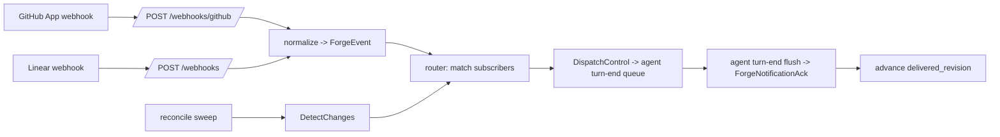

# Compass forge agent-notification (RIG-2732 Pieces 2 + 3) — webhook-only

Status: Active
Lane: compass-server
Tracker: RIG

This record designs the DELIVERY half of DL-053 — the pipeline that turns an
upstream forge change (new comment / state flip / title-body-label edit /
CI-check flip / review / newly-opened artifact) on an agent-subscribed forge
coordinate into a `ForgeNotification` pushed to that agent's live session,
coalesced at turn-end — **on a webhook-only transport**. It REWORKS the prior
draft of this record (PR #634), which designed a DL-053 conditional-GET POLL
driver, after Matt's 2026-08-25 transport rulings: (1) fold the GitHub App
design into THIS record; (2) remove poll entirely — App-install-to-subscribe
is the only transport, with a lightweight reconciliation catch-up as the
reliability mitigation; (3) fold in container-level (GitHub repo / Linear
project) subscription paths. Matt's 2026-08-26 rulings on the four carried
forks (W1-W4) are folded in as decided outcomes — see Resolved decisions.

Scope boundary, stated up front: this record flips the transport of the
**agent-notification** lane only. The board-ingestion repo-LIST poll (DL-161,
`compass-forge-poll-driver/design.md`) is a different lane feeding the issue
board, not agent notifications; it is untouched by this rework.

## Problem / Intent

An agent can subscribe to a forge artifact (RIG-2732 Piece 1, PR #631 —
open, pending merge:
`EnsureAgentForgeSubscription` / `DeleteAgentForgeSubscription`), but nothing
watches the subscribed coordinate and nothing delivers: the shared
per-artifact cursor table `forge_artifact_cursors` is writer-less ("The poll
driver owns the cursor WRITER (Piece 2); this file never inserts a cursor
row", `go/internal/store/forge_subscriptions.go` package doc, PR #631,
pending merge), and
no `forge_notification` reaches an agent — the agent-side control dispatch
switch counts an unknown variant as "unrecognized control variant" and acks
it (`packages/compass-agent/src/transport/control-source.ts:432-438`), i.e. a
forge notification arriving today is silently dropped. Subscription is also
per-artifact only: `SubscribeForgeRequest {repo, kind, number}`
(`proto/compass/v1/agent_gateway.proto:340-344`) cannot express "any new PR
opened on this repo". This record completes DL-053's delivery half on
webhooks: a GitHub App ingress + the existing Linear webhook ingress feed an
event router that notifies subscribers over the built control rail, with a
bounded reconciliation sweep as the missed-delivery backstop.

## Approach

### The transport pivot: DL-053's poll premise, and why the App dissolves it

DL-053 rejected webhooks on **adoption friction**, not on merit. Its own
table concedes webhooks win on latency ("seconds" vs "one tick") and budget
("~0" vs 2-3 conditional GETs per artifact per tick), and rejects them for
operational cost: "**a public HTTPS ingress the Server must expose**, a
shared secret per repo, HMAC verification, replay/dedupe handling, and
per-repo webhook registration (admin rights on every adopted repo)" —
"many adopters cannot or will not expose the Server, and many cannot install
a webhook on a repo they do not admin"
(`compass-server-ownership-layer/design.md:1090-1107`). Every leg of that
premise has since dissolved:

- **The public ingress SHAPE is ruled, and its implementation is in
  flight.** RIG-2717's merged design record (#625, DL-254) rules the first
  production webhook ingress: a plain `POST /webhooks` `http.Handler` on
  the compass-server network TLS door (mounted beside the Connect mounts in
  `buildNetworkServer`, `go/server/network_door.go:233-333`), raw-body
  HMAC-SHA256 fail-closed, ack-200-fast / work-async, inheriting the
  G112/RIG-1298 body-read guards. The CODE is unlanded: the RIG-2717
  implementation stack (PRs #637-639 = its T1/T2/T3/T3a/T5) ships the
  verifiers and the `--public-url` / `$COMPASS_PUBLIC_URL` config
  (RIG-2717 T5, `compass-linear-agent-responder/design.md:728-734`) but
  does NOT yet mount `/webhooks` — the mount is a later RIG-2717 task.
  This record's webhook-mount tasks (T2's mount surface, T7's wiring)
  SEQUENCE AFTER that handler/mount task lands (Global Constraints,
  sequencing prerequisites); a deployment that runs the Linear responder
  will then expose exactly the surface this record needs.
- **"A shared secret per repo" and "per-repo webhook registration" were
  repo-webhook facts, not webhook facts.** A **GitHub App** has ONE webhook
  URL and ONE webhook secret at the App level; installing the App on an org
  or repo subscribes every selected repo to the App's event set with zero
  per-repo webhook configuration and no repo-admin webhook rights — the
  install consent screen IS the registration. "User just installs App at
  setup like they do for many other products" (Matt, 2026-08-25).
- **DL-053 itself designed for this reversal.** The webhook path was framed
  as feeding "the *same* change-detection function the poller feeds"
  (`compass-server-ownership-layer/design.md:1104-1107`), and the poller
  skeleton pins it: "a future webhook ingress feeds the SAME function — that
  is what makes the webhook path a latency change and nothing else"
  (`compass-server-ownership-layer/design.md:2259-2263`). This record keeps
  that function (`DetectChanges`) — repositioned onto the reconciliation
  path (below) rather than the hot path, because a webhook event already
  names its change.

What does NOT dissolve: webhook delivery is not perfectly reliable (Matt:
GitHub webhooks have been "slightly unreliable lately"), GitHub retains
delivery logs only 3 days and "does not automatically redeliver failed
deliveries" (docs.github.com §Redelivering webhooks; changelog 2023-10-17),
and a Server that is down misses deliveries outright. The mitigation is a
**reconciliation catch-up** (below): a conditional-GET reconcile sweep on
startup plus a bounded periodic backstop that self-heals a missed delivery —
NOT a poll transport (its cadence is tens of minutes, not seconds; it emits
only what webhooks missed; webhooks remain the sole primary transport).

### The GitHub App (folded per Matt's ruling 1)

GitHub auth today is a static token: `forge.TokenSource` yields "the current
forge token", the client calls `Invalidate()` on auth failure
(`go/internal/forge/github.go:24-31`, DL-052) — no App JWT, no installation
id, no event handling. The App design:

**Registration — each deployment registers its OWN App (Renovate-style).**
There is no central Compass-owned App that self-hosted deployments share: a
webhook URL is baked into the App registration, so each deployment (managed
`compass.rigel.build` included — it is simply the first such deployment)
registers an App pointing at its own `<public-url>/webhooks/github`. Setup is
documented as a runbook (T7): create the App (org- or user-owned), set the
webhook URL + a generated webhook secret, select permissions + events
(below), generate a private key, install it on the org/repos the deployment's
agents work. GitHub's **App manifest flow** ("a way to share a preconfigured
GitHub App registration … the manifest flow creates the App registration and
generates the app's webhook secret, private key (PEM file), client secret,
and GitHub App ID", docs.github.com §Registering a GitHub App from a
manifest) is the documented one-click path the runbook links; v1 does not
build a manifest-serving endpoint (non-load-bearing deferral — the manual
registration is ~10 fields).

**Permissions + events.** Repository permissions: **Issues: read**,
**Pull requests: read**, **Checks: read**, **Commit statuses: read**,
**Metadata: read** (mandatory baseline). Subscribed events (the notification
alphabet — mapping in T2):

| GitHub event | Actions consumed | → `ForgeNotificationKind` |
| --- | --- | --- |
| `issues` | `opened` | OPENED (container-scope subs) |
| `issues` | `closed` / `reopened` | STATE |
| `issues` | `edited` / `labeled` / `unlabeled` | UPDATE |
| `issue_comment` | `created` | COMMENT (GitHub serves PR conversation comments on this event too, so ONE event covers both kinds) |
| `pull_request` | `opened` | OPENED (container-scope subs) |
| `pull_request` | `closed` (incl. merged) / `reopened` | STATE |
| `pull_request` | `edited` / `labeled` / `unlabeled` | UPDATE |
| `pull_request_review` | `submitted` | REVIEW (new kind, T3) |
| `pull_request_review_comment` | `created` | COMMENT |
| `check_suite` | `completed` | CHECKS (triggers a combined-checks fetch for the head SHA — see below) |

`check_suite.completed` (not per-`check_run`) is the roll-up TRIGGER, not
the roll-up TRUTH: a check suite is per-App, so a head with CI + a linter
App + CodeQL completes three-plus suites, each firing its own `completed`
event — building `ChecksSummary` from ONE suite's conclusion would present
per-suite truth as roll-up truth and flap ("checks: failure" while CI still
runs). On `check_suite.completed` the webhook arm therefore FETCHES the
combined checks state for the head SHA — one API call, reusing the same
combined check-runs + statuses roll-up the reads already compute
(`github.go:713-731`; T5's `ChecksConditional` is its conditional sibling)
— and builds the true roll-up, matching the wire's `ChecksSummary` and the
poll design's semantics (T2 parses, T4's router fetches). Ignored actions
(assigned, milestoned, …) are counted-and-dropped, never an error.

**Token minting.** A new `forge.AppTokenSource` implements the existing
`forge.TokenSource` interface (`github.go:28-31`) — the seam was built for
exactly this substitution:

- Mints a short-lived App JWT (RS256 over the App's private key, ~10 min
  expiry) → `POST /app/installations/{installation_id}/access_tokens` → an
  installation access token (1 h expiry), cached until ~5 min before expiry.
- `Invalidate()` drops the cached installation token (the client already
  calls it on 401/bad-creds-403, `github.go:24-31`); the JWT is re-minted
  per refresh, never cached across refreshes.
- The installation id is config (read off the App's installations list once
  at setup; the runbook shows the one `curl`). Multi-installation (one App
  installed on several orgs) is a non-load-bearing deferral — v1 binds one
  installation id, matching the one-forge-host binding the client already
  has (`GitHubConfig.Host`, `github.go:34-38`).
- Private key + webhook secret enter through the existing declared-secrets
  resolver exactly like the current forge token (`server_only`, DL-052 —
  never container-injected).

**Rate-limit consequence (dissolves the old OQ-5 pressure).** An
installation token gets its own bucket: minimum 5,000 req/h, scaling +50/h
per repo past 20 to a 12,500/h ceiling (docs.github.com §Rate limits for
GitHub Apps). With poll gone, steady-state read traffic is ~zero — only
reconciliation sweeps (bounded, mostly-304, and 304s are primary-limit-exempt
per the client's own verified note, `github.go:60-63`) and agent writes
consume it. The DL-053 "background starving foreground" cliff
(`compass-server-ownership-layer/design.md:1135-1146`) loses its cause; the
reserve floor machinery the prior draft carried (its F2) is dropped to a
non-load-bearing deferral.

**The App token is THE GitHub credential (W1, decided (a) — unified).**
GitHub App authentication uses an *installation token* and consumes NO org
seat; a deployment that wants two distinct GitHub identities — an
authoring/writing identity and a reviewing identity — registers TWO Apps,
clean identity separation at zero seat cost. `AppTokenSource` backs the
ONE shared `forge.GitHub` client for reads AND writes when App config is
present (T7 wiring); the "notification-lane-only" split is dropped. This
touches DL-052 only in WHICH secret backs the `TokenSource` — the
`server_only` posture is unchanged — and the App dissolves DL-053's
per-repo-secret / repo-admin friction premise (transport pivot, above).
See Resolved decisions (W1).

### The webhook ingress (extends the RIG-2717 door)

Two mounts on the same network TLS door, sharing the RIG-2717 shape
(fail-closed raw-body HMAC, ack-200-fast / work-async, bounded body,
G112/RIG-1298 inherited):

- **`POST /webhooks/github`** — NEW sibling mount beside the Connect mounts
  (`network_door.go:270-277`). GitHub signs with `X-Hub-Signature-256`
  (`sha256=<hex>` HMAC-SHA256 over the raw body with the App webhook
  secret); the event name rides `X-GitHub-Event`, the delivery UUID
  `X-GitHub-Delivery`. Bad/missing signature → 400, body never parsed;
  unknown/ignored event or action → 200-with-drop (counted). A separate
  path (not multiplexed onto `/webhooks`) because the signature scheme,
  secret, and header contract differ per provider — discriminating inside
  one handler would interleave two fail-closed verifiers on one code path.
- **`POST /webhooks` (Linear — the RIG-2717 mount, in flight; Global
  Constraints)** — the RIG-2717 handler dispatches
  on the payload's `type`; as designed it consumes `AgentSessionEvent`
  (`compass-linear-agent-responder/design.md:92-96`). This record adds the
  Linear **data-change** resource types to the same webhook + handler:
  `Issue` and `Comment` (Linear webhooks "support data change events for
  Issues, Comments, … Projects, …" with actions create/update/remove and an
  `updatedFrom` object of previous values, linear.app/developers/webhooks).
  Same signature check, same timestamp guard, new `type` arms handing a
  normalized event to the forge router (T2). Mapping: `Issue create` →
  OPENED (container-scope subs — Linear's container is a PROJECT, and the
  payload's project id is what container rows match on, W2); `Issue
  update` with a state change in `updatedFrom` → STATE, else UPDATE;
  `Comment create` → COMMENT. `repo` is the Linear team key, exactly as
  the write client already models it ("`repo` is the Linear TEAM KEY
  (e.g. \"SEA\")", `go/internal/forge/linear.go:10-12`); the Linear
  webhook `Issue` payload additionally carries the issue's project, so
  container matching needs no extra read. The Linear app is already
  installed with actor=app (RIG-2682); enabling the two resource types on
  its webhook is a Linear-side settings step in the T7 runbook.

**Ingress dedup + at-least-once.** Delivery is at-least-once end to end. The
ingress keeps a best-effort in-memory LRU of recent delivery ids
(`X-GitHub-Delivery` / `Linear-Delivery` UUIDs) to collapse routine retries;
it is deliberately NOT durable — a duplicate that survives it is delivered
downstream, and the contract absorbs it: a `ForgeNotification` is
informational (the agent re-reads the artifact), and agent-side control-rail
dedup is **SEQ-based** — a redelivered control op is dropped by
`acks.isApplied(seq)` (`control-source.ts:363-367`), which covers
rail-level redelivery; a re-DISPATCHED duplicate gets a fresh seq and is
delivered again, which at-least-once permits. No content-tuple idempotency
key exists or is added on this lane (this corrects the prior draft's
implication that agents dedup by `(subscription_id, change, …)` content —
they dedup by seq, and duplicate content is acceptable by contract).

### The subscription model (folded per Matt's rulings 3 + W2)

Today `SubscribeForgeRequest {repo, kind, number}`
(`agent_gateway.proto:340-344`) with `ForgeArtifactKind` ISSUE/PULL_REQUEST
(`forge.proto:69-73`) — per-artifact only. Additions (all wire-additive):

- **Container-scope subscription: an EXPLICIT scope discriminator (W2,
  decided (b)), with provider-native containers.** The `number = 0`
  sentinel the prior revision recommended is dropped: proto3 cannot
  distinguish "field unset" from `number = 0`, so under the sentinel a
  caller that merely FORGETS `number` — today a CAUGHT bug ("zero number →
  ErrInvalidArgument", per #631's own test list) — silently becomes a
  whole-repo subscription, and the callers here are LLM-driven tool
  invocations, exactly the population that omits fields. Instead the
  request gains an explicit scope enum (T3), and `number` is meaningful
  ONLY under ARTIFACT scope — zero number under ARTIFACT stays
  `ErrInvalidArgument`:

  ```proto
  enum ForgeSubscriptionScope {
    FORGE_SUBSCRIPTION_SCOPE_UNSPECIFIED = 0; // treated as ARTIFACT (pre-scope callers)
    FORGE_SUBSCRIPTION_SCOPE_ARTIFACT = 1;    // one issue/PR; number REQUIRED (> 0)
    FORGE_SUBSCRIPTION_SCOPE_CONTAINER = 2;   // GitHub: the whole repo; Linear: a PROJECT
  }
  ```

  The container is PROVIDER-NATIVE: GitHub's container is the REPO
  (identified by the existing `repo` = owner/name); Linear's container is
  a **PROJECT** — NOT the team key that rides `repo` (`linear.go:10-12`) —
  so container scope carries the Linear project identifier in a slot of
  its own, never overloaded onto `repo` (the encoding is OQ-1, ruled
  (i): a dedicated `project` column). An agent wanting both
  issues and PRs on a GitHub repo subscribes twice (two rows,
  independently unsubscribable).
- **What a container-scope subscription delivers:** exactly the OPENED
  event for its kind (`issues.opened` / `pull_request.opened` / Linear
  `Issue create` carrying the subscribed project), as a
  `ForgeNotification{change: OPENED, number: <new artifact's number>,
  url: …}` — the agent then subscribes per-artifact if it wants to follow
  the new artifact. It does NOT fan in every event on every artifact in
  the container (that would make one busy repo a notification firehose and
  duplicate per-artifact subscriptions' job).
- **New notification kinds** (`forge.proto:96-102`, additive enum values):
  `FORGE_NOTIFICATION_KIND_REVIEW = 5` (a submitted PR review — detectable
  for free on webhooks where the poll design had no priced endpoint for
  it; payload: the existing `CommentRef comment` field carries the review
  body + URL, and `state` carries the verdict string) and
  `FORGE_NOTIFICATION_KIND_OPENED = 6` (container-scope: a new artifact;
  no new payload field — `number`/`url` on the envelope already address
  it).
- **Agent-facing surface:** per Matt's ruling, the container subscribe is
  a DISTINCT tool call on the agent side (or the same tool with
  container-specific params — the SDK tool shape is settled at T6), never
  a magic zero on the artifact path: a GitHub container subscribe names
  the repo; a Linear container subscribe names the project.
- **Linear PROJECT-container mechanics** (promoted from the prior
  revision's non-load-bearing deferral — in scope per W2): the
  subscription row keeps the team key in `repo` (the namespace Linear
  issue numbers live in, `linear.go:10-12`) and carries the project
  identifier beside it; the router matches a Linear event to container
  rows by the event's project id. Linear webhook `Issue` payloads carry
  the project, so the hot path needs no extra read. A project spanning
  several teams takes one subscription per team in v1 (the coordinate
  model and the reconcile LIST walk are team-keyed, `linear.go:232-275`) —
  a non-load-bearing deferral.

### The pipeline, end to end



1. **Ingress** (T2): verify, ack 200, enqueue the raw event on the async
   dispatcher (the RIG-2717 drain-loop shape).
2. **Normalize** (T2): provider payload → one `ForgeEvent` (coordinate +
   kind + payload), the single currency both providers and the reconciler
   emit.
3. **Route** (T4): match the event's coordinate against subscribers —
   exact artifact rows, plus container-scope rows for OPENED events
   (GitHub: same repo + kind; Linear: the event's project — W2) — one
   indexed store query
   (`agent_forge_subscriptions_artifact_idx`, `0001_init.sql:643-644`).
4. **Notify per subscriber** (T4): resolve account → live session
   (`SessionResolver.SessionForAccount`,
   `go/internal/runnerhub/relay_comms.go:176-180`), build the
   `ForgeNotification` (stamping `subscription_id` per subscriber), wrap as
   `AgentControl_ForgeNotification`, `DispatchControl` it
   (`go/internal/runnerhub/dispatch_control.go:38-54`). The dispatch NEVER
   advances the delivery cursor (W3, decided beta):
   `delivered_revision`/`delivered_at` advance only when the agent's
   turn-end `ForgeNotificationAck` arrives (Approach, advance signal). A
   refusal — synchronous or async — and any other pre-ack loss leave the
   cursor unadvanced; the reconciliation sweep re-notifies from the
   durable gap.
5. **Maintain the snapshot** (T4): apply the event to the coordinate's
   `forge_artifact_cursors.snapshot`/`revision` (comment-key added, state
   flipped, …) so the reconciler diffs against post-webhook truth, not
   stale truth. TWO producers now write the same snapshot, so the
   cross-producer canonicalization invariant (Global Constraints) is
   load-bearing here: an `ApplyEvent`-mutated snapshot MUST be
   byte-identical, post-canonicalization, to what the sweep's full fetch
   would rebuild for the same artifact state. Webhook payloads carry no
   ETags, so the apply leaves the stored ETags stale by design: the next
   sweep GET for that artifact pays one charged 200, re-diffs (empty, by
   the invariant), and re-stores fresh ETags. The cursor row is created on
   first subscribe-then-event or by the first sweep.
6. **Reconcile** (T5): on startup and every backstop interval, sweep
   subscribed coordinates with conditional GETs, `DetectChanges` against
   the stored snapshot, and feed any diff into the SAME router as synthetic
   `ForgeEvent`s. A subscriber whose `delivered_revision` lags the current
   revision with an empty diff gets ONE synthesized payload-free UPDATE
   (kind + url; the agent re-reads the artifact) — the prior draft's
   restart-safe catch-up, unchanged.

**Delivered-revision semantics** carry over from the prior draft intact:
`revision` is a digest of the whole-artifact snapshot; `delivered_revision`
is the per-subscriber high-water mark, advanced only on that subscriber's
own in-band `ForgeNotificationAck` (W3; DL-053's two-cursor split,
`compass-server-ownership-layer/design.md:965-972`, survives verbatim — only
what ADVANCES the fetch side changes: webhook-applied snapshot updates and
sweep 200s instead of poll 200s). `delivered_revision != revision` durably
marks the lagging subscriber for the sweep. Fresh-subscription catch-up:
a subscriber with `delivered_revision = ''` is baselined to the current
revision without a notify (first event after subscribing is the first
notify) — same one-observation-window deviation from DL-053's "at Subscribe
time" wording (`:999-1001`) the prior draft flagged; decided in W3's
ratification bundle (below).

**Advance signal (W3, decided (beta): advance on the in-band ack).** The
delivery cursor advances on the agent's in-band forge delivery ack —
NEVER on dispatch success. This is the dispatch arm's own documented
model ("a control deliver is SEND-ONLY … success rides a later
AgentFrame.delivery_ack", `dispatch_control.go:3-11`; "The cursor is
never advanced on send — it advances only later on the recipient's
delivery_ack", `dispatch_control.go:31-33`), and it makes the sweep's
boundedness claim true WITHOUT subclass qualification for every pre-ack
loss: a SYNCHRONOUS refusal (no live session — `DispatchControl` returns
an error), an ASYNC refusal (a RunnerError observed later by
`router.complete`, `dispatch_control.go:26-32`), and
agent-death-before-flush all leave `delivered_revision` unadvanced, so
the sweep observes the durable gap and re-notifies within one backstop
interval. Only post-ack loss (a turn that flushed and acked, then lost
state) sits outside the signal — true of any ack scheme.

The added work is the forge-delivery correlation: today's
`AgentFrame.delivery_ack` correlates by comms `message_id` and carries no
forge field (`DeliveryAck { string message_id = 1; }`,
`agent.proto:232-239`), so it cannot carry this lane's ack. T3 adds an
additive AgentFrame variant, `ForgeNotificationAck { subscription_id,
revision }`, emitted by the agent arm at turn-end FLUSH (T6 — the same
point the control-rail ack retires the op) and applied by a hub ack arm
beside `deliverAck` that calls the store's delivered-revision advance
(T7 wiring). A proto + Runner + agent change, accepted by the ruling.
This REOPENS the frozen delivery record's advance-signal clause
(`compass-notification-delivery/design.md:894-897`) — aligning this lane
with its in-band-success model rather than deviating from it — so it
rides Matt's freeze-gate ratification, bundled with the
fresh-subscription baseline move (above). See Resolved decisions (W3).

**Turn-end coalescing is the recipient's contract, unchanged.** The
agent-side arm (T6) joins the control-source dispatch switch
(`control-source.ts:373-439`), queues to turn-end (RT-3 "deliver → queue →
coalesce → ack", `compass-notification-delivery/design.md:39`), and acks at
FLUSH, not decode — a decode-ack would discard the Runner's
retain-until-acked durability (`gateway/control.go:74-83`) for the
decode→flush window.
The flush is also where the W3 forge delivery ack is emitted (T6).

### Where each piece lives

| Piece | Package | Why there |
| --- | --- | --- |
| `AppTokenSource` (JWT + installation-token mint) | `internal/forge` | Implements `forge.TokenSource` (`github.go:28-31`) beside the client that consumes it |
| GitHub webhook handler + payload structs + `VerifySignature` | `internal/forge` (new `githubapp_webhook.go`) | Mirrors `linearagent/webhook.go`'s pure-verifier shape (`compass-linear-agent-responder/design.md:618-626`); forge payload types live with the forge types they reference |
| Linear data-change arms | `internal/linearagent` | The `type` switch already dispatches Linear payloads there (RIG-2717 T1/T6); the new arms normalize and hand off, never route |
| `ForgeEvent` normalize + router + notify step | `internal/ingest` (new `notify_router.go`) | `ingest` owns raw→canonical translation and "imports NO store" (`ingest.go:7-8`); store enters via a structural seam |
| `DetectChanges` + snapshot codec + reconcile sweeper | `internal/ingest` (new `notify_detect.go`, `notify_reconcile.go`) | The DL-053 pure diff core; the sweeper is a sibling of the board `Driver` (`driver.go:55-67`) |
| Conditional single-artifact reads (`NotifyReader`) | `internal/forge` | Sibling of `ListIssuesPage`, which owns the conditional-GET idiom (`github.go:148-153`) |
| Store methods (targets, cursor upsert, delivered-revision advance, container-scope guard + scope/project columns) | `internal/store` | Beside Piece 1's `forge_subscriptions.go` (pending #631) |
| Boot wiring, mounts, config, runbook | `go/server` | Where hub + store + door meet (`network_door.go:233-333`, `serve.go:767-818` patterns) |
| Agent-side arm | `packages/compass-agent` | The control-source decode switch + turn-end injection |

## Alternatives considered

- **Poll as primary transport (the prior draft of this record, PR #634).**
  Rejected by Matt's 2026-08-25 ruling, and on the merits: DL-053's own
  table scores webhooks better on latency and budget and rejected them only
  on friction grounds
  (`compass-server-ownership-layer/design.md:1093-1107`) that the App model
  dissolves (one App-level secret + URL, install-to-subscribe, no repo-admin
  webhook rights, ingress shape ruled by DL-254 with the implementation in
  flight — the RIG-2717 stack, Global Constraints). What survives
  from that draft: the `DetectChanges` core and snapshot codec (repositioned
  to reconciliation), the `NotifyReader` conditional-read surface (ditto),
  the DispatchControl relay decision (DL-265), the two-cursor semantics, the
  synthesized catch-up UPDATE, and the agent-side turn-end arm.
- **Hybrid: webhooks + a slow full poll as fallback.** Rejected — Matt's
  ruling is webhook-ONLY. Stated honestly: the reconcile sweep REUSES most
  of the poll draft's implementation surface (`DetectChanges`, the snapshot
  codec, `NotifyReader`'s conditional reads, the cursor table, per-target
  pacing, the `ErrBudgetExhausted` abort — roughly 80% of that draft's
  machinery ships anyway, repositioned). What this rework actually DELETES
  is the fast ticker, the reserve-floor machinery, and the poll-as-PRIMARY
  framing; the practical difference from this rejected hybrid is cadence
  plus intent, not mechanism. That distinction is still real and worth the
  rejection: the sweep runs at tens-of-minutes cadence, exists only to
  heal gaps, and emits only diffs against webhook-maintained snapshots —
  a gap-healer built from a poll driver's parts, never a transport.
- **A dedicated webhook ingress service/port.** Rejected — RIG-2717 already
  ruled the shape for this codebase: a plain `http.Handler` on the network
  TLS door, NOT a Connect service (Connect's bearer interceptors can't be
  satisfied by a forge, and signature verification needs the raw body that
  Connect's decode consumes,
  `compass-linear-agent-responder/design.md:483-487`), and NOT a second
  ingress (DL-254). Same reasoning transfers verbatim to GitHub.
- **Per-repo webhooks instead of an App.** Rejected — reinstates two legs of
  DL-053's friction premise (per-repo secret, per-repo registration needing
  repo admin) and forfeits App-scoped rate limits and the install-consent
  UX. The App IS the dissolution.
- **GitHub's redelivery API as the catch-up** (instead of reconcile).
  Rejected — delivery logs are retained only 3 days, "GitHub does not
  automatically redeliver failed deliveries" (docs.github.com §Redelivering
  webhooks), redelivery needs App-manager credentials doing delivery-log
  list+replay bookkeeping, and it cannot cover the acked-then-lost-in-house
  window (we acked 200; GitHub considers it delivered). The conditional-GET
  sweep covers every gap class with machinery we already designed.
- **Riding the comms bus / delivery consumer for the notify step.**
  Rejected, unchanged from the prior draft: the delivery consumer is
  comms-semantic (message settle gates, seq cursors); the frozen delivery
  record already ruled the composition point — "the poller's notify step
  calls the same dispatch the comms consumer calls … and advances its own
  per-subscriber cursor" (`compass-notification-delivery/design.md:574-577`).

## Plan

### Global Constraints

- **Toolchain:** module `github.com/RigelBuild/compass/go` (`go/go.mod`);
  proto under `proto/compass/v1/`, generated Go under `go/internal/gen/` via
  `moon run compass-proto:gen`. This rework HAS wire changes (T3): a new
  `ForgeSubscriptionScope` enum + two `SubscribeForgeRequest` fields, two
  additive `ForgeNotificationKind` values, and the `ForgeNotificationAck`
  AgentFrame variant (W3) — all additive, buf-breaking-safe, one regen.
- **Webhooks are the ONLY primary transport.** No task builds a standing
  per-artifact poll loop. The reconcile sweep (T5) is bounded (startup + a
  default 30 min backstop), conditional (mostly-304), and emits only diffs;
  any design drift that turns it into a fast poll is mis-scoped — stop and
  re-read.
- **Sequencing prerequisites — two UNLANDED dependencies.** (1) The
  `/webhooks` ingress: RIG-2717's implementation stack is in flight (PRs
  #637-639 = its T1/T2/T3/T3a/T5) and does NOT yet mount `/webhooks` — the
  mount is a later RIG-2717 task. This record's T2 mount surface and T7
  wiring sequence AFTER that handler/mount task lands. (2) The
  subscription store writer: PR #631 (RIG-2732 Piece 1) is OPEN
  (merge-state blocked at last check), so every citation in this record
  into `forge_subscriptions.go`, `validSubscriptionCoordinate`, and the
  Piece-1 guard/tests is **pending #631 merge** — T3's guard change has no
  target on main until it lands.
- **Cross-producer snapshot canonicalization (correctness invariant).**
  The snapshot has TWO writers — T4's webhook `ApplyEvent` and T5's sweep
  full-fetch rebuild — and `revision` is a digest of canonical JSON, so a
  webhook-applied snapshot MUST be byte-identical (post-canonicalization)
  to what the sweep would rebuild for the same artifact state: identical
  state-string mapping (e.g. closed+merged → "merged" in BOTH arms),
  identical comment-key format (URL-keyed; a webhook payload's comment URL
  and the API read's comment URL must normalize to the same key),
  identical label ordering, identical field truncation. Any divergence
  makes every sweep detect a phantom diff on every webhook-touched
  artifact — a chronic 30-minute spurious-notification heartbeat that also
  poisons T8's diff-count alert signal. T4 and T5 carry the shared
  meeting-point test: apply-event-then-full-fetch of the same state →
  empty diff, for EVERY event kind. Webhook payloads carry no ETags, so
  the webhook arm cannot refresh them; the accepted cost is one charged
  200 per webhook-touched artifact on the next sweep, which re-stores
  fresh ETags (Approach, pipeline step 5).
- **The ingress is fail-closed and ack-fast** (DL-254 shape): raw-body HMAC
  before any parse (bad/missing signature → 400), bounded body
  (`http.MaxBytesReader`, 1 MiB), ack 200 before any work, all work async
  on the serve errgroup. Constant-time compare (`crypto/hmac.Equal`).
- **`internal/ingest` imports no store** ("it imports NO store",
  `go/internal/ingest/ingest.go:7-8`): durable state enters through
  package-local structural interfaces; `*store.Store` adapters live in
  `go/server` (the `forgePollStore` pattern, `serve.go:1082-1090`).
- **Coordinate types:** `store.ForgeProvider` (SMALLINT 1-4) +
  `store.ForgeArtifactKind` (1=issue, 2=PR), matching the tables' CHECKs
  (`0001_init.sql:632-635`). `number` is meaningful ONLY under ARTIFACT
  scope after T3 (container rows store number=0 behind an explicit `scope`
  discriminator — W2); zero `number` under ARTIFACT and zero provider/kind
  remain caller bugs → `ErrInvalidArgument`.
- **Secrets:** App private key + App webhook secret + Linear webhook signing
  secret are `server_only` declared secrets through the existing resolver
  (DL-052 posture; the RIG-2717 lazy-resolve idiom,
  `compass-linear-agent-responder/design.md:786-787`).
- **Linear is issues-only and check-less** (`linear.go:10-12`): its event
  alphabet is Issue/Comment; no CHECKS/REVIEW arms for Linear.
- **Bodies on the wire are header-stripped + attributed**: a COMMENT/REVIEW
  notification's body runs `forge.StripOwner` (`owner.go:138`) in the
  normalize step — webhook payloads carry bodies RAW, same as provider
  reads (`provider.go:66`).
- **Red-green:** every task lands tests-first per `rule://red-green-testing`;
  pgtests follow the isolated-schema pattern
  (`serve_forge_pgtest_test.go:8-10`); webhook handlers get
  vector-based signature tests (known secret + body → expected hex, the
  RIG-2717 T1 pattern).

### T1 — `internal/forge`: GitHub App credential (`AppTokenSource`)

The App JWT → installation-token mint behind the existing `TokenSource`
seam. No client changes: `forge.NewGitHub` already takes any `TokenSource`
(`github.go:34-38`).

- Interfaces (in `go/internal/forge`, new `githubapp.go`):

  ```go
  // GitHubAppConfig identifies one GitHub App installation this deployment
  // registered (each deployment registers its OWN App — see the T7 runbook).
  type GitHubAppConfig struct {
      AppID          int64
      InstallationID int64
      PrivateKey     func(ctx context.Context) ([]byte, error) // PEM, lazily resolved (server_only secret)
      Host           string       // "github.com" or GHES; API base derives as in GitHubConfig
      Client         *http.Client // nil -> default
      Clock          func() time.Time // nil -> time.Now (test seam, the github.go idiom)
  }
  // NewAppTokenSource returns a TokenSource minting installation access
  // tokens: RS256 App JWT (~10 min) -> POST /app/installations/{id}/access_tokens
  // -> cached until ~5 min before the 1 h expiry. Invalidate drops the cache
  // (the client calls it on 401/bad-creds-403, github.go:24-31). Safe for
  // concurrent use; mint is singleflighted.
  func NewAppTokenSource(cfg GitHubAppConfig) (TokenSource, error)
  ```

- JWT: stdlib `crypto/rsa` + `crypto/x509` + hand-rolled RS256 JWS (three
  base64url segments over `{"iat","exp","iss"}`) — no JWT dependency,
  matching the client's no-dependency posture (`github.go:53-58`).
- Per **W1 (decided: unified)**, server wiring passes this `TokenSource`
  to the ONE shared `forge.GitHub` client — reads AND writes — when App
  config is present; the static-PAT path remains only for deployments
  that have not yet registered an App (they keep writes, and get NO
  GitHub notifications — W4's decided hard-off posture, stated by the T7
  boot warning; the runbook's tunnel step is the supported path to an
  App).
- Test cycle (red first, httptest): JWT header/claims/signature verify
  against a test key; mint caches (second Token() = no HTTP); refresh
  before expiry boundary (injected clock); Invalidate forces re-mint; 401
  on mint surfaces as error (not a panic); singleflight under concurrent
  Token().

### T2 — ingress: `POST /webhooks/github` + Linear data-change arms + normalize

The event front door, both providers, producing the pipeline's single
currency.

- Interfaces:

  ```go
  // internal/forge (new githubapp_webhook.go) — pure, unit-tested:
  // VerifyGitHubSignature checks X-Hub-Signature-256 ("sha256=<hex>") over
  // the raw body with the App webhook secret (constant-time).
  func VerifyGitHubSignature(secret, rawBody []byte, headerValue string) bool
  // ParseGitHubEvent maps (X-GitHub-Event, body) -> a normalized event, or
  // ok=false for ignored events/actions (counted-and-dropped by the caller).
  func ParseGitHubEvent(event string, body []byte) (ev ForgeEvent, ok bool, err error)

  // internal/forge (new notify_event.go) — the normalized currency:
  type ForgeEvent struct {
      Provider   compassv1.Forge // GITHUB / LINEAR
      Host       string
      Repo       string          // owner/name, or Linear team key
      Kind       ArtifactKind    // 1 issue, 2 PR
      Number     uint64          // the artifact's number (always set; on
                                 // OPENED it is the NEW artifact's number)
      Project    string          // Linear: the issue's project id (container
                                 // matching, W2); "" on GitHub events
      URL        string
      Change     compassv1.ForgeNotificationKind
      Comment    *compassv1.CommentRef    // COMMENT / REVIEW
      Checks     *compassv1.ChecksSummary // CHECKS (filled by the router's
                                          // roll-up fetch, never at parse)
      HeadSHA    string                   // CHECKS: the completed suite's head SHA
      State      string                   // STATE / REVIEW verdict
      DeliveryID string                   // X-GitHub-Delivery / Linear-Delivery UUID
  }

  // internal/linearagent — new type arms in the existing payload dispatch
  // (RIG-2717 T1 types file): parse Linear `Issue`/`Comment` data-change
  // payloads (action create/update/remove + updatedFrom) into ForgeEvent;
  // AgentSessionEvent handling is untouched.
  func ParseLinearDataEvent(raw []byte) (ev forge.ForgeEvent, ok bool, err error)

  // go/server — the mount (T7 wires it): a plain http.Handler, the DL-254
  // shape (verify -> ack 200 -> enqueue), with an in-memory delivery-id LRU.
  ```

- GitHub mapping per the Approach event table; `issue_comment` on a PR maps
  Kind=PULL_REQUEST via the payload's `issue.pull_request` marker;
  `check_suite.completed` parses to a CHECKS event carrying HeadSHA and NO
  `ChecksSummary` — a suite is per-App, never roll-up truth; T4's router
  fetches the combined roll-up (Approach, event table). Bodies run
  `forge.StripOwner` here (normalize is the one
  strip point).
- Linear mapping: `Issue create` → OPENED; `Issue update` → STATE iff
  `updatedFrom` shows a workflow-state change (mapped through the client's
  existing state-truth mapping, `linear.go:62-70`), else UPDATE;
  `Comment create` → COMMENT. The `Issue` payload's project id lands in
  `ForgeEvent.Project` (Linear container matching, W2). `remove` actions
  are counted-and-dropped in v1 (no notification kind models deletion;
  non-load-bearing deferral).
- Test cycle (red first): signature vectors (valid/tampered/missing →
  400-path booleans); every table row parses to the right
  kind/coordinate/payload from recorded fixture payloads; ignored actions
  → ok=false; PR-vs-issue comment discrimination; Linear state-vs-update
  discrimination via `updatedFrom`; a Linear `Issue` fixture's project id
  lands in `Project`; `check_suite.completed` → HeadSHA set,
  Checks nil; strip applied; oversized body rejected
  by the mount.

### T3 — wire + store: container-scope subscriptions + new kinds + forge ack

The `SubscribeForgeRequest` scope extension (W2), the two enum values, the
W3 ack frame, and the store surface (the prior draft's T1 store methods,
extended for scope). The container-id encoding is OQ-1, ruled (i); the
DDL + proto below are the (i) encoding.

- Wire (additive; one regen):

  ```proto
  // agent_gateway.proto — SubscribeForgeRequest gains an explicit scope
  // (W2, decided (b): the number=0 sentinel is dropped) plus the Linear
  // PROJECT container identifier (OQ-1, ruled (i)):
  enum ForgeSubscriptionScope {
    FORGE_SUBSCRIPTION_SCOPE_UNSPECIFIED = 0; // treated as ARTIFACT (pre-scope callers)
    FORGE_SUBSCRIPTION_SCOPE_ARTIFACT = 1;    // one issue/PR; number REQUIRED (> 0)
    FORGE_SUBSCRIPTION_SCOPE_CONTAINER = 2;   // GitHub: the whole repo; Linear: a PROJECT
  }
  message SubscribeForgeRequest {
    string repo = 1;                   // GitHub owner/name; Linear team key
    ForgeArtifactKind kind = 2;
    uint64 number = 3;                 // ARTIFACT only; MUST be 0 under CONTAINER
    ForgeSubscriptionScope scope = 4;  // additive; UNSPECIFIED = ARTIFACT
    string project = 5;                // CONTAINER on LINEAR only: the project id
  }
  // SubscribeForgeResponse unchanged. Zero/absent number under ARTIFACT
  // remains CodeInvalidArgument — the W2 silent-misfire class stays caught.

  // forge.proto — two additive enum values:
  //   FORGE_NOTIFICATION_KIND_REVIEW = 5;  // a submitted PR review; comment
  //                                        // carries body+url, state the verdict
  //   FORGE_NOTIFICATION_KIND_OPENED = 6;  // container-scope: a new artifact; the
  //                                        // envelope's number/url address it

  // agent.proto — one additive AgentFrame oneof variant (W3), the forge
  // sibling of DeliveryAck (which correlates by comms message_id only,
  // agent.proto:232-239): emitted at turn-end flush (T6), applied by a
  // hub ack arm beside deliverAck (T7).
  message ForgeNotificationAck {
    string subscription_id = 1;
    string revision = 2;  // the notified revision; the advance target
  }
  ```

- Store DDL (in `0001_init.sql` — `agent_forge_subscriptions`,
  `0001_init.sql:629-641` — per OQ-1, ruled (i)):

  ```sql
  -- two additive columns:
  scope   SMALLINT NOT NULL DEFAULT 1 CHECK (scope IN (1, 2)),  -- 1 artifact, 2 container
  project TEXT     NOT NULL DEFAULT '',  -- Linear CONTAINER rows: project id; else ''
  -- and the UNIQUE widens to
  -- (agent_account_id, forge_provider, forge_host, repo, kind, number, project)
  -- so two project containers on one team do not collide.
  ```

- Store guard + surface (in `go/internal/store`, extending Piece 1's file +
  the prior draft's surface):

  ```go
  // validSubscriptionCoordinate (Piece 1's guard, pending #631 merge —
  // Global Constraints) learns scope: ARTIFACT -> number > 0 AND project
  // empty; CONTAINER -> number == 0 (stored as 0), project REQUIRED on
  // LINEAR / forbidden on GITHUB. Zero provider/kind/empty repo remain
  // ErrInvalidArgument on every arm.

  type ForgeNotifySubscriber struct {
      SubscriptionID    string
      AgentAccountID    AccountID
      DeliveredRevision string
  }
  // SubscribersForArtifact returns the exact-artifact subscribers plus —
  // when openedEvent — the container-scope subscribers for the same
  // container: GitHub (repo, kind); Linear (repo, kind, project). One
  // indexed query over agent_forge_subscriptions_artifact_idx
  // (0001_init.sql:643-644).
  func (s *Store) SubscribersForArtifact(ctx context.Context, provider ForgeProvider, host, repo string, kind ForgeArtifactKind, number uint64, project string, openedEvent bool) ([]ForgeNotifySubscriber, error)

  type ForgeArtifactCursor struct {
      Provider ForgeProvider
      Host, Repo string
      Kind ForgeArtifactKind
      Number uint64            // 0 = the container-scope reconcile cursor row
      ETag, CommentsETag, ChecksETag string
      Revision string
      Snapshot []byte          // raw JSONB
      PolledAt time.Time
  }
  type ForgeNotifyTarget struct {
      Provider ForgeProvider
      Host, Repo string
      Kind ForgeArtifactKind
      Number uint64
      Cursor *ForgeArtifactCursor // nil: never observed
      Subscribers []ForgeNotifySubscriber
  }
  // ListForgeNotifyTargets enumerates distinct subscribed coordinates
  // (artifact AND container-scope rows) with their cursor + subscribers —
  // the reconcile sweep's enumeration (LEFT JOIN forge_artifact_cursors).
  // Container targets collapse per (repo, kind): every Linear project sub
  // on one team shares one team-keyed LIST walk; each subscriber row
  // carries its project for the router's match.
  func (s *Store) ListForgeNotifyTargets(ctx context.Context, provider ForgeProvider, host string) ([]ForgeNotifyTarget, error)
  func (s *Store) UpsertForgeArtifactCursor(ctx context.Context, cur ForgeArtifactCursor) error
  // AdvanceForgeDeliveredRevision is called from the hub's
  // ForgeNotificationAck arm (W3; T7 wiring) — never from the router's
  // dispatch path.
  func (s *Store) AdvanceForgeDeliveredRevision(ctx context.Context, agent AccountID, subscriptionID, revision string) error
  ```

- `forge_artifact_cursors` admits number=0 rows (its PK includes number,
  `0001_init.sql:649-662`; the kind CHECK is untouched) — the
  container-scope reconcile cursor, ONE per (repo, kind) regardless of how
  many Linear project subs ride it (Linear issue numbers are per-team, so
  one team-level high-water covers every project on that team): `snapshot`
  holds the high-water artifact number + the LIST page-1 ETag rides
  `etag`. That table needs NO project column (OQ-1, ruled (i)).
- `AdvanceForgeDeliveredRevision`: `UPDATE … SET delivered_revision=$3,
  delivered_at=now() WHERE id=$2 AND agent_account_id=$1`; zero rows →
  `ErrNotFound` (unsubscribed mid-flight — log and move on).
- Test cycle (pgtest, red first): container Ensure idempotent on
  (agent, repo, kind, 0, project); ARTIFACT with number=0 →
  `ErrInvalidArgument` (the W2 misfire regression); LINEAR CONTAINER
  without project / GITHUB CONTAINER with project → `ErrInvalidArgument`;
  two Linear project containers on one team → two rows; artifact event
  matches exact + container rows correctly (openedEvent on/off; Linear
  project match vs mismatch); targets grouping (2 agents on 1 artifact →
  1 target, 2 subscribers; cursor nil before first upsert; N project subs
  on one team → 1 container target); advance happy/unknown-id/
  foreign-agent → `ErrNotFound`; the unsubscribe GC invariant (PR #631,
  pending merge) still holds with container rows.

### T4 — `internal/ingest`: router + notify step + snapshot maintenance

The hot path: `ForgeEvent` in, notifications out, snapshot current.

- Interfaces (in `go/internal/ingest`, new `notify_router.go`; store enters
  via a structural seam per the no-store rule):

  ```go
  // NotifyStore is the durable surface the router + reconciler share — the
  // server wiring adapts *store.Store and binds (provider, host), the
  // forgePollStore pattern (serve.go:1082-1090).
  type NotifyStore interface {
      SubscribersForArtifact(ctx context.Context, repo string, kind forge.ArtifactKind, number uint64, project string, opened bool) ([]NotifySubscriber, error)
      ListNotifyTargets(ctx context.Context) ([]NotifyTarget, error)
      UpsertArtifactCursor(ctx context.Context, cur ArtifactCursor) error
      // No delivered-revision advance here: the advance rides the hub's
      // ForgeNotificationAck arm in go/server (W3), never the router.
  }
  // NotifyDispatcher is the notify seam: resolve account -> live session ->
  // DispatchControl, satisfied in go/server by a hub-backed adapter (T7).
  // The dispatch never advances the delivery cursor (W3): success and
  // failure alike leave it to the agent's ack; the reconcile sweep
  // re-notifies from any durable gap.
  type NotifyDispatcher interface {
      Notify(ctx context.Context, account string, n *compassv1.ForgeNotification) error
  }
  // ChecksRoller resolves the combined checks roll-up for a CHECKS event's
  // head SHA (a check_suite is per-App, never roll-up truth — Approach,
  // event table). Satisfied in go/server by NotifyReader's
  // ChecksConditional (T5), passing the cursor's checks_etag.
  type ChecksRoller interface {
      RollUp(ctx context.Context, repo string, number uint64, headSHA, etag string) (forge.ConditionalResult[forge.Checks], error)
  }
  // NotifyRouter routes one normalized event: load the coordinate's
  // snapshot, apply the event (snapshot mutation + new revision digest),
  // upsert the cursor, then notify each matched subscriber. It never
  // advances delivered_revision (W3 — the hub's ack arm does).
  type NotifyRouter struct{ /* store, dispatcher, checksRoller, forgeRef, log */ }
  func NewNotifyRouter(st NotifyStore, disp NotifyDispatcher, checks ChecksRoller, forgeRef *compassv1.ForgeRef, log *slog.Logger) *NotifyRouter
  func (r *NotifyRouter) Route(ctx context.Context, ev forge.ForgeEvent) error
  ```

- Snapshot apply (in `notify_detect.go`, beside `DetectChanges`): a pure
  `ApplyEvent(prev *ArtifactSnapshot, ev forge.ForgeEvent) (next
  ArtifactSnapshot)` — COMMENT adds the comment key (URL-keyed: Linear
  comment ids are UUIDs and `forge.Comment.ID` is always zero there,
  `linear.go:748-756`; `Comment.URL` is populated by both providers,
  `provider.go:61-70`), STATE/UPDATE/CHECKS overwrite their snapshot
  halves, OPENED bumps the container-scope high-water number. Revision =
  `SnapshotRevision` (sha256 of canonical JSON), shared with T5.
  `ApplyEvent` is bound by the cross-producer canonicalization invariant
  (Global Constraints): its output must match, byte-for-byte after
  canonicalization, the snapshot T5's full fetch would build for the same
  state — comment-URL keys, state-string mapping (closed+merged →
  "merged" in both arms), label ordering, truncation. The apply leaves
  stored ETags stale by design (webhooks carry none); the next sweep GET
  pays one 200, re-diffs (empty, by the invariant), re-stores fresh ETags.
  CHECKS events arrive as a head SHA: the router resolves the combined
  roll-up via the `ChecksRoller` seam BEFORE snapshot apply + notify.
- Ordering: cursor upsert BEFORE notify (the fetch-side truth advances
  unconditionally; DL-053's split, surviving); the per-subscriber
  delivery advance is ack-driven (W3) and happens outside the router.
- An OPENED event notifies container-scope subscribers only (GitHub: the
  repo; Linear: rows whose project matches the event's — W2); per-artifact
  events notify exact-coordinate subscribers only (no fan-in; Approach).
- Test cycle (red first, fakes for both seams): each kind routes +
  notifies, and delivered_revision is NEVER touched by the router (W3 —
  advance is ack-driven, tested in T6/T7); an OPENED event reaches the
  matching Linear project subscriber and not a mismatched one; snapshot
  mutation per kind (comment-key growth, state
  flip, high-water bump); duplicate COMMENT event (same URL) → snapshot
  unchanged + still notified (at-least-once, dedup is NOT content-based —
  see Approach); CHECKS event → roll-up fetched via the ChecksRoller seam,
  snapshot's checks half holds the COMBINED truth, never one suite's
  conclusion; the meeting-point invariant test (shared with T5): for EVERY
  event kind, ApplyEvent then DetectChanges against a full fetch of the
  same resulting state → empty diff + identical revision (Global
  Constraints, cross-producer canonicalization); an event on a coordinate
  whose subscription vanished mid-flight → logged, no crash.

### T5 — `internal/ingest`: reconciliation sweep (startup + bounded backstop)

The reliability mitigation: heal missed webhooks without reintroducing poll.
Reuses the prior draft's conditional-read + diff design wholesale, at
backstop cadence.

- `forge.NotifyReader` (in `internal/forge`) — the per-endpoint conditional
  reads, unchanged in shape from the prior draft (its F1(c) resolution: a
  capability interface, NOT a `Provider` widening — `Provider` carries a
  `//nolint:interfacebloat` waiver and deliberately unconditional reads,
  `provider.go:223-243`; precedent: the board driver's structural
  `pageLister` seam, `driver.go:33-37`):

  ```go
  type ConditionalResult[V any] struct {
      V           V
      ETag        string
      NotModified bool
  }
  type NotifyReader interface {
      GetIssueConditional(ctx context.Context, repo string, number uint64, etag string) (ConditionalResult[Issue], error)
      GetPullRequestConditional(ctx context.Context, repo string, number uint64, etag string) (ConditionalResult[PullRequest], error)
      // Page-1 conditioned, NEWEST-first (sort=created&direction=desc), so a
      // new comment always changes page-1: 304 = no new comments in one
      // request; a miss walks remaining pages (getAllPages idiom, github.go:723).
      ListComments(ctx context.Context, repo string, kind ArtifactKind, number uint64, etag string) (ConditionalResult[[]Comment], error)
      ChecksConditional(ctx context.Context, repo string, number uint64, headSHA, etag string) (ConditionalResult[Checks], error)
      // Container-scope: newest-first conditional LIST for artifacts of
      // kind opened above sinceNumber. Two contract points an implementer MUST
      // honor: (1) GitHub's /repos/{repo}/issues — the endpoint
      // ListIssuesPage wraps (github.go:169) — returns PRs INTERLEAVED
      // with issues (each PR row carries a pull_request marker); a
      // kind=ISSUE sweep MUST filter those out, and kind=PULL_REQUEST uses
      // /repos/{repo}/pulls (a DIFFERENT endpoint with different filter
      // params — sort=created&direction=desc, no issue filters), NOT the
      // ListIssuesPage idiom. (2) The ETag conditions page 1 only
      // (sort=created&direction=desc, so any new artifact changes page 1);
      // on a miss, walk successive pages until a page's OLDEST number is
      // <= sinceNumber (the getAllPages Link-chain walk, github.go:683-689)
      // so a >1-page burst of new artifacts between sweeps is never
      // truncated to page 1.
      ListNewArtifacts(ctx context.Context, repo string, kind ArtifactKind, sinceNumber uint64, etag string) (ConditionalResult[[]Issue], error)
  }
  ```

  GitHub impl: a conditional sibling of `getJSON` carrying
  `If-None-Match`/304 (the `ListIssuesPage` idiom, `github.go:176-191`,
  including `recordBudget` on 304). Linear impl: GraphQL has no ETags, so
  its reads return 200-equivalents with empty ETag (documented limitation —
  acceptable at backstop cadence against Linear's separate rate bucket);
  PR/checks arms → `ErrUnsupported` (`linear.go:277-302` pattern).
  Linear container targets walk the team-keyed `ListIssues`
  (`linear.go:232-275`); the read selection gains the issue's project id
  so routed OPENED events carry `ForgeEvent.Project` for the project
  match (W2).
- `DetectChanges` + snapshot codec (`notify_detect.go`) — the prior draft's
  pure diff, verbatim: previous `ArtifactSnapshot` + fetched state → zero
  or more changes + next snapshot + revision. `prev == nil` → baseline, no
  changes. A 304'd half carries prev's values forward.
- `NotifyReconciler` (new `notify_reconcile.go`): `Run(ctx)` on the serve
  errgroup — one immediate sweep at startup (heals the downtime window),
  then a `time.Ticker` at `Backstop` (default **30 min**; config). Per
  sweep: enumerate targets (`ListNotifyTargets`), conditionally fetch each,
  diff, feed changes into the SAME `NotifyRouter.Route` as synthetic
  events, and for each subscriber with `delivered_revision !=
  cursor.Revision` and an empty diff, synthesize ONE payload-free UPDATE
  (kind + url; the agent's ack advances the cursor — W3) — the
  restart-safe lagging-subscriber recovery, unchanged from the prior
  draft. Requests are
  paced within the sweep (anti-burst; `ErrBudgetExhausted` aborts the
  sweep, resumed next interval — the board driver's treatment,
  `driver.go:134-136`). Per-target error isolation (log and continue).
- Cost arithmetic, restated for the backstop cadence: 150 distinct
  artifacts × 2-3 conditional GETs per 30 min ≈ **600-900 issued/h**,
  mostly-304 and thus mostly-uncharged — 30× under the prior poll design's
  18k-30k/h, inside a 5,000/h installation bucket without floor machinery.
  The **30 min default** is a chosen point, not a floor: the same
  arithmetic admits much faster (10 min ≈ 1,800-2,700 issued/h, still
  comfortably inside the bucket), and the backstop interval is also the
  worst-case latency for any missed webhook. 30 min keeps the sweep
  unmistakably a backstop (tens-of-minutes cadence, per the webhook-only
  constraint); a deployment that weights missed-webhook latency higher
  turns `ReconcileBackstop` down to 10 min without budget consequence.
- Test cycle (red first, fakes): startup sweep heals a seeded gap (snapshot
  behind live → notification); backstop tick 304s → zero dispatches,
  `polled_at` only; lagging subscriber + empty diff → exactly one
  synthesized UPDATE (advance rides the ack — W3); lagging + real diff →
  the real change set, nothing synthesized; container-scope target →
  `ListNewArtifacts` + OPENED per new artifact above high-water; budget
  abort resumes next
  sweep; ctx cancel mid-sweep → prompt clean return; the meeting-point
  invariant's T5 half: a webhook-applied (T4 `ApplyEvent`) snapshot
  full-fetched by the sweep → empty diff, zero dispatches, fresh ETags
  re-stored.

### T6 — receive side: relay regression + agent-side turn-end arm

Near-unchanged from the prior draft (it was transport-independent); W3
adds the forge delivery ack. Server-side dispatch (the SEND) needs NO new
hub method — `DispatchControl` takes any
`*AgentControl` (`dispatch_control.go:38`) and the gateway's `representable`
already admits every variant except Replay/Config/nil
(`go/internal/runner/gateway/control.go:196-203`). The bare
`SessionsResponse.forge_notification = 7` variant stays reserved with a
superseded-by-DispatchControl doc comment (DL-265) — zero new Runner code;
the Runner half is a regression test proving a forge op relayed via
`DispatchControl` reaches `host.Deliver` and the gateway seam accepts it.
W3 adds one RECEIVE arm: a hub handler for the additive
`AgentFrame.forge_notification_ack` frame (T3), beside the existing
`deliverAck` arm, calling `AdvanceForgeDeliveredRevision` (T7 wires it) —
so "zero new Runner code" softens to zero new Runner DISPATCH code; the
Runner's frame spine relays the new additive AgentFrame variant.

- **Agent-side arm** (`packages/compass-agent/src`): a `forgeNotification`
  case in the control-source dispatch switch (`control-source.ts:373-439`)
  — decode, enqueue on the turn-end queue (RT-3 coalescing), render at
  flush as a structured system message (forge, repo#number, kind, per-kind
  payload; REVIEW renders verdict + body, OPENED renders "new
  `<kind>` repo#number"). **Ack at turn-end FLUSH, not decode**: steer/deliver
  ack at decode only because they dispatch at decode
  (`control-source.ts:415-417`); a decode-ack here would discard the
  Runner's retain-until-acked durability
  (`go/internal/runner/gateway/control.go:74-83`) for the decode→flush
  window. The flush ALSO emits the W3 forge delivery ack — one
  `ForgeNotificationAck{subscription_id, revision}` per flushed
  notification (T3's frame) — which is what advances `delivered_revision`
  server-side. Rail-level redelivery dedup is the existing SEQ-based
  `acks.isApplied` path (`control-source.ts:363-367`) — the delivery
  idempotency mechanism on this lane (see Approach; no content-tuple key).
- Test cycle (red first): gateway seam accepts
  `AgentControl_ForgeNotification` (`gateway/control_test.go` table
  pattern); DispatchControl e2e carries it to `host.Deliver`; agent decode
  → queued, not dropped; pre-barrier refusal; turn-end flush renders each
  kind (incl. REVIEW/OPENED); ack at flush, not decode
  (death-before-flush → Runner redelivers); flush emits one
  `ForgeNotificationAck` per notification and the hub arm advances
  `delivered_revision` (no flush → no ack → cursor unadvanced, the sweep
  re-notifies); redelivered seq deduped by
  `acks.isApplied`.

### T7 — server boot wiring + config + setup runbook

Assemble T1-T5 in `go/server`; document the per-deployment App setup.

- Interfaces (in `go/server`):

  ```go
  // ForgeAppConfig extends the forge config block (serve.go:108-135):
  //   AppID int64; InstallationID int64
  //   AppPrivateKeySecret string  // declared-secret NAME (PEM value)
  //   AppWebhookSecretName string // declared-secret NAME
  //   ReconcileBackstop time.Duration // default 30 * time.Minute
  // Gate: the GitHub notification lane runs iff AppID != 0 AND the two
  // secrets are declared (validateForgeSecret's fail-fast pattern,
  // serve.go:188-192). Linear data-change arms run iff the Linear webhook
  // secret is declared (the RIG-2717 gate). Boot Warn (not error) when
  // agent_forge_subscriptions has rows but the lane is off — the
  // warnDisabledForgePolling idiom (serve.go:840-843).
  // The AppID==0 arm IS W4's decided posture (a): no App -> NO GitHub
  // notifications, hard-off. Ingress-less adopters reach an App via the
  // runbook's tunnel step — never a second in-server transport.

  // forgeNotifyStore adapts *store.Store to ingest.NotifyStore, binding
  // (provider, host) — the forgePollStore pattern (serve.go:1082-1090).
  // forgeNotifyDispatcher adapts the hub: SessionForAccount
  // (relay_comms.go:176-180) then DispatchControl (dispatch_control.go:38),
  // wrapping n as AgentControl_ForgeNotification.
  func buildForgeNotifyLane(ctx context.Context, cfg ServeConfig, st *store.Store, hub *runnerhub.Hub, resolver secrets.Resolver, log *slog.Logger) (*forgeNotifyLane, error)
  // forgeNotifyLane carries: the /webhooks/github http.Handler (mounted in
  // buildNetworkServer beside the Connect mounts, network_door.go:270-277),
  // the Linear data-change hook registration into the RIG-2717 handler's
  // type dispatch, the router, and the reconciler's Run for the errgroup.
  ```

- Per W1 (decided: unified): when App config is present,
  `NewAppTokenSource` becomes the `TokenSource` for the ONE shared
  `forge.GitHub` client (writes + reconcile reads, one budget); otherwise
  the static-PAT source stays and the GitHub notification lane is off
  (W4). The hub's `ForgeNotificationAck` arm (T6) is wired here to
  `store.AdvanceForgeDeliveredRevision` (W3).
- **Setup runbook** (`docs/` beside the record, shipped with T7): the
  Renovate-style self-hosted App registration — create App, set webhook URL
  `<public-url>/webhooks/github` + secret, permissions/events table
  (Approach), generate + declare the private key, install on org/repos,
  read the installation id, boot flags. An ingress-less deployment
  (homelab / NAT / tailnet) fronts `<public-url>` with a TUNNEL
  (Cloudflare Tunnel / ngrok) — the supported path to a public webhook
  URL (W4); a deployment wanting distinct authoring vs reviewing GitHub
  identities registers TWO Apps (installation tokens consume no org
  seat — W1) and points this lane at one of them. Plus the Linear step:
  enable Issue/Comment resource types on the existing app webhook. The
  managed deployment follows the same runbook with its own App.
- Test cycle: pgtest e2e — real store, fake reader, fake dispatcher: seed a
  subscription, POST a signed webhook fixture → notification content +
  fetch-cursor advance, then a `ForgeNotificationAck` → delivery advance
  (W3); tampered signature → 400, nothing enqueued; container-scope
  fixture (`issues.opened`) → OPENED to the container subscriber; a
  Linear `Issue create` fixture with a project → OPENED to the matching
  project subscriber only; disabled-gate → nil lane; boot Warn on
  rows-but-disabled.

### T8 — observability

The webhook lane's health surface (replacing the prior draft's
budget-floor task, which the transport pivot dissolved — see Approach,
rate-limit consequence).

- Per-event structured log at ingress (event, action, delivery id,
  verify/parse outcome) and at route (matched subscribers, dispatched,
  refused); per-sweep reconcile log (targets, requests, 304 ratio, diffs
  found, synthesized catch-ups — a non-zero diff count is the "webhooks
  missed something" signal worth alerting on later); counters for dropped
  events (bad signature, ignored action, LRU-deduped).
- No rate-floor machinery: the reconcile keeps the pace gate + the client's
  existing `ErrBudgetExhausted` abort (`github.go:19-22`) only.
- Test cycle: log fields present on each path; drop counters increment;
  sweep log carries the diff count.

## Tasks

- [ ] T1 — `forge.AppTokenSource`: App JWT + installation-token mint behind
  the existing `TokenSource` seam (`go/internal/forge/githubapp.go`)
- [ ] T2 — ingress: `VerifyGitHubSignature` + `ParseGitHubEvent` +
  `ForgeEvent` normalize + Linear `Issue`/`Comment` data-change arms
- [ ] T3 — wire + store: container-scope subscribe (explicit `scope` +
  provider-native container: GitHub repo, Linear project), REVIEW/OPENED
  enum values, `ForgeNotificationAck` frame, scope/project columns +
  guard, `SubscribersForArtifact` / `ListForgeNotifyTargets` / cursor
  upsert / delivered-revision advance (container-id encoding per OQ-1,
  ruled (i))
- [ ] T4 — `ingest.NotifyRouter`: route + notify + snapshot apply
  (fakes for both seams; no delivery advance — W3)
- [ ] T5 — `ingest.NotifyReconciler` + `forge.NotifyReader` +
  `DetectChanges`/snapshot codec: startup sweep + 30 min backstop +
  synthesized catch-up
- [ ] T6 — receive side: DispatchControl relay regression + agent-side
  `forgeNotification` turn-end arm + flush-time `ForgeNotificationAck`
  emission (`packages/compass-agent`)
- [ ] T7 — boot wiring: App config + gates, `/webhooks/github` mount,
  Linear arm registration, the hub's forge-ack arm, reconciler on the
  errgroup, setup runbook (incl. the W4 tunnel step)
- [ ] T8 — observability: ingress/route/sweep logs + drop counters

Sequencing: T1/T2/T3 are independent; T4 needs T2+T3; T5 needs T3+T4 (it
routes through T4); T6 is
independent (wire types exist after T3's regen); T7 needs T1+T2+T4+T5;
T8 rides
T2/T4/T5. External prerequisites (Global Constraints): T3 targets Piece
1's writer, so it lands after PR #631 merges; T2's mount surface + T7's
wiring land after RIG-2717's `/webhooks` handler/mount task lands
(PRs #637-639 are in flight and do not yet mount it).

## Ledger-impact

New rows for `docs/designs/DECISIONS.md` (single root ledger; next free
after DL-263 → DL-264..DL-267 in file order) **plus one scoped
supersession**:

| # | Decision |
| --- | --- |
| DL-264 | The DL-053 agent-notification transport is WEBHOOK-ONLY: a per-deployment GitHub App (one App-level webhook URL + secret, install-to-subscribe, `X-Hub-Signature-256` fail-closed) posting to `POST /webhooks/github` on the network TLS door, and Linear `Issue`/`Comment` data-change events on the RIG-2717 `POST /webhooks` handler (implementation in flight — Global Constraints) — no standing poll loop exists on this lane. Reliability is a bounded reconciliation catch-up: one conditional-GET sweep at startup plus a 30 min backstop that diffs snapshots via `DetectChanges` and re-notifies from the durable `delivered_revision` gap (synthesizing one payload-free UPDATE when the missed set is no longer derivable) — a gap-healer at tens-of-minutes cadence, never a primary transport. Supersedes DL-053's transport premise; its two-cursor split and delivery semantics survive. |
| DL-265 | Forge notifications ride the generic `DispatchControl` relay (`SessionsResponse.deliver_control` envelope wrapping `AgentControl.forge_notification`), NOT the bare `SessionsResponse.forge_notification = 7` variant — that variant predates the generic relay (`compass-notification-delivery/design.md:199-202`) and is superseded: it stays reserved on the wire with a doc comment, and no Runner dispatch arm is built for it. Zero new Runner code on the relay path. Agent-side delivery idempotency is control-rail SEQ-based (`acks.isApplied`, `packages/compass-agent/src/transport/control-source.ts:363-367`); no content-tuple key exists on this lane, and duplicate content is within the at-least-once contract. |
| DL-266 | The forge delivery cursor (`delivered_revision`) advances on the agent's in-band forge delivery ack — `ForgeNotificationAck{subscription_id, revision}`, an additive AgentFrame variant emitted at turn-end flush — NEVER on dispatch success (Matt's W3 ruling, option beta), aligning this lane with the dispatch arm's own model ("The cursor is never advanced on send — it advances only later on the recipient's delivery_ack", `go/internal/runnerhub/dispatch_control.go:31-33`). Every pre-ack loss (synchronous refusal, async RunnerError via `router.complete`, agent death before flush) leaves the cursor unadvanced and is healed by the reconcile sweep within one backstop interval. The correlation is new work: today's `delivery_ack` carries only a comms `message_id` (`agent.proto:232-239`). This reopens the frozen delivery record's advance-signal clause (`compass-notification-delivery/design.md:894-897`) and rides the freeze-gate ratification, bundled with the fresh-subscription catch-up baseline moving from DL-053's "at Subscribe time" to first-observed-event/sweep (bounded by ≤1 backstop interval) — also decided in W3's ruling. |
| DL-267 | Forge subscriptions gain CONTAINER-SCOPE granularity via an explicit `ForgeSubscriptionScope` enum on `SubscribeForgeRequest` — Matt's W2 ruling, option (b); the `number = 0` sentinel is REJECTED (proto3 absent-vs-0 blindness would convert a forgotten `number` from an LLM tool caller into a silent whole-repo subscription). Containers are PROVIDER-NATIVE: GitHub's container is the REPO (the existing `repo` slot); Linear's is a PROJECT, carried in a slot of its own and never overloaded onto the team key in `repo` — Linear project scope is thereby IN scope (promoted from deferral). The project identifier lives in a dedicated column (OQ-1, ruled (i): additive `scope` + `project` columns, UNIQUE widened). A container subscription delivers exactly `FORGE_NOTIFICATION_KIND_OPENED` with the new artifact's number/url — never a fan-in of every event on every artifact. Two additive `ForgeNotificationKind` values land with it: `REVIEW = 5` (submitted PR review; free on webhooks where the poll design priced no review endpoint) and `OPENED = 6`. |

**Scoped supersession of DL-053 (transport only).** DL-053's row
(`DECISIONS.md:81`) is a MULTI-CLAUSE decision: (a) the two-cursor
FETCH/DELIVERY split, (b) the account-addressed `Sessions` →
`AgentGateway.Control` push path, (c) the delivery semantics, and (d) the
conditional-poll transport premise. This rework supersedes ONLY clause
(d); (a)-(c) remain live current truth — the board lane (DL-161)
instantiates DL-053's FETCH-cursor model, and this lane's own DL-264/266
reuse the two-cursor split and delivery semantics (the comms
delivery-cursor model DL-071/DL-072 is a parallel sibling, not a
dependency). The ledger row-status grammar has no
partial-supersession cell, and flipping DL-053 to a bare `Superseded`
would falsely retire its live clauses — so DL-053 STAYS `Active` and
DL-264's prose carries the scope ("Supersedes DL-053's transport
premise; its two-cursor split and delivery semantics survive"), the
house partial-overturn pattern (DL-236/DL-183 "Refines … which stays
Active"). The same-PR citation sweep (`per DL-053`) updates code
comments citing the poll premise — notably
`go/internal/store/forge_cursors.go`,
`go/internal/store/forge_subscriptions.go` (PR #631), and
`go/internal/ingest/driver.go`'s DL-053 references, which describe the
BOARD lane and mostly survive with a scope-clarifying touch. DL-161
(board repo-LIST poll) is NOT flipped — different lane, out of scope.

The prior draft's proposed poll-specific rows (its own "per-artifact
loop" and the poll halves) are NOT applied — they never froze; PR #634 is being
updated in place with this rework.

## Deferrals

W1-W4 and OQ-1 are all RULED (Matt, 2026-08-26) — folded into the
sections above and the Resolved decisions below. What remains here is
only explicit non-load-bearing deferrals, ratified on merge:

- **App manifest-flow endpoint** (one-click registration serving): the
  documented manual registration (~10 fields, T7 runbook) suffices;
  additive later.
- **Multi-installation support** (one App on several orgs): v1 binds one
  installation id, matching the client's one-host binding
  (`github.go:34-38`); additive config later.
- **Cross-team Linear projects**: a project spanning several teams takes
  one container subscription per team in v1 (the coordinate model and the
  reconcile LIST walk are team-keyed, `linear.go:232-275`); a
  team-spanning project match is additive router work later.
- **Reconcile-only degraded mode for ingress-less adopters**: W4 is
  decided hard-off + tunnel; a PAT-only reconcile-only mode remains
  additive-later IF ingress-less adopters materialize — as its own
  ratified decision, never drift.
- **`remove`/deleted-artifact events**: no notification kind models
  deletion; counted-and-dropped in v1.
- **Rate-reserve floor** (the prior draft's F2 / DL-053's OQ-5): with poll
  gone, background reads are ~600-900 issued/h mostly-304 at backstop
  cadence inside a ≥5,000/h installation bucket — the starvation cliff has
  no cause. The reconcile keeps the pace gate + `ErrBudgetExhausted` abort;
  a floor is additive if telemetry (T8) ever shows pressure.
- **GHES**: the App model works on GitHub Enterprise Server (App
  registration is per-instance); the runbook notes it, no code fork —
  `GitHubConfig.Host` already derives the API base (`github.go:34-38`).

## Resolved decisions (Matt, 2026-08-26)

The four forks the prior revision carried as W1-W4 are ruled; each is
folded into the sections above and kept here as the settled record.

- **W1 — GitHub App token scope: (a) UNIFIED.** The App is THE GitHub
  credential — reads AND writes — whenever App config is present:
  `AppTokenSource` backs the one shared `forge.GitHub` client (T1/T7);
  the static PAT survives only as the no-App fallback. GitHub App
  authentication uses an *installation token* and consumes NO org seat,
  so a deployment wanting separate authoring and reviewing identities
  registers TWO Apps — clean identity separation at zero seat cost.
  Touches DL-052 only in WHICH secret backs the `TokenSource` (the
  `server_only` posture is unchanged); the App also dissolves DL-053's
  per-repo-secret / repo-admin friction premise.
- **W2 — container-scope encoding: (b) EXPLICIT SCOPE FIELD, with
  provider-native containers.** The `number = 0` sentinel is dropped:
  proto3 cannot distinguish "unset" from 0, so the sentinel converts a
  forgotten `number` — from LLM tool callers, exactly the population
  that omits fields — into a silent whole-repo subscription. Container
  scope rides the `ForgeSubscriptionScope` enum (T3), and the container
  is PROVIDER-NATIVE: GitHub's is the REPO (the existing `repo` slot),
  Linear's is a PROJECT ("it also needs to carry the linear terms like
  PROJECT, not repo") — so Linear project scope is IN scope, promoted
  from the prior revision's non-load-bearing deferral. The agent-facing
  subscribe is a distinct tool call (or distinct params), never a magic
  zero on the artifact path. The one remaining sub-fork — where the
  project identifier lives — was OQ-1, ruled (i); see below.
- **W3 — delivered-revision advance signal: (beta) ADVANCE ON THE
  IN-BAND ACK.** Not dispatch success (alpha), not a `router.complete`
  un-advance hook (beta'). This is the dispatch arm's own documented
  model ("The cursor is never advanced on send — it advances only later
  on the recipient's delivery_ack", `dispatch_control.go:31-33`) and
  makes the sweep's boundedness claim true for EVERY pre-ack loss
  subclass. The added work is the forge-delivery correlation — today's
  `delivery_ack` correlates by comms `message_id` and carries no forge
  field (`agent.proto:232-239`) — landed as the additive
  `ForgeNotificationAck` frame (T3), emitted at turn-end flush (T6),
  applied by a hub ack arm (T7). This reopens the frozen delivery
  record's advance-signal clause
  (`compass-notification-delivery/design.md:894-897`), so it rides
  Matt's freeze-gate ratification — bundled with the fresh-subscription
  catch-up baseline moving from DL-053's "at Subscribe time"
  (`compass-server-ownership-layer/design.md:999-1001`) to
  first-observed-event/sweep (bounded by ≤1 backstop interval), also
  decided in this ruling.
- **W4 — ingress-less deployments: (a) HARD-OFF + TUNNEL.** No App
  configured → NO GitHub notifications; boot Warn when subscriptions
  exist (T7's gate). Matt's reasoning: ONE webhook path only — he will
  not support a dual in-server transport. The adopter class DL-053's
  poll rejection protected (homelab / NAT / tailnet) is served honestly:
  it exposes the webhook URL via a TUNNEL (Cloudflare Tunnel / ngrok), a
  documented T7 runbook step — not a degraded second in-server
  transport. A reconcile-only mode stays additive-later (deferrals) if
  that class materializes.
- **OQ-1 — Linear PROJECT container-id encoding: (i) `scope` ENUM +
  STABLE `repo` + DEDICATED `project` COLUMN** (Matt, 2026-08-26:
  "634 Q1 - (i) lgtm"). The Linear project identifier lives in its own
  slot — `scope = 4` + `project = 5` on `SubscribeForgeRequest`, and two
  additive table columns (`scope SMALLINT NOT NULL DEFAULT 1 CHECK (scope
  IN (1, 2))`, `project TEXT NOT NULL DEFAULT ''`) with the UNIQUE widened
  to include `project` — never overloading `repo`, which keeps its one
  meaning (GitHub owner/name; Linear team key). The generic
  `container_kind`/`container_ref` (ii) and the `repo`-overload sentinel
  (iii) are rejected: (ii) forks the `(repo, kind, number)` coordinate
  shape the artifact index, cursor PK, and reconcile walk are built on,
  and (iii) reintroduces the exact silent-reinterpretation class W2's
  explicit enum was chosen to kill. This was the last load-bearing fork
  gating T3; the T3 DDL/proto/store surface above is the (i) encoding.
