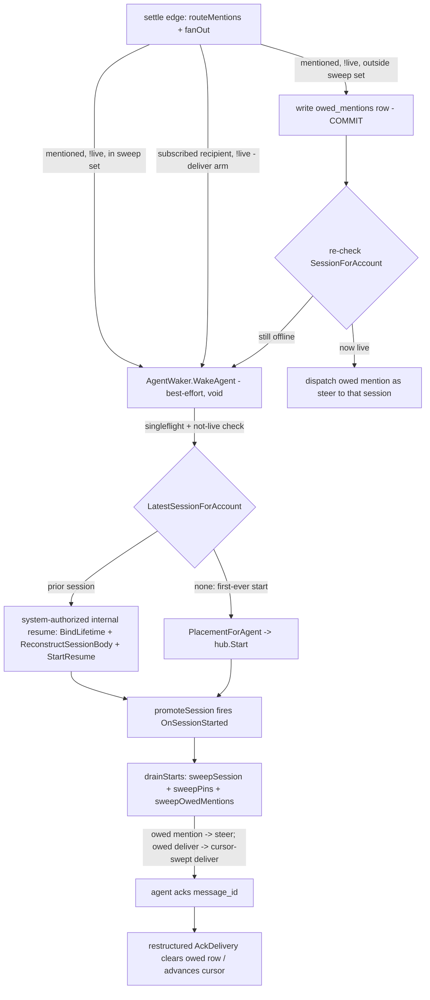

# Compass mention delivery for offline channel members — wake-based redelivery amendment

Status: Draft

All seven Open Questions ruled by Matt (2026-08-21) — folded into the body; see §Decisions.

Tracker: RIG-1641.

Amends: `compass-notification-delivery/design.md` (SEA-1569) — D5 mention→steer
routing (design.md:507-562) and OQ-3's offline clause (design.md:951-960).

Ledger: this record's PR appends a new `DL-<n>` row to
`docs/designs/product/DECISIONS.md` in the same diff (§Ledger delta at the end
of this record). DL-071/DL-073 stay Active — this record amends the frozen
OQ-3 offline clause by citation, it does not reverse the steer-only precedence
or the control-op shapes.

> **Amends `compass-notification-delivery` (frozen).** Per the sealed
> convention a later change ADDS a record (sibling precedent:
> `compass-sidebar-pins-unreachable-amendment`,
> `compass-server-ownership-layer-amendment`); the frozen record is never
> edited in place. All file+line grounding below was verified against the
> working tree this run (jj workspace off main `6200cde3`).

## Problem / Intent

An `@`-mentioned channel agent member that is **unsubscribed, non-home,
non-mandatory, and offline** receives the mention on NO path — it is silently,
permanently dropped. Matt ruled (2026-08-21) to make this gap recoverable by
waking the agent: *"i think in most cases we just want to restart that agent
so they get the message."* This record designs that wake-based recoverable
path.

The three-path proof of the gap, at source:

1. **No steer.** `routeMentions` skips a mentioned agent with no live session
   (`go/internal/delivery/dispatch.go:136-140`):

   ```go
   for agent := range mentioned {
       sessionID, live := c.resolver.SessionForAccount(agent)
       if !live {
           continue // no live turn to interrupt; redelivery only if subscribed-or-home (SEA-1641)
       }
       c.dispatchSteerTo(ctx, sessionID, msg)
   }
   ```

2. **No plain deliver.** Steer-only precedence (OQ-3, RATIFIED) excludes every
   mentioned agent from the fan-out (`dispatch.go:104-107`):

   ```go
   for _, agent := range recipients {
       if mentioned[agent] {
           continue // steer-only precedence: a mentioned agent never also gets a deliver
       }
   ```

   — and even without that exclusion, the fan-out set is `SubscribedAgents`,
   which an unsubscribed non-home member is not in.

3. **No sweep redelivery.** The D2 reconnect sweep read `UndeliveredMessages`
   is subscription-gated (`go/internal/store/delivery_cursors.go:244-245`):

   ```sql
   WHERE cm.account_id = $1
     AND (cm.subscribed OR cm.channel_id = aa.home_channel_id OR ch.mandatory_subscription)
   ```

   An unsubscribed, non-home, non-mandatory member is not in the swept set, so
   even a later session start delivers nothing.

Yet the mention→steer routing set DELIBERATELY includes that member —
`ChannelAgentMembers` is membership-based, not subscription-based
(`go/internal/store/delivery_reads.go:59-63`): "resolves every AGENT member of
a channel, author excluded, **regardless of subscribe state** — the
mention→steer routing set […] this query is the same JOIN shape MINUS the
`(cm.subscribed OR home_channel)` disjunct, so an unsubscribed non-home agent
member is STILL returned." So the mention is routed-at but never delivered.

The frozen contract this amends is D5's offline promise
(`compass-notification-delivery/design.md:546-549`): "A mentioned agent with no
live session gets nothing now and picks the message up as a swept `deliver` on
next start — a steer is a mid-turn interrupt by definition; there is no turn to
interrupt. This interaction rule is OQ-3, RATIFIED (Matt, 2026-07-29: steer
only, as recommended)." That promise is TRUE for a subscribed-or-home member
and silently FALSE for the unsubscribed non-home one — the shipped
`routeMentions` docstring already documents the gap as by-design and points at
the tracking issue (`dispatch.go:123-127`): "An UNSUBSCRIBED non-home member
has no sweep redelivery (UndeliveredMessages is subscription-gated […]),
so a mention reaches it only while it is live: offline + unsubscribed =
nothing this cycle, by design (SEA-1641 tracks whether that gap should become
recoverable)."

Intent: a mention is never silently dropped once the settle edge processes
it, and an offline mentioned or subscribed member gets its message promptly
rather than on its next natural start. When a recipient is offline, the
server durably records the owed mention (for the mention-gap population) and
best-effort wakes the member's session — a RESUME of its most recent session,
so the woken agent keeps its working context (§Decisions OQ-7). The window
BEFORE the settle edge (message-post commit → delivery-consumer processing)
inherits the in-process bus's guarantees; it is accepted for MVP and tracked
as follow-up RIG-2490 (§Decisions OQ-5).

## Approach

Matt's rulings fix the mechanism (§Decisions): wake every offline recipient
that is owed a signal — every offline MENTIONED member (OQ-3, broadcasts
included per OQ-6) and every offline SUBSCRIBED plain-deliver recipient
(OQ-6) — and mint the wake as a RESUME of the agent's most recent session so
its working context survives (OQ-7). The load-bearing subtlety is that
**waking is necessary but not sufficient for the mention-gap population** —
the session-start sweep the woken session runs (`OnSessionStarted` →
`drainStarts` → `sweepSession` → `UndeliveredMessages`,
`go/internal/delivery/settle.go:37-62, 113-137`) is the SAME
subscription-gated read proven insufficient in path 3 above. A wake that only
starts the session delivers nothing to that population. So the approach has
two halves, ordered durability-first:

**Half 1 — durably record the owed mention BEFORE any wake attempt (the
no-loss half; the mention-gap population only).** When `routeMentions`
resolves a mentioned member with no live session that is OUTSIDE the sweep
set (unsubscribed, non-home, non-mandatory), it writes an `owed_mentions` row
keyed `(agent_account_id, message_id)` (plus `channel_id`, recorded-at). The
write happens at the settle edge inside the existing routing path, before the
wake, so a wake that fails, races, or is rate-limited loses nothing — the row
is the durable fact that redelivery is owed. Only this population needs the
row: an offline subscribed/home/mandatory member already has the cursor sweep
as its durable backstop (`delivery_cursors.go:244-245`), so for it the wake
(Half 2) is a pure latency improvement and no owed row is written.

The mentioned agent deliberately STAYS UNSUBSCRIBED (§Decisions OQ-1):
membership ≠ subscription is a deliberate store distinction. An agent is
added to a channel as a MEMBER so it is mentionable/visible —
`ChannelAgentMembers` routes a mention to every agent member regardless of
subscribe state (`go/internal/store/delivery_reads.go:59-63`) — WITHOUT
receiving the channel's full firehose (`SubscribedAgents` = subscribed OR
home OR mandatory, `delivery_reads.go:29-38`). Only the agent's own home
channel is auto-subscribed at creation (`accounts.go:278`, subscribed=TRUE);
every other membership insert is subscribed=FALSE (`accounts.go:338` in
EnsureChannelMember, `coordination.go:273-275`, `channels.go:152-154`).
Auto-subscribing on mention would erase that distinction — and under wake-all
it would turn a single `@mention` into a permanent wake-plus-firehose
subscription. The owed row delivers exactly the one mentioned message and
leaves the subscription set untouched.

The session-start sweep gains a sibling step that surfaces owed mentions
REGARDLESS of subscription — the exact shape `sweepPins` already established
as a start-sweep sibling that bypasses the cursor gate (`settle.go:139-143`):
"each PinnedEntry's message is re-read and dispatched […] REGARDLESS of
cursor position". Unlike the pin step it dispatches each owed mention as a
STEER (the `dispatchSteerTo` shape, `dispatch.go:141`), preserving D5
mention→steer semantics for the mention-gap population (§Decisions OQ-4).
The row is cleared when
the message is acked (`AgentFrame.delivery_ack{message_id}`, the frozen D3
ack) — via a deliberate restructure of `AckDelivery`
(`go/internal/store/delivery_cursors.go:93`) that T1 specifies: the existing
txn's cursor-gated early-return/rollback path would otherwise never commit
the clear for exactly the gap population this table exists for. Agent-side
message_id dedup (DL-073/T5) absorbs any overlap with a cursor-swept copy of
the same message, exactly as it does for pin-sweep overlap
(`settle.go:150-153`).

**Half 2 — best-effort wake of every offline recipient, realizing a core
product capability (the latency half).** An agent causing another agent's
session to start is an INTENDED core capability of the product — managers
stand up their manager tree (§Decisions OQ-2). The wake realizes that
capability server-internally; it is not a new network door and not a
security risk. `StartAgentSession`'s adminOnly classification
(`go/internal/auth/admin_gate.go:58-69`) guards the PUBLIC RPC door and is
untouched — the server-internal wake is an orthogonal path and needs no such
gate.

The wake fires on BOTH dispatch arms:

- **The mention arm (wake-all, §Decisions OQ-3).** Every offline MENTIONED
  agent member is woken: the mention-gap population (owed row written first,
  Half 1) AND the subscribed/home/mandatory population (no owed row — the
  cursor sweep is its durable backstop, so the wake is pure latency).
  Broadcast mentions wake too (§Decisions OQ-6): `@everyone`/`@agents`
  expand to every agent member (`resolveMentioned`, `dispatch.go:170-173`),
  so one `@agents` post can wake N offline members = N starts — ACCEPTED as
  the intended behavior ("agents actually get it"); per-agent singleflight +
  the not-live pre-check bound each agent to one start per offline period,
  and once live, subsequent messages deliver live.
- **The deliver arm (subscribe-wake, §Decisions OQ-6).** `fanOut`'s deliver
  arm today skips an offline subscribed recipient (`dispatch.go:108-111`:
  "no live session: the reconnect sweep delivers on next start"). It is
  widened: the offline subscribed/home/mandatory recipient is ALSO woken, so
  it gets the message promptly rather than on its next natural start. No
  owed_mentions row — the cursor sweep is the durable backstop, and a
  best-effort wake failure just falls back to it.

The delivery consumer gains a narrow wake seam mirroring
`comms.AskAnswerWaker` (`go/internal/comms/ask_waker.go:17-24`) in every
contract dimension:

```go
// The precedent, verbatim:
type AskAnswerWaker interface {
    // […] Best-effort: it must never fail the RPC, so it returns nothing — a
    // dispatch fault is logged in the rail layer, not surfaced.
    WakeAskAnswer(ctx context.Context, agent store.AccountID, askID string, answers []*compassv1.AskQuestionAnswer)
}
```

- a narrow public-typed interface defined by the DEPENDING package (delivery),
  implemented at server assembly (runnerhub imports nothing back);
- wired post-construction via a `Set…` setter, mirroring
  `Comms.SetAskWaker` (`go/internal/comms/comms.go:82-84`) and the hub's
  `SetSessionStartSink` (`go/internal/runnerhub/hub.go:425-429`);
- nil-safe: a consumer with no waker wired is exactly today's behavior minus
  loss (the owed row still lands; delivery waits for the next natural start);
- best-effort and void: a wake fault is logged, never fails the post or the
  fan-out — the frozen "mention routing can never fail a post" property
  (design.md:521-523) holds unchanged.

The implementation RESUMES the offline agent's most recent session — never a
fresh, context-free start when prior context exists (§Decisions OQ-7). The
chain, all through existing machinery plus two specified additions (T3):

1. **A new durable read, account → most-recent session_id
   (`LatestSessionForAccount`).** No such read exists today:
   `agent_sessions.go` carries only `RecordAgentSession` (`:36`) and
   `RequireAgentSessionSubscriber` (`:74`), and the hub's `SessionForAccount`
   (`go/internal/runnerhub/relay_comms.go:179`) is in-memory and LIVE-only.
   The read resolves the account's latest recorded row in the durable
   `agent_sessions` table (T3 specifies the recency column the table lacks
   today, `0001_init.sql:363-367`).
2. **A system-authorized internal resume.** The public resume
   (`startResumeSession`, `go/server/service.go:581-616`) gates on
   `RequireAgentSessionSubscriber(caller, resume_session_id)`
   (`service.go:592`) — but an internal wake holds an `agent_account_id`,
   not a caller. OQ-2's core-capability ruling authorizes a server-internal
   sibling that skips the caller-subscriber check (the wake IS the
   authorization — the same trust base as `ChannelAgentMembers` routing)
   while STILL performing the same ordered chain: `BindLifetime`
   (`service.go:603`) → `ReconstructSessionBody` (`:612`) → `hub.StartResume`
   (`:616`, `resume_start.go:33`).
3. **Fresh fallback for a never-started agent.** An agent with no recorded
   session has no session_id to reconstruct (`ReconstructSessionBody` needs
   one), so the wake falls back to the existing fresh chain: resolve the
   durable placement (`store.PlacementForAgent`,
   `go/internal/store/agent_placements.go:176`), then `hub.Start` +
   `RecordAgentSession` (the `go/server/lifecycle.go:323-335` chain). A
   necessity, not a fork: resume-when-a-prior-session-exists,
   fresh-when-none-does. No placement (never-provisioned agent) = logged
   no-op: the owed row still waits for any future start.
4. **The start sweep fires either way.** A resume reuses the logical session
   id as the live id (`service.go:206-217`) and `StartResume` promotes the
   session exactly as `Start` does (`resume_start.go:43`), so
   `OnSessionStarted → drainStarts → sweepSession/sweepPins/sweepOwedMentions`
   (`settle.go:37, 113-137`) runs for the resumed session too — the woken
   session actually delivers what it is owed.

Start-storm cost control (not a security bound, §Decisions OQ-2): a per-agent
single-flight (module already depends on `golang.org/x/sync`, `go/go.mod:32`)
plus a reject-on-live pre-check via `SessionResolver.SessionForAccount`, so a
burst of messages at one offline agent coalesces onto one start; the owed
rows (one per message, PK-deduped) and the cursor carry the actual redelivery
regardless of how many wakes coalesced.

**End-to-end flow:**



**Two races, named and disposed:**

1. *Owed-row-vs-sweep.* `routeMentions` checks not-live, then writes the owed
   row; a concurrent session start's `sweepOwedMentions` can read BEFORE that
   row commits, and the agent being live by then makes the waker's not-live
   check suppress the wake — the mention would wait until the NEXT restart
   (delayed, not lost). Closed by the re-check in the flow above: after the
   owed-row COMMIT, routing re-checks `SessionForAccount`; if the agent is
   now live it dispatches the owed mention as a steer directly for that
   session (equivalently, runs `sweepOwedMentions` for it). One post-commit
   check closes the window.
2. *Start-vs-Start TOCTOU.* The not-live pre-check → resume/Start races a
   concurrent operator `StartAgentSession` or a re-enroll re-promotion;
   per-agent singleflight serializes only the waker's own calls, and Runner
   behavior on a double-Start at an already-starting container is unverified
   (`go/internal/runnerhub/commands.go:68` is a thin relay). ACCEPTED, named:
   a lost double-Start race is a logged best-effort fault, and the owed row
   is the durable backstop — delivery still happens on whichever start wins.

**Signal shape after the wake (§Decisions OQ-4):** the owed MENTION — the
gap population's, carried by the owed row — arrives as a STEER: "if it's a
mention it was already going to be a steer, so we deliver as a steer to keep
the semantics the same; in practice they both do the same thing to an agent
who isn't running a turn" (Matt, 2026-08-21). D5 mention→steer is preserved
for that population by `sweepOwedMentions`, the only start-sweep step that
dispatches a steer. Steer-only precedence (the frozen record's OQ-3,
RATIFIED) keeps its ratified meaning throughout: exactly one signal per
message per agent — never steer + deliver.

The two other woken populations receive a PLAIN deliver, not a steer, and
this is correct — it is the frozen offline behavior (design.md:546-548: an
offline subscribed mentioned member "picks the message up as a swept
`deliver` on next start"), not a regression:

- a **subscribed/home/mandatory MENTIONED** member has no owed row, so on the
  woken session's start the message arrives via `sweepSession` as a
  cursor-swept deliver; the wake is pure latency (deliver now vs on next
  natural start), and the mention's steer already fired live for it in the
  cycles it was live. The ack advances the cursor exactly as any deliver's
  would (an ack for a below-cursor seq stays the existing no-op).
- the **subscribe-wake deliver arm** (OQ-6, an offline subscribed
  *unmentioned* recipient) likewise arrives as a plain deliver via the cursor
  sweep.

So the steer ruling is scoped precisely to the mention-gap population — the
one population the owed row exists for; the woken steer acks through the
frozen message_id ack, which clears the owed row (T1's restructured
`AckDelivery`) for that no-cursor population.

**"Natural start", defined (§Decisions OQ-3):** a natural start is the next
time the agent's session starts for a reason INDEPENDENT of this mechanism —
an operator restart, an owner-triggered resume, a scheduled/dogfood start.
Under wake-all the mechanism itself triggers the start, so "wait for the
natural start" is no longer the delivery path for a mentioned member; it
remains the delivery point only for the OQ-5 pre-settle residual and for a
wake that best-effort fails (the durable owed row / cursor still delivers on
the eventual natural start).

No new abstraction is invented: the owed-mention row is a D2-family durable
delivery fact beside the cursor; the sweep step is a `sweepPins` sibling; the
wake seam is the third instance of the established narrow-interface +
post-construction-setter pattern (AskAnswerWaker, SessionStartSink); the
internal resume is a system-authorized sibling of `startResumeSession`
reusing its bind/reconstruct/relay steps; `LatestSessionForAccount` is a
one-query read beside the existing `agent_sessions` reads. The one new table
earns its place in the Approach because no existing structure can carry
"this specific message is owed to this specific agent regardless of
subscription": the cursor is subscription/home-gated by design, and pins are
channel-scoped, not agent-scoped.

## Alternatives considered

**(A) Auto-subscribe the mentioned member so the existing sweep naturally
delivers.** Smallest delivery-side change: flip `channel_members.subscribed`
and `UndeliveredMessages` picks the message up unmodified. There is no gentler
cursor-only variant: the sweep's WHERE gates on `cm.subscribed OR home OR
mandatory` INDEPENDENT of the cursor LEFT JOIN (`delivery_cursors.go:245`), so
seeding an `agent_delivery_cursors` row at `message.seq - 1` WITHOUT flipping
`subscribed` delivers nothing — (A) NECESSARILY mutates
`channel_members.subscribed`, and that policy-state mutation is the whole
objection. REJECTED (§Decisions OQ-1; Matt's "why isn't it set as subscribed
in the first place?" is answered there): membership ≠ subscription is
deliberate in the store (§Approach Half 1 — member = mentionable/visible,
subscribed = the firehose; every non-home membership insert is
subscribed=FALSE), and a delivery mechanism silently flipping it is
action-at-a-distance. It also over-delivers (the agent would receive every
FUTURE message in the channel, not the one it was mentioned in), forces an
unanswerable "when do we unsubscribe again?" question, and — under wake-all
— would turn a single `@mention` into a permanent wake-plus-firehose
subscription. It has a seed wrinkle besides: subscribing via
`UpdateChannelMembers{Subscribed: true}` seeds the delivery cursor at head,
so the triggering mention itself would be skipped unless special-cased below
head (`delivery_cursors_test.go:296`, "seed-at-subscribe yields an empty
sweep").

**(B) Wake carries the message id; a post-start targeted dispatch delivers just
that message, no durable record.** Least store surface — but it loses the
mention even AFTER the settle edge has processed it: a server restart, a
Runner re-enroll, or a failed container start between the mention and the
dispatch drops it with nothing durable to recover from, recreating RIG-1641
one layer down. The decided design's exposure is strictly narrower — only
the pre-settle window every consumer-processed fact shares (§Decisions
OQ-5); once
`routeMentions` runs, the owed row survives wake failure, restart, and
re-enroll. Durable fact first, in-memory coordination second (the same
reasoning the frozen record uses for the cursor itself, design.md D2).
Rejected standalone; its targeted-dispatch idea survives inside the decided
design as the start-sweep's owed-mention step.

**(C) Widen `UndeliveredMessages` to also return mention-carrying messages for
unsubscribed members.** Requires the sweep read to parse mentions in SQL or
join a mention-index table — the server parses mentions in Go at the settle
edge (D5, design.md:509-517); duplicating that grammar into the sweep query is
a second convention for the same fact. An explicit owed-row written by the one
existing Go parse point is strictly simpler and is queryable/observable on its
own.

**(D) Accept-by-design (the issue's option (a)).** Overruled by Matt
(2026-08-21); recorded only for completeness. Not re-litigated here.

## Global Constraints

- **Go floor:** `go 1.25.0` (`go/go.mod:15`); the module's floor policy tracks
  the toolchain pin minus at most one minor (`go/go.mod:10-12`).
- **Best-effort / nil-safe wake contract (the AskAnswerWaker contract,
  `go/internal/comms/ask_waker.go:14-24`):** the wake seam is void, never
  returns an error to the routing path, logs faults in the implementing layer;
  a consumer with no waker wired compiles, runs, and loses nothing (unit tests
  need no hub). Mention routing can never fail a post
  (`compass-notification-delivery/design.md:521-523`) — unchanged.
- **No-loss invariant (scoped at the settle edge; §Decisions OQ-5):** a
  mention of a channel agent member is never silently dropped ONCE
  `routeMentions` processes the settle edge for its message. The durable
  owed-mention write precedes any wake attempt; wake failure, restart, or
  re-enroll leaves the owed row intact for the next session start. The window
  BEFORE the settle edge — message-post commit → consumer processing of
  `MessagePosted`, and the bus's `Lagged()` overrun recovery, which re-sweeps
  via the subscription-gated `UndeliveredMessages` (`consumer.go:231-271`) —
  is NOT covered by the owed row; it is accepted for MVP (§Decisions OQ-5)
  and tracked as a follow-up: RIG-2490 (filed by the driver).
- **message_id dedup reuse (DL-073/T5):** owed-mention redelivery is
  at-least-once; agent-side per-session message_id dedup absorbs overlap with
  a cursor-swept or live-delivered copy, exactly as the pin sweep already
  relies on (`go/internal/delivery/settle.go:150-153`). No server-side dedup
  is added.
- **Frozen contracts untouched:** steer-only precedence (the frozen record's
  OQ-3) in its ratified sense — exactly one signal per message per agent, and
  the woken mention IS that one steer (§Decisions OQ-4); the D2 cursor shape
  and `AckDelivery`'s cursor-advance semantics (T1 deliberately changes only
  its early-return CONTROL FLOW so the owed-clear can commit — the cursor a
  given ack advances, and by how much, is unchanged); the D3 `DeliverControl`
  payload and the steer control-op shape; `StartAgentSession`'s adminOnly
  classification (`go/internal/auth/admin_gate.go:58-69`) — that gate guards
  the PUBLIC RPC door, which the server-internal wake/resume never opens or
  widens (§Decisions OQ-2).
- **Owner lane:** every implementation task below lands in `compass-comms`
  (runnerhub/delivery/store), red-green (test first, watch it fail, then
  implement).

## Plan

The plan encodes the rulings in §Decisions; nothing below is conditional.

**T1 — the durable owed-mention fact.** New table `owed_mentions
(agent_account_id TEXT NOT NULL REFERENCES agent_accounts(account_id) ON
DELETE CASCADE, message_id TEXT NOT NULL REFERENCES messages(id) ON DELETE
CASCADE, channel_id TEXT NOT NULL REFERENCES channels(id) ON DELETE CASCADE,
recorded_at_unix_ms BIGINT NOT NULL, PRIMARY KEY (agent_account_id,
message_id))` in `go/internal/store/migrations/0001_init.sql` (the store's
single squashed pre-dogfood migration — the only file in `migrations/`, so no
new migration number is minted). `ON DELETE CASCADE` is correct, not merely
convenient: an owed mention of a deleted message, agent account, or channel is
moot by construction, and `RESTRICT` would make an outstanding owed row a lien
blocking three tables' delete paths. `recorded_at_unix_ms` is read by T2's
observability line (owed-row age in the periodic count log) and bounds a
future retention sweep; it carries no other load. Store methods beside the
cursor family in `delivery_cursors.go`. The PK makes a re-recorded mention
(settle re-fire, at-least-once routing) an idempotent upsert.

  **Ack-clear placement (a deliberate `AckDelivery` control-flow change).**
  The clear CANNOT ride `AckDelivery`'s existing txn as a drop-in callee:
  `AckDelivery` early-returns `nil` under a deferred `Rollback`
  (`delivery_cursors.go:98`) in exactly the gap case — an unsubscribed
  non-home non-mandatory member has NO `agent_delivery_cursors` row, so the
  cursor load hits `noRows` and returns at `delivery_cursors.go:127-128`
  WITHOUT commit (sibling early returns share the trap:
  message-not-in-channel at `:108-109`, duplicate/reordered ack at
  `:135-136`). A clear placed "inside the existing txn" before those returns
  is rolled back; after them it is unreachable — the owed row would NEVER be
  cleared for the very population the table exists for, and every session
  start would re-deliver forever (agent-side dedup is per-session). So T1
  restructures: the owed-clear runs FIRST in the ack txn, keyed
  `(agent_account_id, message_id)` independent of channel-cursor state, and
  the txn COMMITS whenever an owed row was deleted even when the cursor arm
  no-ops — the cursor-arm early returns become
  commit-if-owed-row-cleared-then-return. This changes `AckDelivery`'s
  documented control flow and is intended. Clearing an absent owed row stays
  a no-op (idempotent).

  Interfaces:

  ```go
  // store
  func (s *Store) RecordOwedMention(ctx context.Context, agent AccountID, channel ChannelID, messageID string) error
  func (s *Store) OwedMentions(ctx context.Context, agent AccountID) (map[ChannelID][]Message, error) // shape mirrors UndeliveredMessages (delivery_cursors.go:222)
  // clearOwedMention runs FIRST inside AckDelivery's txn, keyed (agent, message_id)
  // independent of channel-cursor state, and reports whether a row was deleted so
  // the cursor arm's early returns can commit-then-return instead of rolling back
  // when the clear did real work.
  func (s *Store) clearOwedMention(ctx context.Context, tx pgx.Tx, agent AccountID, messageID string) (cleared bool, err error)
  ```

  Red-green: pgtest — record → OwedMentions returns the message; duplicate
  record is a no-op; AckDelivery for the message clears the row EVEN WHEN the
  agent has no `agent_delivery_cursors` row for the channel (the gap
  population — the case the control-flow restructure exists for); ack of an
  unrelated message leaves it.

**T2 — record + sweep the mention arm; wake on BOTH arms.** `routeMentions`
gains the offline arm: for every mentioned member with no live session, (a)
if it is OUTSIDE the sweep set, write the owed row (log-and-continue on error
— never fail the post — but the error is loud: it is the no-loss edge), then
re-check `SessionForAccount` after the COMMIT and, if the agent is now live,
dispatch the owed mention as a steer directly for that session (closing the
owed-row-vs-sweep race, §Approach); (b) in the sweep set or not, invoke the
wake (T3) — wake-all, §Decisions OQ-3, broadcasts included (§Decisions OQ-6).
`fanOut`'s deliver arm is widened symmetrically: the `!live` skip
(`dispatch.go:108-111`) now also invokes the wake for the offline subscribed
recipient — no owed row (the cursor sweep is its durable backstop; §Decisions
OQ-6). Needs a store predicate for "outside the sweep set"; the start-sweep
drain (`drainStarts`, `settle.go:113-137`) gains a `sweepOwedMentions` step
beside `sweepPins`, dispatching each owed message as a STEER (the
`dispatchSteerTo` shape, §Decisions OQ-4) under the session's dispatch gate,
regardless of subscription and cursor. A permanently-unreadable owed message
(the re-read fails) is CLEAR-and-log, not skip-and-log: a vanished message is
undeliverable by construction, so the owed row is cleared rather than
re-logged on every start (contrast `sweepPins`' skip-and-log at
`settle.go:180-184` — cosmetic for a pin, an every-start re-log loop for an
owed row). Observability: `sweepOwedMentions` logs the per-agent owed-row
count it swept, and the consumer surfaces the table's total owed-row count in
a startup (or periodic) structured log — a silently-growing owed table must
be visible.

  Interfaces:

  ```go
  // store — the sweep-set predicate (the delivery_cursors.go:245 disjunct, factored)
  func (s *Store) InSweepSet(ctx context.Context, agent AccountID, channel ChannelID) (bool, error)
  // delivery (consumer methods, mirroring sweepPins at settle.go:158;
  // dispatches STEERS, §Decisions OQ-4)
  func (c *Consumer) sweepOwedMentions(ctx context.Context, agent store.AccountID, sessionID string) error
  ```

  `DeliveryReads` (`delivery/consumer.go:62`) gains `OwedMentions` +
  `RecordOwedMention` + `InSweepSet`.
  Red-green: consumer test with fake resolver/store — offline unsubscribed
  mentioned member ⇒ owed row recorded + wake invoked, no immediate signal;
  offline subscribed mentioned member ⇒ NO owed row, wake invoked; offline
  subscribed unmentioned recipient (deliver arm) ⇒ NO owed row, wake invoked;
  broadcast `@agents` with N offline members ⇒ N wake invocations, owed rows
  only for the out-of-sweep-set members; start edge for the agent ⇒ owed
  message dispatched as a STEER even though `UndeliveredMessages` returns
  nothing; ack clears; re-sweep after ack dispatches nothing; unreadable owed
  message ⇒ row cleared and logged (not re-swept on the next start).

**T3 — the resume-based wake seam.** `delivery` defines the narrow interface +
setter (AskAnswerWaker shape); the server package implements it over the
RESUME machinery (§Decisions OQ-7) with per-agent singleflight and a not-live
pre-check (cost control, §Decisions OQ-2).

  Interfaces:

  ```go
  // delivery
  type AgentWaker interface {
      // WakeAgent best-effort resumes agent's most recent session (fresh
      // start only when none exists) so an owed mention or subscribed
      // deliver can reach it. No-op when the agent is live or has no
      // placement. Void: a fault is logged in the implementing layer,
      // never surfaced.
      WakeAgent(ctx context.Context, agent store.AccountID)
  }
  func (c *Consumer) SetAgentWaker(w AgentWaker) // nil-safe, mirrors SetAskWaker (comms.go:82-84)
  // store — NEW durable read: account → most-recent recorded session. No
  // such read exists today: agent_sessions.go carries only
  // RecordAgentSession (:36) and RequireAgentSessionSubscriber (:74), and
  // runnerhub's SessionForAccount (relay_comms.go:179) is in-memory,
  // LIVE-only. agent_sessions has no recency column (session_id,
  // agent_account_id, base_entry_seq — 0001_init.sql:363-367), so the same
  // squashed migration adds recorded_at_unix_ms BIGINT NOT NULL and the read
  // orders by it, served by agent_sessions_agent_idx (0001_init.sql:371).
  func (s *Store) LatestSessionForAccount(ctx context.Context, agent AccountID) (sessionID string, ok bool, err error)
  // server (implementation, beside lifecycle.go's provisionAndStart) — wraps
  // the SYSTEM-AUTHORIZED internal resume: a sibling of startResumeSession
  // (service.go:581-616) that SKIPS RequireAgentSessionSubscriber
  // (service.go:592 — an internal wake holds an agent_account_id, not a
  // caller; the wake IS the authorization, §Decisions OQ-2) but keeps the
  // same ordered chain: BindLifetime (service.go:603) →
  // ReconstructSessionBody (:612) → hub.StartResume (:616, resume_start.go:33).
  func (l *lifecycleService) WakeAgent(ctx context.Context, agent store.AccountID)
  ```

  Implementation chain: `SessionForAccount` not-live check →
  `singleflight.Group.Do(string(agent), …)` → `LatestSessionForAccount`, then:

- **prior session exists → system-authorized internal resume** (above).
  Resume reuses the logical session id as the live id (`service.go:206-217`)
  and `StartResume` promotes the session exactly as `Start` does
  (`resume_start.go:43`), so `OnSessionStarted` fires and T2's start sweep
  delivers what is owed.
- **no prior session (first-ever start) → fresh fallback:**
  `PlacementForAgent` (`agent_placements.go:176`) → `hub.Start(ctx, "",
  &compassv1.StartAgentSessionRequest{ContainerName: container})` →
  `RecordAgentSession` (the `lifecycle.go:323-335` chain). A necessity, not
  a fork: `ReconstructSessionBody` needs a session id to reconstruct.
- **no placement (never-provisioned agent) → logged no-op:** the owed row /
  cursor still waits for any future start.

  Wired at server assembly beside `SetSessionStartSink`. Each wake attempt
  emits a structured log with an outcome field — `outcome` ∈ {`resumed`,
  `fresh-started`, `coalesced`, `no-placement`, `failed`} — plus the agent
  id, so a persistently-failing wake is visible, not silent.
  Red-green: unit — nil waker: routing records the owed row and returns;
  fake waker: called once per offline mentioned member (in or out of the
  sweep set) and once per offline subscribed deliver recipient, never for a
  live member; singleflight: N concurrent wakes for one agent produce one
  start; prior-session agent: resume path (bind + reconstruct + StartResume),
  no fresh Start; never-started agent: fresh Start; live agent: no start.

**T4 — routeMentions/fanOut integration + docstring truth.** Wire T2's record
and T3's wake into the `!live` arms of `routeMentions` (`dispatch.go:136-142`)
and `fanOut` (`dispatch.go:108-111`); rewrite the `dispatch.go:123-127`
docstring (the "by design, SEA-1641 tracks" text) to describe the recoverable
path; end-to-end pgtest: post a mention at an offline unsubscribed member ⇒
owed row + wake fired; simulated start (`OnSessionStarted`) ⇒ the mention
arrives as exactly one STEER; ack ⇒ row cleared, second start sweeps nothing;
post a plain message with an offline subscribed member ⇒ wake fired, NO owed
row, and the start-edge cursor sweep delivers it as a plain deliver.

  Interfaces: none new — this task is wiring + the behavioral test cycle over
  T1-T3's surfaces.

**T5 — ledger + frozen-record cross-note.** Append the DL row(s) (§Ledger
delta) to `docs/designs/product/DECISIONS.md` in the same PR; the frozen
record itself is not edited (amend-by-addition).

## Tasks

- [ ] T1 — `owed_mentions` table + store methods (`RecordOwedMention`,
      `OwedMentions`, ack-txn clear) with pgtest cycle. Lane: compass-comms.
- [ ] T2 — offline-arm record in `routeMentions` (owed row for the gap
      population) + wake on BOTH arms (mention wake-all incl. broadcasts;
      deliver-arm subscribe-wake) + `sweepOwedMentions` start-sweep step
      dispatching STEERS + `InSweepSet` predicate, consumer test cycle.
      Lane: compass-comms.
- [ ] T3 — `AgentWaker` seam + resume-based server implementation
      (`LatestSessionForAccount` store read + recency column,
      system-authorized internal resume, fresh fallback, singleflight +
      not-live cost control), unit cycle. Lane: compass-comms.
- [ ] T4 — wiring (both arms) + docstring rewrite + end-to-end pgtest. Lane:
      compass-comms.
- [ ] T5 — DECISIONS.md ledger delta in the same PR. Lane: compass-comms.

## Decisions (ruled by Matt, 2026-08-21)

All seven questions went to Matt in one batch; every one is ruled and folded
into the body above, which reads as the decided design. Each entry records
the ruling and its rationale. No open questions remain in this record.

**OQ-1 — delivery-after-wake mechanism. RULED: (i) — the `owed_mentions`
durable row + subscription-independent start-sweep step; the mentioned agent
STAYS UNSUBSCRIBED.** The spine is confirmed for the mention-gap population
(unsubscribed + non-home + non-mandatory) — the only population with no
cursor-sweep backstop. Matt asked "why isn't it set as subscribed in the
first place?" — because membership ≠ subscription is deliberate in the
store: an agent is added as a MEMBER so it is mentionable/visible
(`ChannelAgentMembers` routes regardless of subscribe state,
`delivery_reads.go:59-63`) without receiving the channel's full firehose
(`SubscribedAgents` = subscribed OR home OR mandatory,
`delivery_reads.go:29-38`); only the home channel is auto-subscribed at
creation (`accounts.go:278`), and every other membership insert is
subscribed=FALSE (`accounts.go:338`, `coordination.go:273-275`,
`channels.go:152-154`). Auto-subscribing on mention would erase that
distinction and — under OQ-3's wake-all — turn one `@mention` into a
permanent wake-plus-firehose subscription; it also has a seed wrinkle
(`UpdateChannelMembers{Subscribed: true}` seeds the cursor at head, so the
triggering mention itself would be skipped unless special-cased —
`delivery_cursors_test.go:296`, "seed-at-subscribe yields an empty sweep").
(i) delivers exactly the one mentioned message and leaves subscription state
untouched.

**OQ-2 — auto-start authority + cost. RULED: agent-triggered starts are a
core product capability — reframed.** Matt: "agents can provision other
agents. or should be able to. if not we're missing a core feature of the
whole product — the managers need to be able to stand up the manager tree."
The draft's capability-delta / new-door alarm framing was wrong and is gone
from this record: an agent causing another agent's session to start is
intended, and the wake realizes it server-internally. Per-agent singleflight
and the not-live pre-check stay as COST control (no start-storm, no duplicate
start), not as a security bound. `StartAgentSession`'s adminOnly
classification (`admin_gate.go:58-69`) guards the PUBLIC RPC door and is
unchanged — the server-internal wake is an orthogonal path and needs no such
gate. This ruling also authorizes OQ-7's system-authorized internal resume.

**OQ-3 — scope of the wake trigger. RULED: wake ALL offline mentioned
members**, not just the strict gap. The durability split holds: the
unsubscribed-non-home population gets an owed_mentions row (no cursor
backstop); the subscribed/home/mandatory population gets no owed row — the
cursor sweep is its durable backstop, so its wake is pure latency (deliver
now vs on next natural start). A "natural start" is defined in §Approach:
the next session start for a reason independent of this mechanism (an
operator restart, an owner-triggered resume, a scheduled/dogfood start);
under wake-all it remains the delivery point only for the OQ-5 pre-settle
residual and for a wake that best-effort fails.

**OQ-4 — steer vs deliver after wake. RULED: the woken MENTION arrives as a
STEER.** Matt: "if it's a mention it was already going to be a steer, so we
deliver as a steer to keep the semantics the same; in practice they both do
the same thing to an agent who isn't running a turn." The steer is delivered
by `sweepOwedMentions` and so is scoped to the population that carries an
owed row — the mention-gap population (unsubscribed, non-home,
non-mandatory). D5 mention→steer is preserved there; steer-only precedence
keeps its ratified meaning throughout (exactly one signal per message per
agent — a steer, never steer + deliver). The woken steer acks through the
frozen message_id ack, clearing the owed row for that no-cursor population
(T1's restructured `AckDelivery`). Scope, stated precisely: a
subscribed/home/mandatory MENTIONED member has no owed row, so when woken it
receives the message as a cursor-swept PLAIN deliver via `sweepSession` —
the frozen offline behavior (design.md:546-548), not a regression; and the
subscribe-wake deliver arm (OQ-6) likewise stays a plain deliver. The steer
is the gap population's; the deliver is everyone else's.

**OQ-5 — scope of the no-loss invariant. RULED: accept the residual
pre-settle window for MVP, stated.** Durability begins when `routeMentions`
processes the settle edge; the window before it (message-post commit →
consumer processing, and the bus's `Lagged()` overrun recovery,
`consumer.go:231-271`) inherits the in-process bus's
at-least-once-per-process guarantee — the same exposure class as
held-deliver entries. The residual pre-settle window (§Decisions OQ-5) is
accepted for MVP and tracked as a follow-up: RIG-2490 (filed by the driver).
This record's no-loss claims (§Problem/Intent, §Global Constraints, the
Alternative-B rejection) stay scoped at the settle edge, so the invariant is
not an overclaim.

**OQ-6 — do broadcast mentions wake? RULED: yes — and wake on applicable
subscribes too.** Matt: "also wake — the whole point of the mentions is that
the agents actually get it. we need to wake on mentions, and also on
applicable subscribes — otherwise agents that should have got a message just
won't, bad UX." Two widenings: (1) `@everyone`/`@agents` (expanding to every
agent member, `resolveMentioned`, `dispatch.go:170-173`) DO wake and DO
write owed rows for the unsubscribed-non-home members among them; the
N-start amplification of one broadcast post is ACCEPTED as intended
behavior, bounded per agent by singleflight + not-live (one start per
offline period; once live, live delivery). (2) `fanOut`'s deliver arm no
longer skips an offline subscribed recipient silently
(`dispatch.go:108-111`) — it wakes it, a pure latency improvement with the
cursor sweep as the durable backstop (no owed row; a failed wake falls back
to the sweep on natural start).

**OQ-7 — fresh start vs resume. RULED: the wake mints a RESUME.** Matt: "why
would we use a fresh session? and just lose all of the context that makes
this useful at all?" The wake resumes the agent's most recent session via
`StartResume` (`resume_start.go:33`) so the woken agent keeps its prior
working context. Two additions this requires, specified in T3: (a) a new
durable read `LatestSessionForAccount` — account → most-recent session_id
from the durable `agent_sessions` table (no such read exists:
`agent_sessions.go` has only `RecordAgentSession` `:36` and
`RequireAgentSessionSubscriber` `:74`; the hub's `SessionForAccount`,
`relay_comms.go:179`, is in-memory and live-only); (b) a system-authorized
internal resume sibling of `startResumeSession` (`service.go:581-616`) that
skips the caller-subscriber gate (the wake IS the authorization, per OQ-2)
while keeping `BindLifetime` + `ReconstructSessionBody` + `StartResume`. A
never-started agent has no session to reconstruct, so the wake falls back to
a fresh `hub.Start` — a necessity, not a fork. The start sweep fires either
way: resume reuses the logical session id as the live id
(`service.go:206-217`) and `StartResume` promotes the session exactly as
`Start` does (`resume_start.go:43`), so `OnSessionStarted → drainStarts`
(`settle.go:37, 113-137`) runs for the resumed session and delivers what is
owed.

## Ledger delta (for the driver, wired at commit time)

- **Add `DL-226`** (next free id — the ledger's current maximum is DL-225,
  `DECISIONS.md:287`): "A message owed to an OFFLINE channel agent member is
  never silently stranded: the server wakes the member by RESUMING its most
  recent session (a system-authorized internal sibling of the public resume
  path, via a new LatestSessionForAccount read; fresh start only for a
  never-started agent; per-agent singleflight + not-live pre-check as cost
  control — agent-triggered starts are a core product capability, and
  StartAgentSession's adminOnly PUBLIC door is untouched). Durability split:
  a mentioned member outside the sweep set (unsubscribed, non-home,
  non-mandatory) gets a durable owed-mention row `(agent_account_id,
  message_id)` written at the settle edge before the wake and swept
  subscription-independently on session start AS A STEER (D5 mention→steer
  preserved; steer-only precedence intact), cleared on the frozen message_id
  ack; a subscribed/home/mandatory member gets no owed row — the D2 cursor
  sweep is its durable backstop and the wake (on both the mention arm and
  the plain-deliver arm) is pure latency. Broadcast mentions
  (@everyone/@agents) wake too; N-start amplification accepted. The residual
  pre-settle window is accepted for MVP (RIG-2490). Amends D5/OQ-3's offline
  clause by citation" | Active (Matt, 2026-08-21) | [mention offline
  redelivery §Approach, §Decisions].
- **No row flips.** OQ-3's ratification lives in the frozen record's prose
  (design.md:951-960), not in its own ledger row — DL-071/DL-073 (the D1/D3
  rows nearest it, `DECISIONS.md:133,135`) describe machinery this record
  extends, not reverses, so both stay Active. If the driver prefers an
  explicit cross-reference, amend DL-071's Status cell to "Active; offline-gap
  mention redelivery amended by DL-226" rather than flipping it.
