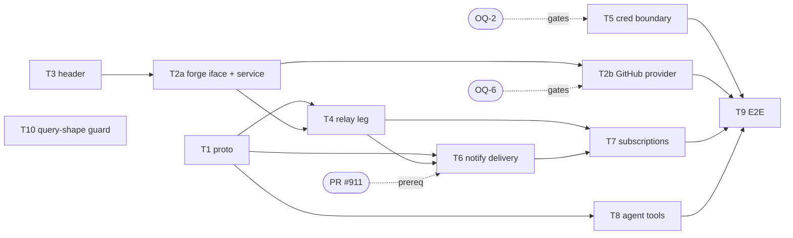

# Server as the ownership layer

Status: Active

Ledger: this record's PR appends DL-048 … DL-055 to
`docs/designs/product/DECISIONS.md` in the same diff (see §Ledger delta) and
supersedes no existing row, so it satisfies the ledger gate's touch-coupling
leg directly — no `Ledger-impact:` escape hatch is needed in the PR body.

Design for making the Compass **Server** the sole path from an agent to the
three human↔agent surfaces — **Issues, Chat, PRs**. All file+line grounding
below was verified against the working tree this run; paths are repo-relative
under `` unless otherwise pathed, so the record survives the
decided move of the Compass tree to `RigelBuild/compass`.

Tracker: RIG-1364.

## Problem / Intent

An agent that files an issue or opens a PR today would do it as a **human's**
forge account, so the work is unattributable and every agent needs its own
seat. The obvious fix — stand up Forgejo and Plane so each agent gets a real
account — loses on adoption: **nobody switches their issue tracker or their git
forge to use Compass**, and per-agent seats on GitHub cost money and admin per
agent. Instead the **Server** becomes the ownership layer: agents call a tool,
the Server knows which agent account called (it already resolves that,
`go/internal/runnerhub/relay_comms.go:105-113`), and the **Server** stamps a
machine-parseable author/owner header into the issue body, PR body, and comment
it writes — attribution on the artifact itself, on whatever forge the adopter
already runs.

The second payoff is credential collapse. Only the Server holds a forge
credential capable of creating issues and PRs; the agent container keeps
**only** the git credential it already has for pull/push of branches
(`go/internal/runtime/workspace.go:99-151`, the `$HOME/.git-credentials` store
helper). An agent that is compromised can push a branch. It cannot open a PR
claiming to be another agent, cannot close an issue, cannot read a private
tracker — **provided** the credential the operator declared for it is scoped to
contents-write only. Compass does not mint that credential and cannot inspect
its scopes. A second injection path (`SecretKindGH` → `~/.config/gh/
hosts.yml`) is **documented but not built** — no materializer exists, so no
declared secret reaches any container today — and it would put a forge token
in a container independently of this record once it is. So the collapse is
real, but its second half is operator hygiene rather than an enforced
invariant, and it becomes load-bearing when container secret injection ships —
see Decision 4 and OQ-2.

## Approach

### The substrate this composes with (verified, not reinvented)

Five facts do most of the work; every decision below leans on one of them.

1. **The attribution seam already exists, is proven, and is the precedent this
   record extends.** `go/internal/comms/agent_caller.go:57` is
   `PostAsAccount(ctx, account, req)` — with a `ListAsAccount` sibling at
   `:80`. It takes a **resolved** account, sets it on the context via
   `WithActor`, and delegates to *the same handler path a human caller takes*:
   "They reuse the exact PostMessage / ListMessages handler paths a human
   caller takes — same store calls, same D9 authz, same idempotency, same event
   fan-out … So a comms call the agent makes is indistinguishable downstream
   from one its account made by hand, and no new authz code exists to drift"
   (`agent_caller.go:10-17`). It fails **closed** on an unresolved actor:
   `errNoActor` maps to `CodeInvalidArgument` and the doc is explicit that "a
   missing actor is a hard error, never silent admin attribution"
   (`agent_caller.go:19-24`, `:36-42`) — because `actorFromContext` would
   otherwise fall back to the bootstrap admin.

   **Issues and PRs become a THIRD `*AsAccount` leg over this identical seam**,
   not a parallel path. Same signature shape (`ctx`, resolved
   `store.AccountID`, typed request), same fail-closed-on-empty-account rule,
   same "the account is an argument the caller resolved, never a request
   field". Decision 3's `forge.Service` is that leg.
2. **Two different identities, and this record must not conflate them.** The
   provisioning chain is durable and non-spoofable; the *live session binding*
   the forge path actually resolves against is in-memory. Both are correct for
   what they do, and telling them apart is what makes Decision 5's poller
   designable at all.

   **(2a) The durable provisioning chain.** Migration
   `go/internal/store/migrations/0003_agent_ownership.sql` persists
   `session_id → container_name → agent_account_id → home_channel_id` across
   two FK-linked tables (`agent_containers` at `:24-27`, `agent_sessions` at
   `:35-38`). Its header states the rooting property: the chain "is rooted
   non-spoofably: agent_account_id is the ProvisionAgentWorkspace REQUEST
   field, but container_name and session_id are SERVER-MINTED RESPONSE values
   … written only after the Runner call succeeds, so a row never claims a
   container/session the Runner failed to create and a client cannot forge a
   mapping it does not own" (`0003_agent_ownership.sql:6-13`), and it is
   "persisted, not in-memory", precisely "so the resolution survives a Server
   restart (the in-memory RunnerHub enrollment does not; a durable authz
   boundary cannot depend on it)" (`:2-5`). **Its consumer is
   `Store.RequireAgentSessionSubscriber`**
   (`go/internal/store/agent_sessions.go:90-115`) — the *human* door's
   authorization for `SubscribeAgentSession`. It is **not** the forge path's
   identity source. An earlier draft of this record cited it as though it were;
   the citation was accurate and the claim attached to it was not.

   **(2b) The forge path's AUTHORIZATION identity is in-memory, and that is
   correct.** `Hub.accountForSession`
   (`go/internal/runnerhub/relay_comms.go:78-83`) reads
   `h.sessionAccounts[sessionID]`, an in-process map declared at
   `go/internal/runnerhub/hub.go:120-127` and cleared wholesale by `enroll()`
   (`hub.go:269-270`) on a Runner reconnect. A missing binding is
   `CodeNotFound` (`relay_comms.go:105-113`): it **fails closed**, never to a
   stale account and never to the bootstrap admin. For a *per-call
   authorization* that is exactly the required property — an unbound session
   cannot act, and a call in flight when `unbindSession` fires
   (`relay_comms.go:68-72`) completes under the account that was valid when it
   arrived. T4 inherits this verbatim and adds nothing.

   **(2c) ROUTING identity is a different requirement, and the tree does not
   satisfy it.** Decision 5's poller runs on a Server-side timer, not inside a
   call, and must answer "which live session(s) does this `agent_account_id`
   have?" — including after a restart, when `sessionAccounts` is empty. The
   durable tables cannot answer it either: `agent_sessions` is **insert-only**.
   `RecordAgentSession` (`go/internal/store/agent_sessions.go:51`) is its only
   writer and the tree contains no `DELETE FROM agent_sessions` and no delete
   method (grepped this run, zero hits), so a durable reverse lookup would
   return every session an agent EVER had, dead ones included. **Durable
   routing therefore needs liveness state that does not exist yet.** This
   record does not build it, and every downstream element is designed against
   the fact rather than around it: routing stays the Hub's concern behind
   `NotifyForgeAccount` (T6), "the agent has no live session" is an explicit
   policy point rather than an error the poller logs (T7, and the open question
   OQ-10), and no element assumes a restart-surviving account→session map.

   On the human door the uniform reader is `auth.CallerFrom`
   (`go/internal/auth/interceptor.go:44-47`) — one reader across both doors,
   the network door resolving it from a bearer token
   (`interceptor.go:49-70`; tokens 32B CSPRNG, SHA-256-hashed in store,
   `go/internal/auth/token.go:51-65`) and the socket door from an ambient
   identity (`interceptor.go:83-98`).

   **And the chain's read-path authorization is a constant-shape single query,
   deliberately.** `Store.RequireAgentSessionSubscriber`
   (`go/internal/store/agent_sessions.go:90-115`) resolves the whole chain AND
   the caller's home-channel membership in ONE `EXISTS`
   (`agent_sessions.go:96-104`), returning `ErrNotFound` for both an unknown
   session and a non-member caller. The rationale is explicit and is a
   constraint on everything this record adds: merging the two "is load-bearing:
   it must not leak session existence to a caller who holds a foreign
   session_id — neither via the error class NOR via timing skew. A two-step
   shape (resolve, then separately check membership) would take one round-trip
   for an unknown session but two for a known-but-foreign one, so the latency
   itself would distinguish 'does not exist' from 'exists but forbidden'"
   (`agent_sessions.go:78-86`). This is the D9 not-found/forbidden merge, and
   Global Constraints turns it into a rule this record must not break.
3. **An agent→Server call path with server-side attribution already carries
   agent tool calls today.** The agent dials a per-container bind-mounted Unix
   socket and calls `AgentGateway.Comms`
   (`proto/compass/v1/agent_gateway.proto:47-48`); the Runner relays it as
   `RunnerService.RelayCommsCall` (`proto/compass/v1/runner.proto:87`,
   request/response `runner.proto:206-218`); the Server resolves
   `session_id → account` and executes under it
   (`go/internal/runnerhub/relay_comms.go:105-131`). The Runner asserts **no**
   account — "a `session_id` on the wire selects an account, it never carries
   one" (`relay_comms.go:14-15`). **The forge tools are a new family of
   variants on exactly this path.**

   **The agent-side transport already EXISTS** — only the tool layer over it is
   absent. The seam is `RunnerTransport`
   (`packages/compass-agent/src/transport/index.ts:46-54`), which already
   exposes `comms(req: CommsCallRequest): Promise<CommsCallResult>` (`:47`)
   alongside `publishSpine()`, `postConversationFrame` and `control`, over a
   Connect client dialing the Unix socket
   (`createUnixSocketTransport`, `index.ts:66-73`). Adding `forge()` is one
   method on a live interface, not a new transport. (Note: older records call
   this seam `RunnerCallTransport`; that name is stale — the built symbol is
   `RunnerTransport`, and this record uses the built name.)
4. **Server→agent push already works, bidirectionally, and is lossless.**
   `SubscribeComms` is a visibility-filtered server-stream with replay-at-zero
   then live tail (`proto/compass/v1/comms.proto:93`, handler
   `go/internal/comms/subscribe.go:31-93`, per-event D9 filter
   `subscribe.go:269-274`). Agent-side, `AgentGateway.Control`
   (`agent_gateway.proto:63`) is a server-stream the Runner pushes one
   `AgentControl` down per op, with Runner-assigned `control_seq`, retention,
   redelivery and apply-then-ack
   (`go/internal/runner/gateway/control.go:209-226` — **branch-only, see the
   provenance note below**, agent side
   `packages/compass-agent/src/transport/control-source.ts:1-51`).

   **Citation provenance — `control.go` is not on `main` yet.** Every
   `go/internal/runner/gateway/control.go` citation in this record was verified
   against the working tree on branch
   `compass-sea-1364-c3-runner-control-producer` (17 commits ahead of
   `origin/main`), where the file was introduced by **unmerged PR #911**. The
   file does **not** exist on `origin/main`: `git ls-tree origin/main
   go/internal/runner/gateway/` returns only `gateway.go`, `socket.go` and
   their tests (verified this run). So `control.go:100-102`,
   `:173-187`, `:199-207` and `:209-226` — cited in fact (4), Decision 5 and
   T6 — resolve **only** once #911 merges, and **T6 depends on #911**. Every
   other file+line citation in this record is main-resolvable.
5. **Zero existing forge integration.** No GitHub/Linear/issue/PR code exists
   anywhere in the tree; `Message.author_account_id`
   (`proto/compass/v1/comms.proto:244`) is comms-internal attribution with no
   tool-based creation path. This is greenfield, so the design is free to pick
   its shape — and obliged to compose with (1)–(4) rather than invent a
   parallel one.

### The risk this design exists to avoid: a second attribution path

State it plainly, because it is the failure mode that makes the whole record
worthless if it lands: **putting an issue/PR client directly in `go/server`
would create a second, parallel attribution path — and two attribution paths is
how you get a spoofable one.**

Concretely, the bad shape is a forge client reachable from a `CompassService`
handler that takes an author from somewhere other than the durable session
chain — a request field, a config default, a `CallerFrom` on a *human's* token
while the body claims an agent. The moment two code paths can write an owner
header, the weaker one is the contract.

Two rules follow, and both are enforced structurally rather than by review:

- **One chokepoint.** `forge.StampOwner` (Decision 2) is the **only** function
  in the tree that writes a `compass:owner` header, and the only caller that
  can supply its `Author` is `forge.Service`, whose every method takes a
  resolved `store.AccountID` as an argument (never a request field) — the
  `*AsAccount` rule from fact (1). `forge.Service` derives `Author` from that
  account by store lookup; there is no setter, no override, and no request
  field anywhere in `ForgeCallRequest` that names an author. Task T3's test
  suite includes a source guard: `compass:owner` appears in exactly one
  non-test source file. **That guard establishes a floor, it does not
  consolidate existing violations:** `compass:owner` currently appears in
  **zero** files anywhere in `compass` (grepped this run; independently
  verified at a fetched `origin/main` ref). T3's implementer is *creating* the
  one file, not merging several — so the guard lands green on day one and every
  subsequent addition is the regression it is there to catch.
- **One identity source.** The only way to obtain that resolved account is
  `Hub.accountForSession` (fact 2b) — the in-memory, fail-closed live-session
  binding, never a request field and never a durable lookup that could return a
  dead session (fact 2c). A future human-facing "file an issue as me" RPC would
  resolve its caller via `auth.CallerFrom` and pass *that* account into the same
  `forge.Service` method — a second *caller*, still one attribution path.
- **WRITE-side only, and say so.** Both rules above constrain the path that
  *writes* a header. They say nothing about the path that *reads* one back, and
  a forge body is authored by an untrusted party: any human with write access to
  the repo, any bot, any fork PR author. Nothing stops that party typing a
  well-formed `compass:owner` line naming any agent they like. So a parsed
  header is a **claim about** attribution, never attribution — and the record
  carries a matching read-side constraint (Global Constraints, "A parsed
  `ForgeAuthor` is display metadata") plus an open fork on what, if anything,
  would let the Server *verify* such a claim (OQ-1). Do not read the write-side
  chokepoint as covering the read path; it does not, and an earlier draft of
  Decision 2 called the read-side handle lookup a "confirmation", which it is
  not.

### Why the forge tools ride the EXISTING AgentGateway socket

Adopted from the compass-agent lane, and it is the right call: **identity comes
free from the bind-mount.** The socket is per-container and 1:1 with a session,
so the Runner knows by construction which container a call arrived from — the
caller is authenticated by the filesystem, and the agent cannot name a session
it is not (`agent_gateway.proto:40-46`; the `Control` subscribe request
deliberately "carries no session id: the per-container socket the call arrives
on IS the session identity", `agent_gateway.proto:124-126`).

A second channel — a direct agent→Server client, a separate port, an HTTP
sidecar — would mean re-solving, from scratch: authentication (a token would
have to enter the container, which the egress/credential posture forbids),
reconnect, correlation, dedup, and retention. All of that is already built and
tested on this socket. Riding it costs one RPC on an existing service.

### Decision 1 — a sibling `ForgeCallRequest`, on the SAME AgentGateway socket

**Decided: a sibling `ForgeCallRequest`/`ForgeCallResult` pair, a fifth
`AgentGateway` RPC on the existing per-container socket, and a sibling
`RelayForgeCall` Runner→Server RPC — NOT new members of `CommsCallRequest`'s
oneof, and NOT a second channel.**

Two separate choices, decided together:

*Same socket (not a second channel).* Settled above — identity is free from the
bind-mount, and a second channel re-solves auth, reconnect, correlation and
dedup for no gain.

*Sibling envelope (not an extension of `CommsCallRequest`).*
`CommsCallRequest`'s variants are *literally the public `CommsService` request
messages* — `PostMessageRequest`, `ListMessagesRequest`
(`agent_gateway.proto:69-75`) — because the Server executes them by delegating
to the very handler path a human caller takes (`agent_caller.go:10-17`). A
forge call has no `CommsService` counterpart and no in-process handler to
delegate to: it is a network call to an external system, rate-limited, with its
own auth and its own failure taxonomy (hence `ForgeCallError.retry_after_ms`,
which `CommsCallError` has no reason to carry). Folding it into
`CommsCallRequest` would make that message's name a lie and put a rate-limit
field on the comms error type. Two envelopes, **one relay pattern**, is the
honest shape — and it costs nothing, because the Runner leg is a mechanical
mirror of `RelayCommsCall` and the Server leg is the third `*AsAccount` leg of
the seam fact (1) established.

The wire (all in the internal-only `agent_gateway.proto` + `runner.proto`,
never public gen — see Global Constraints):

```proto
// agent_gateway.proto — the agent->Runner leg, a fifth AgentGateway RPC.
// Named `Forge` beside `Comms`; the envelopes are `ForgeCall*` because the SAME
// messages are reused verbatim as RelayForgeCallRequest.call /
// RelayForgeCallResponse.result (identical rationale to CommsCall*,
// agent_gateway.proto:22-29 — the buf.yaml ignore_only scope already covers
// this file).
service AgentGateway {
  // … existing Comms / Publish / PostConversationFrame / Control unchanged …
  rpc Forge(ForgeCallRequest) returns (ForgeCallResult);
}

// One agent-initiated forge call. `call_id` is the agent-minted correlation id
// (the SDK toolCallId), mirroring CommsCallRequest.call_id.
message ForgeCallRequest {
  string call_id = 1;
  oneof call {
    CreateIssueRequest      create_issue      = 2;
    CommentOnIssueRequest   comment_on_issue  = 3;
    GetIssueRequest         get_issue         = 4;
    ListIssuesRequest       list_issues       = 5;
    CreatePullRequestRequest create_pull_request = 6;
    CommentOnPullRequestRequest comment_on_pull_request = 7;
    GetPullRequestRequest   get_pull_request  = 8;
    SubscribeForgeRequest   subscribe         = 9;   // Decision 5
    UnsubscribeForgeRequest unsubscribe       = 10;  // Decision 5
  }
}

message ForgeCallResult {
  string call_id = 1;
  oneof result {
    Issue                   issue        = 2;   // create_issue / get_issue
    IssueComment            issue_comment = 3;  // comment_on_issue
    ListIssuesResponse      issues       = 4;
    PullRequest             pull_request = 5;   // create_pull_request / get_pull_request
    IssueComment            pr_comment   = 6;   // comment_on_pull_request
    SubscribeForgeResponse  subscribed   = 7;
    UnsubscribeForgeResponse unsubscribed = 8;
    ForgeCallError          error        = 9;
  }
}

// An in-band forge-call failure: a tool error the agent renders to the model,
// never a transport teardown. Mirrors CommsCallError (agent_gateway.proto:93-96)
// and adds `retry_after_ms` because a forge, unlike the in-process comms
// handler, rate-limits.
message ForgeCallError {
  string code = 1;            // Connect status token, e.g. "not_found", "resource_exhausted"
  string message = 2;
  uint32 retry_after_ms = 3;  // 0 when the forge gave no hint
}
```

The domain messages. `repo` is `"<owner>/<name>"` on GitHub and the project key
on Linear, and it is **REQUIRED on every call** — an empty `repo` is an
`invalid_argument` `ForgeCallError`, never a default. An agent is not bound to
one repo, so there is nothing to infer from (OQ-4, re-ruled): nothing is
stored, nothing is resolved, and no coordinate can drift.

```proto
// A forge issue as Compass sees it. `author` is the PARSED owner header
// (Decision 2) when one is present, else empty — so a native tool can surface
// "who wrote this" for anything another agent wrote, and honestly say nothing
// for a human-written issue.
message Issue {
  string repo = 1;
  uint64 number = 2;
  string title = 3;
  string body = 4;             // header STRIPPED; the raw body is never handed to the model
  string state = 5;            // "open" | "closed"
  string url = 6;
  ForgeAuthor author = 7;      // parsed owner header; unset for a non-Compass author
  string forge_author_login = 8; // the forge's own account login, always set
  repeated string labels = 9;
  int64 updated_at_unix_ms = 10;
}

// The parsed author/owner header (Decision 2). Present only when the body
// carried a well-formed Compass owner line.
//
// UNTRUSTED BY CONSTRUCTION. A forge body is authored by an untrusted party, so
// every field below is text that party chose. This message is DISPLAY METADATA
// and MUST NOT reach an authz, routing, trust or ownership decision (Global
// Constraints). `agent_account_id` in particular is a resolved local identity
// TYPE derived from attacker-controllable bytes; whether it survives at all —
// and whether the message gains a `verified` bool set by a forge-login
// cross-check — is OQ-1, which is LOAD-BEARING and gates T1's final field set.
// The shape below is the pre-OQ-1 draft, not a frozen contract.
message ForgeAuthor {
  string agent_handle = 1;      // Account.handle CLAIMED by the header; not proof
  string agent_account_id = 2;  // local account with that handle, if any; empty otherwise. Existence only — NOT authorship. OQ-1 may delete this field.
  string owner_handle = 3;      // the owning USER's handle CLAIMED by the header
  string session_id = 4;        // OQ-1(c): session_id is an authorization SUBJECT (RequireAgentSessionSubscriber takes it as the thing authorized against), so publishing it in a public body is not free. Likely replaced by a derived opaque correlation id, or dropped.
}

message IssueComment {
  string repo = 1;
  uint64 issue_number = 2;
  uint64 comment_id = 3;
  string body = 4;             // header STRIPPED
  string url = 5;
  ForgeAuthor author = 6;
  string forge_author_login = 7;
  int64 created_at_unix_ms = 8;
}

message PullRequest {
  string repo = 1;
  uint64 number = 2;
  string title = 3;
  string body = 4;             // header STRIPPED
  string state = 5;            // "open" | "closed" | "merged"
  string url = 6;
  string head_ref = 7;
  string base_ref = 8;
  ForgeAuthor author = 9;
  string forge_author_login = 10;
  bool draft = 11;
  ForgeChecksSummary checks = 12;  // rolled-up CI/status state (Decision 5)
  int64 updated_at_unix_ms = 13;
}

// The rolled-up CI + status-check state on a PR head, so a read and a
// subscription notification describe checks identically.
message ForgeChecksSummary {
  string head_sha = 1;
  string state = 2;              // "pending" | "success" | "failure"
  repeated ForgeCheck checks = 3;
}
message ForgeCheck {
  string name = 1;
  string state = 2;              // "queued" | "in_progress" | "success" | "failure" | "neutral" | "cancelled"
  string url = 3;
  bool required = 4;
}

message CreateIssueRequest {
  string repo = 1;               // REQUIRED; empty is invalid_argument (OQ-4)
  string title = 2;
  string body = 3;               // WITHOUT the owner header; the Server stamps it
  repeated string labels = 4;
}
message CommentOnIssueRequest {
  string repo = 1;
  uint64 issue_number = 2;
  string body = 3;               // WITHOUT the owner header
}
message GetIssueRequest {
  string repo = 1;
  uint64 issue_number = 2;
}
message ListIssuesRequest {
  string repo = 1;
  string state = 2;              // "" = open
  repeated string labels = 3;
  uint32 limit = 4;              // 0 = server default (30), capped at 100
}
message ListIssuesResponse {
  repeated Issue issues = 1;
}
message CreatePullRequestRequest {
  string repo = 1;
  string title = 2;
  string body = 3;               // WITHOUT the owner header
  string head_ref = 4;           // the branch the agent already pushed with ITS OWN git creds
  string base_ref = 5;           // empty = the repo default branch
  bool draft = 6;
}
message CommentOnPullRequestRequest {
  string repo = 1;
  uint64 pull_number = 2;
  string body = 3;               // WITHOUT the owner header
}
message GetPullRequestRequest {
  string repo = 1;
  uint64 pull_number = 2;
}
```

And the Runner→Server leg, a fifth `RunnerService` RPC, structurally identical
to `RelayCommsCall` (`runner.proto:87`, `runner.proto:206-218`):

```proto
// RelayForgeCall (unary, Runner->Server): execute one agent-initiated forge
// call under the agent account the session resolves to. Same trust model as
// RelayCommsCall (runner.proto:73-86): the Runner is a pure forwarder and
// asserts NO account; the Server resolves session_id -> account from its own
// binding and stamps the owner header itself.
rpc RelayForgeCall(RelayForgeCallRequest) returns (RelayForgeCallResponse);

message RelayForgeCallRequest {
  string session_id = 1;
  ForgeCallRequest call = 2;   // defined in agent_gateway.proto
}
message RelayForgeCallResponse {
  ForgeCallResult result = 1;  // defined in agent_gateway.proto
}
```

**How `executeCall()` grows — exactly.** Today
`go/internal/runnerhub/relay_comms.go:137-165` is a two-arm switch
(`CommsCallRequest_Post` → `h.comms.PostAsAccount`, `CommsCallRequest_List` →
`h.comms.ListAsAccount`, `default` → `CodeInvalidArgument`). It is **not
widened**. Instead a sibling `relay_forge.go` in the same package carries
`Hub.RelayForgeCall` + `executeForgeCall`, an exact mirror:

- `RelayForgeCall` re-uses `h.accountForSession(req.GetSessionId())`
  (`relay_comms.go:78-83`) verbatim — the fail-closed `CodeNotFound` on an
  unbound session (`relay_comms.go:105-113`) and the Runner-reconnect
  binding-drop guarantee come for free.
- The nil-dependency guard mirrors `errCommsUnavailable`
  (`relay_comms.go:85-88`): a hub with no `ForgeCaller` wired fails
  `CodeUnavailable`, never a silent success.
- Error mapping mirrors `commsCallError` (`relay_comms.go:171-176`): a forge
  failure becomes an in-band `ForgeCallError` inside a successful
  `RelayForgeCallResponse`, so a rate-limit or a 404 is a **tool error the
  agent renders**, not a transport teardown.
- `executeForgeCall` switches on the nine `ForgeCallRequest` variants and
  dispatches to the `ForgeCaller` seam (Decision 3), passing the resolved
  `store.AccountID` so the header stamper has an identity.

The `Hub` gains one field beside `comms CommsCaller` (`hub.go:148-152` shows
the existing constructor param), and `NewHub` one parameter — the same narrow-
sink pattern the hub already uses for `ConversationSink`/`CommsCaller` so the
hub never pulls a whole service in.

### Decision 2 — the author/owner header: a fenced HTML comment plus a visible line

This is a **wire contract adopters read in real GitHub bodies**, so the exact
bytes are specified here and pinned by a golden test (Task T3).

**The literal format.** Placed at the **TOP** of the body, two header lines,
then a `---` rule, then a blank line, then the author's content:

```text
<!-- compass:owner v1 agent=atlas owner=matt session=sess-7f3a9c1e -->
🧭 Written by **@atlas** (Compass agent, owned by **@matt**)

---

<the agent-authored body, verbatim>
```

Both lines are the header. The HTML comment is the **machine** half (GitHub and
Linear both hide HTML comments in rendered markdown); the emoji line is the
**human** half, rendered, so a person browsing the forge sees attribution
without reading source. The `🧭` is the Compass mark and doubles as a cheap
visual scan target.

Field grammar, enforced at write time and at parse time:

- `compass:owner` — the fixed sentinel. Parsing keys on this token, never on
  the emoji line, so the human half is free to be re-worded in a later version
  without breaking readers.
- `v1` — the header schema version, bumped only on an incompatible field
  change. A reader that meets `v2` and does not understand it returns
  `ForgeAuthor` **unset** rather than guessing (forward-compat: an unknown
  version is "not attributable by me", never a misattribution).
- `agent=<handle>` — `Account.handle` of the authoring agent
  (`comms.proto:104-107`). Handles match `^[a-z0-9][a-z0-9-]{0,38}$` (Global
  Constraints), which contains no space and no `-->`, so the comment cannot be
  broken by a hostile handle.
- `owner=<handle>` — the owning user's handle, resolved server-side from
  `AgentAccount.owner_user_id` (`comms.proto:130-133`).
- `session=<session_id>` — the session that wrote it, for trace correlation
  back to the Compass session tail. Same grammar constraint as handles.

**Placement: top (RULED 2026-07-27, Matt — reversing the draft's bottom
placement).** Who wrote an artifact is the most important thing to know about
it, so it goes first. The draft argued bottom placement to keep boilerplate out
of notification emails and `gh pr view` previews; **that argument optimised the
wrong thing.** A preview that omits the author is a preview missing its most
load-bearing field, and every truncation surface — email, `gh` list output,
embed cards — is precisely where a reader most needs attribution and is least
able to go find it.

Top placement also **dissolves** the two problems bottom placement created:

- **Header absence stops being the ordinary case.** Under bottom placement the
  header was the first thing lost to any truncation, so `ok=false` and the
  "not a Compass agent" rendering would have been common on genuinely-Compass
  artifacts. Top placement makes the header the **last** thing truncation
  reaches: a preview that shows anything shows the attribution. Absence
  returns to meaning what it should — probably not a Compass artifact.
- **The two rendered lines are the first thing a human sees**, which is the
  point, and the `🧭` becomes a scan target in a list view rather than a
  footnote.

One consequence is unchanged by the move and still holds:

- **The header's bytes are RESERVED, never prepended-then-checked.** GitHub
  enforces a body size limit, so stamping a near-limit agent body can push the
  request over it — losing the header, or the whole write. So `forge.Service`
  computes the stamped header's byte length FIRST and admits only
  `limit − len(header)` bytes of agent body; a body that does not fit is
  rejected with an in-band `ForgeCallError` naming the overage, so the model
  shortens and retries. It is never silently truncated into an unattributed
  artifact — an unattributed artifact is exactly the outcome this record
  exists to prevent, and producing one quietly to fit a size limit is the
  worst available failure. T3 pins both legs: an over-limit body errors, and a
  body at exactly `limit − len(header)` stamps successfully.

**Idempotence — re-writing a body must not duplicate the header.** Every write
path (`create_issue`, `create_pull_request`, and any future body edit) runs the
body through one function before sending it to the forge:

```go
// StampOwner returns body with exactly one owner header at the top. Any
// existing compass:owner header (of ANY version) is REMOVED first, along with
// its rendered companion line and the separating rule, so a re-write replaces
// rather than appends. Idempotent by construction:
// StampOwner(StampOwner(b, a), a) == StampOwner(b, a).
func StampOwner(body string, author Author) string

// StripOwner returns body with any compass:owner header block removed, and the
// parsed Author when one was present and understood. This is the READ half:
// the body handed to the model never contains the header (so the model cannot
// learn to forge one, and cannot be confused by it), and `author` becomes
// ForgeAuthor on the result message.
func StripOwner(body string) (clean string, author Author, ok bool)
```

`StampOwner` is applied **server-side, after** the agent's body arrives. The
agent's request field is documented "WITHOUT the owner header", but the
enforcement is not documentation: `StampOwner` strips any header the agent
embedded before stamping the real one, so **an agent cannot forge attribution**
— the last stamp wins and only the Server stamps. This is the load-bearing
security property of the whole record and Task T3 tests it directly (an agent
body containing a hand-written `compass:owner` line for a *different* agent
must come out stamped for the *calling* agent, with the forgery gone).

**Round-trip on read — and the read path does NOT confirm anything.** Every
read path (`get_issue`, `list_issues`, `get_pull_request`, and the comment
bodies inside them) runs `StripOwner` and populates `ForgeAuthor` from the
parse. So a native tool surfacing an issue another agent filed shows
`author.agent_handle = "atlas"` — the per-seat payoff.

**But a parse is not a verification, and this record earlier said otherwise.**
An earlier draft described resolving the parsed handle against the accounts
store as "the local resolution is the confirmation". That is wrong and the word
was load-bearing: resolving a handle confirms only that a local account with
that handle EXISTS. It says nothing about who authored the body. Since the body
is authored by an untrusted party, an attacker who types
`<!-- compass:owner v1 agent=atlas owner=matt session=sess-7f3a9c1e -->` into
any issue gets `ForgeAuthor` populated with a REAL local `agent_account_id` —
a Compass identity type minted from attacker-chosen bytes. The write side's
one-chokepoint rule does not cover this; the read side is a separate surface
and needs its own rule.

Two things follow, one folded and one open:

- **Folded (Global Constraints).** A parsed `ForgeAuthor` is **display
  metadata** and MUST NOT reach any authz, routing, trust or ownership
  decision. Whatever fields it carries, no consumer may branch on them.
- **Open (OQ-1, LOAD-BEARING).** Whether the read path can *verify* a header at
  all, and on what basis. The recommended basis is a **forge-login
  cross-check**: every genuine Compass write goes through exactly one Server
  credential (Decision 4), so every genuine header was authored by exactly one
  forge login — trust the parse only when the artifact's `forge_author_login`
  equals the Server's own forge identity, and otherwise return the header as an
  explicitly unverified claim. That is cheap, adds no state, and rests on the
  credential boundary this record already owns. OQ-1 decides it; T1's
  `ForgeAuthor` field set and T2a's service behaviour follow from the answer.

**Two headers in one body.** Only Server-written bodies are guaranteed to carry
exactly one, because `StampOwner` strips-then-stamps. An attacker writes as
many as they like. `StripOwner` therefore **refuses a body carrying more than
one `compass:owner` block**: it removes every block from `clean` (so no header
text ever reaches the model) and returns `ok=false` with no author. Not
first-wins, not last-wins — a multi-header body is definitionally not a
Server-written one, so there is no correct author to return, and picking one
would let an attacker choose which of two claims a reader believes. T3 pins it.

**A human edits the body.** Three cases, all handled by "parse defensively,
never repair silently":

- *Header intact, prose edited* — parses fine; `ForgeAuthor` still names the
  original agent. Correct: the agent did author it.
- *Header deleted* — `StripOwner` returns `ok=false`, `ForgeAuthor` unset, and
  `forge_author_login` still identifies the forge account. The read degrades to
  "a non-Compass-attributed artifact", which is exactly true. Compass does
  **not** re-stamp on read (a read is not a write, and re-stamping would let a
  read path silently mutate a human's edit).
- *Header mangled* (a stray character, a broken comment) — the sentinel-anchored
  regex fails, `ok=false`, same degradation. Never a partial parse.

**A non-Compass actor writes without one.** Universal — every human issue and
every dependabot PR. `ForgeAuthor` is unset, `forge_author_login` carries the
forge login, and tool output renders "by `<login>` (not a Compass agent)". No
Compass write path ever back-fills a header onto someone else's artifact.

**A non-Compass actor writes WITH a forged one.** The case the earlier
enumeration omitted, and the only one that is adversarial rather than
accidental. A human (or a bot, or a fork PR author) with write access types a
well-formed `compass:owner` line naming an agent that is not them — commonly an
agent that does exist locally, since handles are visible in every artifact
Compass writes. The parse succeeds; the handle resolves; nothing downstream
distinguishes it from a genuine header. **Under the folded rule this is
contained but not detected:** `ForgeAuthor` is display metadata, so no authz,
routing or ownership decision may consume it, and the blast radius is a
misleading line in tool output. **Detection is OQ-1's forge-login
cross-check**, which is the only mechanism proposed here that separates this
case from the genuine one. Until OQ-1 lands, tool rendering MUST NOT present a
parsed author as established fact. T3 pins the containment leg directly: a body
the Server never wrote, carrying a well-formed header naming another agent,
must NOT produce a verified author.

### Decision 3 — the forge adapter lives in a new `go/internal/forge` package

A new package is justified (per the compose-don't-invent rule) because there is
**no existing abstraction to extend**: fact (5) above — the tree has no forge
code at all. The package boundary mirrors `go/internal/secrets`, which is the
closest structural precedent: a Server-side capability behind an interface, its
own value types, mapping to store types at its own edge
(`go/internal/secrets/secrets.go:6-18`).

**The wiring pattern is the existing sink pattern, copied deliberately.**
`go/server/sinks.go` is the shape: the hub is constructed over narrow
interfaces it does not own — `newRunnerHub(brd, tail, comms, log)` passes a
`ConversationSink`, a `LifecycleSink`, a `SessionTailSink` and a `CommsCaller`
into `runnerhub.NewHub` (`go/server/sinks.go:74-85`), each declared in
`runnerhub` and satisfied elsewhere. That file's own rationale is exactly the
swappability this design needs: a minimal implementation ships first and the
real one "substitutes … behind the same interfaces without touching the hub"
(`sinks.go:16-19`), with `observedConversationSink` (`sinks.go:44-56`) as the
worked example of a logging stand-in behind a real interface.

So: `newRunnerHub` gains a fifth parameter, a `runnerhub.ForgeCaller` satisfied
by `forge.Service`. Two consequences fall out for free — the hub never imports
a forge client, and **every test and every dev run works without live forge
credentials**, because a fake `Provider` (or a `nil` `ForgeCaller`, which fails
`CodeUnavailable` exactly as a nil `CommsCaller` does, `relay_comms.go:85-88`)
substitutes at the seam. No test ever needs a GitHub token.

```go
// Package forge is the Server-side adapter to an external issue tracker / git
// forge. It is the ONLY place a forge credential is used, and the only place
// the compass:owner header is written or parsed. Providers are swappable:
// GitHub implements the whole interface; Linear implements the issue half and
// returns ErrUnsupported for the PR half.
package forge

// Author is the identity the Server stamps into a body. Resolved from the
// relayed session's agent account — never from a request field.
type Author struct {
    AgentHandle string
    OwnerHandle string
    SessionID   string
}

// Provider is one forge backend. Every method is a network call against the
// provider's API using the Server-held credential; none of them accept a
// credential argument (the provider closes over its own).
//
// Body handling is the PROVIDER'S contract, not the caller's: a Create/Comment
// method receives a body already stamped by the service layer, and a read
// method returns the body RAW — the service layer strips and parses. Keeping
// the header logic out of every provider is what makes a second provider cheap
// and keeps one golden test authoritative.
type Provider interface {
    Name() string

    CreateIssue(ctx context.Context, repo string, in CreateIssue) (Issue, error)
    CommentOnIssue(ctx context.Context, repo string, number uint64, body string) (Comment, error)
    GetIssue(ctx context.Context, repo string, number uint64) (Issue, error)
    ListIssues(ctx context.Context, repo string, f IssueFilter) ([]Issue, error)

    CreatePullRequest(ctx context.Context, repo string, in CreatePR) (PullRequest, error)
    CommentOnPullRequest(ctx context.Context, repo string, number uint64, body string) (Comment, error)
    GetPullRequest(ctx context.Context, repo string, number uint64) (PullRequest, error)

    // Checks returns the rolled-up CI/status state for a PR's current head.
    // Separated from GetPullRequest because the subscription poller needs it
    // alone, at a different cadence (Decision 5).
    Checks(ctx context.Context, repo string, number uint64) (Checks, error)
}

// ErrUnsupported is returned by a provider for an operation it cannot serve
// (Linear: the PR half). The service maps it to ForgeCallError{code:
// "unimplemented"} — an in-band tool error naming the provider, so the model
// learns "this forge has no PRs" rather than seeing a transport failure.
var ErrUnsupported = errors.New("forge: operation unsupported by this provider")

// Service is the seam the runnerhub calls. It owns header stamping/stripping,
// account->Author resolution, provider selection, and subscription bookkeeping;
// the Provider owns only the wire call. runnerhub depends on this interface
// (the narrow-sink pattern of hub.go:148-152), never on a concrete provider.
type Service interface {
    CreateIssue(ctx context.Context, account store.AccountID, req *compassv1internal.CreateIssueRequest) (*compassv1internal.Issue, error)
    CommentOnIssue(ctx context.Context, account store.AccountID, req *compassv1internal.CommentOnIssueRequest) (*compassv1internal.IssueComment, error)
    GetIssue(ctx context.Context, account store.AccountID, req *compassv1internal.GetIssueRequest) (*compassv1internal.Issue, error)
    ListIssues(ctx context.Context, account store.AccountID, req *compassv1internal.ListIssuesRequest) (*compassv1internal.ListIssuesResponse, error)
    CreatePullRequest(ctx context.Context, account store.AccountID, req *compassv1internal.CreatePullRequestRequest) (*compassv1internal.PullRequest, error)
    CommentOnPullRequest(ctx context.Context, account store.AccountID, req *compassv1internal.CommentOnPullRequestRequest) (*compassv1internal.IssueComment, error)
    GetPullRequest(ctx context.Context, account store.AccountID, req *compassv1internal.GetPullRequestRequest) (*compassv1internal.PullRequest, error)
    Subscribe(ctx context.Context, account store.AccountID, req *compassv1internal.SubscribeForgeRequest) (*compassv1internal.SubscribeForgeResponse, error)
    Unsubscribe(ctx context.Context, account store.AccountID, req *compassv1internal.UnsubscribeForgeRequest) (*compassv1internal.UnsubscribeForgeResponse, error)
}
```

`ForgeCaller` in `runnerhub` is `forge.Service` — declared in `runnerhub` as a
local interface so the dependency runs one way (runnerhub → forge, no cycle),
exactly as `CommsCaller` is declared locally against `comms.Comms`
(`relay_comms.go` header, `hub.go:148-152`).

**GitHub first, Linear for issues.** GitHub is the provider the fleet actually
runs on today (the container credential path already assumes a git forge,
`go/internal/runtime/workspace.go:47-51` `Credentials.Host`). Linear implements
`CreateIssue`/`CommentOnIssue`/`GetIssue`/`ListIssues` and returns
`ErrUnsupported` for the four PR methods and `Checks`. **Provider selection
follows from the caller's explicit coordinate host** (`github.com` → GitHub)
rather than from configuration.

**The Linear residue is CLOSED by OQ-4's re-ruling** (it was previously an
unruled open question living here). The earlier ruling resolved an empty `repo`
from the agent's clone, which left Linear — having no clone — needing the
operator-set mapping Matt had rejected for repos. **Under an always-explicit
`repo` there is nothing special about Linear:** the caller names the project
key exactly as it names `owner/name`, and the same host-derived selection
applies. No mapping, no configuration surface, nothing to decide before Linear
ships.

### Decision 4 — the Server's forge credential is a declared secret, resolved not stored

No new mechanism. The forge token is a **declared secret in the existing
registry** and resolved through the existing resolver:

- It is declared as a row in `secrets` with `kind = SecretKindGH` (2) and a
  non-empty `host` — the shape the migration already enforces with a CHECK
  constraint (`go/internal/store/migrations/0002_secrets.sql:51-55`,
  `go/internal/store/secrets.go:37-39`).
- Its **value is never persisted by Compass** — "NO value column —
  encryption-at-rest is the provider's job"
  (`0002_secrets.sql:10-14`). The Server resolves it on demand through
  `Resolver.Resolve(ctx, reason)`
  (`go/internal/secrets/resolver.go:37-49`), which reads the registry and pulls
  values from the configured SecretSpec provider
  (`resolver.go:135-139`). Values "live only in the provider and this process's
  memory during a resolve; they are never persisted by Compass and never
  logged" (`go/internal/secrets/secrets.go:20-22`), and every value-bearing
  type redacts under `%s`/`%v`/`%#v` (`secrets.go:146-156`).
- The GitHub provider therefore takes a **resolver + secret name**, not a token
  string, and resolves per call batch with a short in-process cache. It holds
  the value no longer than the call, and `forge.Author`/provider structs carry
  no token field, so a struct dump cannot leak it.

**The boundary, stated as an invariant — and stated as HALF enforced.** Today
the container receives the whole declared secret set — "the MVP injects the
whole store into every agent (inject-all); per-agent scoping is a named FUTURE
seam that adds a filter to FetchSecrets without reshaping this table"
(`0002_secrets.sql:10-14`). **This design requires that future seam now, for
exactly one name.** The Server's forge credential MUST NOT be injected, or the
whole record is theatre — an agent holding the Server's PR-creating token can
bypass the ownership layer entirely.

```sql
-- 0004_forge: server_only secrets + forge subscriptions.
ALTER TABLE secrets
  ADD COLUMN server_only BOOLEAN NOT NULL DEFAULT FALSE;
```

**`FetchSecrets` does not exist. Name the real filter point or T5 ships a
filter nothing calls.** Both this record's earlier draft and the `0002` comment
it quotes name `FetchSecrets` as the seam; grepping `compass` this run
returns exactly one hit — the comment itself, `0002_secrets.sql:14`. There is
no such function in the Go tree. The actual declarations seam is
`declarations interface { DeclaredSecrets(ctx) }`
(`go/internal/secrets/resolver.go:29-31`), consumed by `SpecResolver.Resolve`
(`resolver.go:135-139`), whose own doc says it is "inject-all: the whole store,
no per-agent filter (the future grants seam)" (`resolver.go:130-134`).

The complication that makes this a design question rather than a rename: **that
one `Resolve` serves BOTH consumers.** This record needs the Server's own
resolve to SEE `server_only` rows and container materialization not to — so
introducing `ContainerSecrets` (T5) is only half the change; the other half is
*switching the container-materialization caller* to it while the Server's
resolve keeps calling `DeclaredSecrets`. If that caller is not identified and
switched, T5's unit test passes against a filter that is on no live path.
Naming the exact caller is part of OQ-2, and T5 does not start until it is
named.

**And `server_only` is necessary but NOT sufficient — for a path that is
documented but NOT YET BUILT.** `SecretKindGH` is documented as "a gh
credential routed to GHCredentials.SetupScript; carries a Host"
(`go/internal/store/secrets.go:37-39`) and its `internal/secrets` counterpart
as "a gh credential routed to `~/.config/gh/hosts.yml`"
(`go/internal/secrets/secrets.go:58-60`). Read as live behaviour, that is a
second path from an agent container to a forge token, independent of anything
this record adds: `gh` CLI authentication inside the container, where a token
makes `gh issue create` a one-liner with no header and no Server involvement.

**Those two comments describe intent, not shipped code.** Verified this run:
`NewSpecResolver` has zero non-test callers in the Go tree (only its definition
at `go/internal/secrets/resolver.go:86`); `ResolvedSecret` appears in zero
files outside `go/internal/secrets/`; and the only credential that reaches a
container is `Workspace.Credentials` via `CredentialSetupScript`, which writes
`$HOME/.git-credentials` and nothing else — no `hosts.yml` anywhere in
`go/internal/runtime/workspace.go`. There is no materializer: nothing consumes
a resolved secret, so nothing can place one in a container. The registry can
*declare* a GH-kind secret (`go/internal/store/secrets.go:126` validates the
host) and that is where it stops. **`gh issue create` from inside a container
is not currently possible via anything Compass does.**

So the hazard is not a live bypass to contain — it is that **the documentation
describes a routing nobody built, and the next reader will take it for the
current design.** The operator-scope exposure is real but *deferred*: it
becomes load-bearing the moment container injection is built, because an
operator reaching for one token is the likelier real-world configuration.
`server_only` stops the SERVER's row from leaking; it does nothing about an
over-scoped operator-declared agent `gh` secret — once such a secret can reach
a container at all.

So state the boundary honestly, and state it in the right tense. **Today it is
enforced in NEITHER half**: `server_only` does not exist (zero occurrences
across `compass`, verified this run) and neither does any other
secret-scoping mechanism, so the entire boundary is currently operator hygiene.
**After T5 it is half enforced** — the `server_only` filter, which Compass
controls and can test — **and half operator hygiene** — the agent token's
scope, which Compass neither mints nor inspects. Do not read "half enforced" as
a description of the tree; it describes the state this record's own T5 creates.

That is why the claim below — a leaked agent credential "cannot open a PR" — is
contingent on the operator having declared a contents-write-only token, and
will remain so even after T5. Whether v1 closes the second half — defaulting
`server_only = TRUE` for `SecretKindGH` so injection is opt-IN, or minting the
agent credential itself and thereby changing what Compass is — is OQ-2(iii).

T5 pins what is mechanically pinnable, and pins the **destination** rather than
the declaration list: declare a `server_only` secret and assert it is absent
from the materialized container set, AND assert no `SecretKindGH` row reaches
`~/.config/gh/hosts.yml` in a materialized container unless explicitly opted
in. A regression in either is the one that matters.

**What the agent keeps.** Exactly one credential, unchanged from today: the git
credential written into `$HOME/.git-credentials` by
`Workspace.CredentialSetupScript()`
(`go/internal/runtime/workspace.go:99-151`), scoped to `$HOME` and never the
workspace `.git/config` so it cannot leak into the tree
(`workspace.go:5-8`). It authenticates `git clone`, `git fetch`, `git push` and
nothing else. It is intended to be a **separate credential from the Server's** —
a push-scoped deploy key or fine-grained PAT with contents-write only, no issues
scope, no pull-requests scope. That scope difference is what would make the
boundary real; per the paragraph above it is an operator property Compass
asserts but does not enforce, not an invariant the code holds.

### Decision 5 — subscriptions: Server-stored, poll-based in v1, delivered on the EXISTING push path

**The model.** An agent subscribes to a *forge artifact*: an issue or a PR,
named by `(provider, repo, kind, number)`. The subscription is **Server-side
state in Postgres** — not agent memory — so it survives the agent's container
being replaced (the MVP container is stateless) and a Server restart.

**Two cursors, not one — the fetch cursor and the delivery cursor are different
things.** An earlier draft put a single `last_seen_etag` on the per-subscriber
row while the poller advanced it per-artifact, and made advancement conditional
on a successful notify. That is two data models in one design, and it produces
**deterministic duplicates**: with N subscribers to one artifact and one shared
cursor, if A's notify succeeds and B's fails the cursor cannot advance, so next
tick A is notified again for the same change. Subscribers to one artifact
routinely have different liveness (containers are stateless and replaced), so
this is the normal case, not a race. Worse, combined with fact (2c) — no live
session survives a restart and no durable routing exists — *every* notify fails
after a restart, so no cursor ever advances, every artifact re-diffs every 60s
forever, and returning agents each get the whole backlog at once. A permanent
wedge from a design that reads as conservative.

The fix is to stop conflating them:

- **The FETCH cursor is per artifact** and exists only to make the conditional
  GET cheap. It is the ETag the provider last returned, and it advances
  **unconditionally on any 200** — it is a caching fact about upstream, and it
  has nothing to do with whether anyone was told. It lives in its own table
  keyed by the artifact, not on a subscription row, because N subscribers share
  exactly one.
- **The DELIVERY cursor is per subscriber**: a high-water mark of what THIS
  agent has been told, advanced only after that agent's own successful notify.
  One offline agent can no longer wedge anyone else, and a re-notify is scoped
  to the subscriber that actually missed it.

```sql
-- 0004_forge (same migration as the server_only column above).
-- NOTE (forward pointer): this table ships RENAMED `agent_forge_subscriptions`.
-- The forge-poll driver record renames DL-053's `forge_subscriptions` to
-- disambiguate this per-ARTIFACT, agent-owned subscription from the board's
-- per-REPO poll target `forge_repo_subscriptions`. The rename is name-only;
-- the shipped table is additionally coordinate-aligned (SMALLINT
-- `forge_provider` + a `forge_host` column, recomposed keys) per DL-163, so
-- see that DDL for the exact shape. Authority: DECISIONS.md DL-163; rationale:
-- compass-forge-poll-driver/design.md (OQ-C). A reader grepping
-- `forge_subscriptions` from this frozen record finds the mapping here.
CREATE TABLE forge_subscriptions (
    id               TEXT PRIMARY KEY,
    agent_account_id TEXT NOT NULL REFERENCES agent_accounts (account_id) ON DELETE RESTRICT,
    provider         TEXT NOT NULL,          -- "github" | "linear"
    repo             TEXT NOT NULL,
    -- 1 issue, 2 pull request — matching ForgeArtifactKind's wire values, whose
    -- 0 is the lint-required _UNSPECIFIED sentinel and is never persisted.
    kind             SMALLINT NOT NULL CHECK (kind IN (1, 2)),
    number           BIGINT NOT NULL,
    -- DELIVERY cursor: the last upstream revision THIS subscriber was
    -- successfully notified about. Advanced per subscriber after its own
    -- notify succeeds, never on behalf of another subscriber. Empty means
    -- "never notified" — a fresh subscription is caught up to the artifact's
    -- current revision at Subscribe time so subscribing does not replay
    -- history.
    delivered_revision TEXT NOT NULL DEFAULT '',
    delivered_at     TIMESTAMPTZ,
    created_at       TIMESTAMPTZ NOT NULL DEFAULT now(),
    UNIQUE (agent_account_id, provider, repo, kind, number)
);
CREATE INDEX forge_subscriptions_artifact_idx
    ON forge_subscriptions (provider, repo, kind, number);

-- FETCH cursor: one row per distinct subscribed artifact, shared by every
-- subscriber to it. Purely a conditional-GET cache. `etag` advances on any 200
-- and is NEVER conditioned on delivery. `revision` is the provider-independent
-- content revision DetectChanges diffs against and each subscriber's
-- delivered_revision is compared to. Garbage-collected when the artifact's last
-- subscription is deleted.
CREATE TABLE forge_artifact_cursors (
    provider     TEXT NOT NULL,
    repo         TEXT NOT NULL,
    kind         SMALLINT NOT NULL CHECK (kind IN (1, 2)),
    number       BIGINT NOT NULL,
    etag         TEXT NOT NULL DEFAULT '',   -- issue/PR endpoint
    comments_etag TEXT NOT NULL DEFAULT '',  -- comments endpoint
    checks_etag  TEXT NOT NULL DEFAULT '',   -- check-runs endpoint (PRs only)
    revision     TEXT NOT NULL DEFAULT '',
    snapshot     JSONB,                      -- last observed state, for DetectChanges
    polled_at    TIMESTAMPTZ NOT NULL DEFAULT now(),
    PRIMARY KEY (provider, repo, kind, number)
);
```

Three ETag columns rather than one, because the cost accounting below requires
it: a conditional GET is per ENDPOINT, and detecting a comment needs the
comments endpoint while detecting a check flip needs check-runs.

```proto
message SubscribeForgeRequest {
  string repo = 1;
  ForgeArtifactKind kind = 2;
  uint64 number = 3;
}
// Zero is the _UNSPECIFIED sentinel: agent_gateway.proto is NOT in buf.yaml's
// ENUM_ZERO_VALUE_SUFFIX exemption (that covers comms.proto only,
// buf.yaml:30-31), so the sentinel is required. An unspecified kind is a
// CodeInvalidArgument at the service edge, never a defaulted "issue".
enum ForgeArtifactKind {
  FORGE_ARTIFACT_KIND_UNSPECIFIED = 0;
  FORGE_ARTIFACT_KIND_ISSUE = 1;
  FORGE_ARTIFACT_KIND_PULL_REQUEST = 2;
}
message SubscribeForgeResponse { string subscription_id = 1; }
message UnsubscribeForgeRequest { string subscription_id = 1; }
message UnsubscribeForgeResponse {}
```

**Addressing: identity IS the routing — the unset-means-home convention is
binding here too.** `PostMessageRequest.container` is a **oneof**
(`proto/compass/v1/comms.proto:556-558`), and the home-channel default is
expressed by leaving that oneof **unset**, resolved server-side:
`defaultChannel` returns the request untouched when a channel is named and
otherwise substitutes the account's home channel
(`go/internal/comms/agent_caller.go:109-127`, list sibling at `:131-136`),
"so the common 'post in my own channel' case needs no id plumbed into the
container" (`agent_caller.go:105-108`). An agent posting to its home channel
therefore **never names a channel** — its identity is the routing.

This is a hard constraint on the subscription design, not a nicety. If a forge
notification is ever rendered into a channel — Decision 6's chat ping is
exactly that, and any later "deliver subscription updates as messages" feature
would be too — that write MUST use the same unset-means-home convention and the
same server-side resolution, never a `channel_id` carried in a subscription
row or a notification payload. Two addressing models for the same surface
(identity-routed for comms, explicitly-addressed for forge) would mean an agent
has to know its own home channel id to use half its tools, which is exactly the
id-plumbing `defaultChannel` exists to prevent — and would create a second
place a channel can be chosen, mirroring the second-attribution-path failure
above.

Two concrete consequences, both pinned by tests (T4, T7):

- `forge_subscriptions` carries **no channel column** and
  `SubscribeForgeRequest` carries **no channel field**. A subscription is
  addressed by `(agent_account_id, provider, repo, kind, number)` and nothing
  else; where its notifications land is derived from the agent account, never
  stored beside the subscription.
- `ForgeNotification` carries **no channel field** either. It is delivered to
  the *agent* over the control lane; if the agent then decides a human should
  see it, it posts through the ordinary comms tool with the container oneof
  unset — one addressing model, one resolution site.

**How the Server learns of upstream changes — decided: conditional polling in
v1; webhooks are a deferred additive accelerator, not a fallback.**

| | Webhook | Poll |
| --- | --- | --- |
| Latency | seconds | one tick (60s default) |
| API budget | ~0 | ~2 conditional GETs per subscribed issue per tick, ~3 per PR (see the corrected arithmetic below) |
| Operational cost | **a public HTTPS ingress the Server must expose**, a shared secret per repo, HMAC verification, replay/dedupe handling, and per-repo webhook registration (admin rights on every adopted repo) | none — outbound only |
| Adopter friction | high: many adopters cannot or will not expose the Server, and many cannot install a webhook on a repo they do not admin | none |

The operational asymmetry decides it. Compass's whole positioning here is "work
with the forge the adopter already has" — and requiring a public ingress plus
repo-admin webhook installation is a *larger* adoption ask than the per-seat
problem this record exists to remove. **v1 polls**, with per-artifact batching
(N subscribers to one PR = one fetch). The webhook path is designed as an
**additive accelerator**: a `forge_webhooks` config and an ingress handler that
feeds the *same* change-detection function the poller feeds, so enabling it
changes latency and nothing else. It is out of v1's task list (OQ-3).

**The corrected arithmetic — an earlier draft undercounted by 2–4×.** It said
"1 conditional GET per subscribed artifact per tick". That is wrong: a
conditional GET is per ENDPOINT, and one artifact spans several.

- An **issue** costs ~2: the issue endpoint (state/title/labels) and the
  comments endpoint. A comment does not change the issue resource's own ETag,
  so `FORGE_NOTIFICATION_KIND_COMMENT` cannot be detected from one call.
- A **PR** costs ~3: the PR endpoint, comments, and check-runs — the last
  because `Provider.Checks` is deliberately a separate method "because the
  subscription poller needs it alone".

Worked for the fleet this ships to: 30 agents × ~10 subscriptions ≈ 300
subscriptions, deduping to ~150 distinct artifacts, at 2–3 requests each ≈
300–500 requests per tick ≈ **18k–30k requests/hour issued**.

**That is viable only while most responses are 304, and the exemption is
narrower than it looks.** GitHub documents that a conditional request returning
304 does not count against the primary rate limit
([REST best practices](https://docs.github.com/rest/guides/best-practices-for-using-the-rest-api)),
so 18k–30k issued can sit far under 5000/hr consumed. But the assumption breaks
exactly when it matters: **an active PR with running CI returns 200 on
check-runs every single tick**, and a busy period is precisely when agents are
also writing. And 304s are exempt from the *primary* limit, not from
secondary/abuse limits — firing 300+ requests as a burst is itself a
concurrency risk, so the poller MUST pace within a tick rather than fan out.

**The failure mode is inverted, and that is the part worth deciding.** The
poller and every agent-initiated create/comment share **one** Server credential
and therefore **one** 5000/hr bucket. There is no budget accounting, no
backpressure, and no priority split — so background polling can exhaust the
quota that the foreground ownership layer needs to file an issue or open a PR.
Background starving foreground is the wrong way round, and it fails as a cliff
rather than a slowdown. The recommended shape is a **reserved floor for
agent-initiated writes**, with the poller consuming only the remainder and
degrading its tick interval under pressure — a dozen lines that convert the
cliff into a graceful slowdown. Whether v1 carries it, and whether the cadence
is fixed or adaptive, is **OQ-5**; T7 does not ship without whichever answer
lands.

**The delivery path — VERIFIED: no new transport, and no new proto beyond the
notification payload.** This is the fact the design was asked to check, and it
holds in both directions:

- **Server → Runner.** The Server already pushes to the Runner over the
  `Sessions` bidi stream's response half — "the Server's *response* half of a
  Runner-opened bidi stream" (`proto/compass/v1/runner.proto:22-24`,
  `rpc Sessions` at `:62`), with the command oneof at `runner.proto:132-141`.
  A forge notification is one additional variant on that existing oneof
  (`SessionsResponse.forge_notification = 7`) — additive, buf-breaking-safe.
- **Runner → agent.** The Runner already pushes typed control ops to the agent
  over `AgentGateway.Control` (`agent_gateway.proto:60-63`), with
  Runner-assigned `control_seq`, retention, subscription takeover and
  apply-then-ack redelivery (`go/internal/runner/gateway/control.go:209-226`
  — **branch-only, unmerged PR #911**; see the provenance note in fact 4),
  and the agent already consumes and dispatches them
  (`packages/compass-agent/src/transport/control-source.ts:1-51`). A forge
  notification is one additional `AgentControl` oneof variant
  (`deliver`-adjacent), which the Runner sends through the existing
  `ControlSender.Send` (`control.go:100-102` — branch-only, #911) and
  inherits lossless delivery from. **T6 therefore depends on #911 merging**,
  which is a hard ordering fact, not a preference.

  **One built-in caveat, load-bearing:** `representable()`
  (`control.go:173-187` — branch-only, #911) currently rejects the four
  empty-shell variants (`steer`/`deliver`/`replay`/`config`) so an unpayloaded
  op can never be sent; its `default` arm returns true, so a new variant is
  representable automatically and a rejection is a loud `CodeInvalidArgument`
  at the callsite rather than a silent drop. The new `ForgeNotification`
  variant carries a **real, fully representable payload** (scalars + an
  existing message), so it passes `representable()` unchanged — it must be
  added to neither the rejection list nor `replayPath()` (`control.go:199-207`
  — branch-only, #911). Task T6 pins that with a test.

  Agent-side, the new variant joins the domain union in
  `packages/compass-agent/src/control.ts:32-58` and gets an arm in
  `#applyControl` (`packages/compass-agent/src/agent.ts:135-202`). It is an
  **immediate-dispatch** op, like `deliver`: routed on the event loop rather
  than through the sequential iterator, so a notification arriving mid-turn is
  not stuck behind the running turn's `await`.

- **`SubscribeComms` is NOT the delivery path**, and this is worth stating
  because it is the tempting wrong answer. `SubscribeComms`
  (`comms.proto:93`, `go/internal/comms/subscribe.go:31-93`) is the
  **Client**-facing stream — UIs subscribe to it; agents do not. An agent's
  inbound lane is `AgentGateway.Control`. `SubscribeComms` still matters here
  for the *human* half: when a notification results in a chat ping (Decision
  6), that ping is a normal `PostMessage`, which fans out on `SubscribeComms`
  to every UI, with zero new code.

```proto
// The notification payload, carried identically on both hops.
message ForgeNotification {
  string subscription_id = 1;
  string provider = 2;
  string repo = 3;
  ForgeArtifactKind kind = 4;
  uint64 number = 5;
  string url = 6;
  ForgeNotificationKind change = 7;
  // Set for COMMENT: the new comment, header-stripped, author-parsed.
  IssueComment comment = 8;
  // Set for CHECKS: the rolled-up state after the change.
  ForgeChecksSummary checks = 9;
  // Set for STATE: the new state string ("closed", "merged", …).
  string state = 10;
}
enum ForgeNotificationKind {
  FORGE_NOTIFICATION_KIND_UNSPECIFIED = 0;
  FORGE_NOTIFICATION_KIND_COMMENT = 1;   // a new comment on the issue/PR
  FORGE_NOTIFICATION_KIND_STATE = 2;     // opened/closed/merged/reopened
  FORGE_NOTIFICATION_KIND_UPDATE = 3;    // title/body/labels edited
  FORGE_NOTIFICATION_KIND_CHECKS = 4;    // CI or status-check state changed
}
```

**CI and status checks — first-class in the draft, but this is a SCOPE
decision, so say so.** As drafted the poller calls
`Provider.Checks(ctx, repo, number)` for every subscribed PR on the same tick
and emits `FORGE_NOTIFICATION_KIND_CHECKS` when the rolled-up state or any
individual check's state differs from the stored cursor. GitHub's check-runs
and legacy commit-statuses are both folded into `ForgeChecksSummary` by the
provider, so the agent sees one model.

What that costs, stated plainly because it arrived as an implementation detail
rather than a weighed choice: CI monitoring is a **full sub-feature** —
`Provider.Checks`, `ForgeChecksSummary`, `ForgeCheck`, a notification kind, a
third ETag column and a separate poll leg (~a third of per-artifact request
cost), and an open question of its own — shipped inside a v1 whose stated
content is "pings in chat plus asks". Decision 6's fence holds exactly where it
was drawn; this is scope one layer beneath it. It is defensible on merit —
checks are plausibly the thing an agent actually waits on — but it has never
been weighed against "do not overbuild", and **it is Matt's line to draw, not
this record's**. See the new **OQ-9**. Cadence, if checks stay, is OQ-5.

### Decision 6 — notifications v1: pings in chat plus asks, nothing else

A notification the agent decides a human should see becomes a **normal chat
message** in the agent's home channel via the comms tool it already has
(`comms_post_message`, DL-028), with a link out to the PR or runbook. When it
needs an answer, the agent raises a normal `ask` — `PostMessageRequest.blocks`
already carries `Ask` blocks (`comms.proto:258-267`, `278-290`) and asks are
answerable in place on every surface (DL-037). Both render today with **zero
new UI code**: they are ordinary comms messages fanned out on `SubscribeComms`.

**v1 explicitly does NOT:** add a notifications page, a notification centre, a
bell/badge, an unread count, a per-notification read/dismiss state, a
notification store, a digest/rollup, notification preferences, or any desktop
or email push. If a notifications surface is ever wanted, it is a separate
record built on the `forge_subscriptions` table this one lands.

## Alternatives considered

**Per-agent forge accounts (Forgejo + Plane).** Give every agent a real
account on a self-hosted forge and tracker; attribution is then native and no
header is needed. **Lost on adoption, decisively.** It requires the adopter to
migrate their issue tracker and their git forge to use Compass — the single
largest switching cost in a team's toolchain, and one no team pays for an agent
harness. It also makes Compass responsible for operating a forge (backups,
upgrades, availability of the thing holding the team's source of truth), which
is not the product. On GitHub the same idea costs a paid seat per agent plus
org-admin work per agent. Explicitly **deprioritised**: Forgejo, Plane, forge
migration and per-agent forge accounts are not proposed anywhere in this
record. The header buys the same attribution on the forge the adopter already
has, at the cost of one machine-parseable line in a body.

**Agents hold forge creds and write their own header.** The agent gets an
issues/PR-scoped token and stamps its own `compass:owner` line. Simpler — no
relay leg, no `forge` package on the Server. **Rejected on two independent
grounds.** (1) *Attribution becomes self-asserted.* A header written by the
party it names is not attribution, it is a claim; any agent could stamp another
agent's handle, and the whole per-seat story collapses into "the artifacts say
whatever the agent typed". The Server-side stamp is unforgeable precisely
because `StampOwner` is fed an account the agent cannot choose. (2) *It
re-inflates credential sprawl* — the exact problem this record exists to
collapse. Every container would hold a token that can open PRs and read the
tracker, so a single compromised agent reaches the whole org's issues; today's
container credential is *intended* to be push-only and that is worth keeping —
though note that no scoping mechanism enforces that intent today, and even
after T5 the boundary is only half enforced (Decision 4, OQ-2). So this ground
is "keep the intent and close the gap", not "the gap is already closed". It
would also create the second attribution path called out above, since the
Server would still need a write path for human-initiated and system-initiated
artifacts.

**Extending `CommsCallRequest`'s oneof instead of a sibling envelope.**
Rejected in Decision 1: `CommsCallRequest`'s members are the public
`CommsService` request messages executed through the human handler path
(`agent_caller.go:10-17`), and a forge call has no such counterpart. The
concrete cost of folding them together is a rate-limit field on
`CommsCallError` and a message name that no longer describes its contents.

**A second agent→Server channel for forge calls.** Rejected: identity is free
on the existing per-container socket (the Runner knows which container it
mounted it into, `agent_gateway.proto:40-46`), whereas a second channel
re-solves authentication — which would require a token inside the container,
against the credential posture — plus reconnect, correlation, dedup and
retention, all already built and tested here.

**A forge client wired directly into `go/server`.** Rejected as the primary
failure mode this design guards against: it creates a second attribution path,
and two attribution paths means the weaker one is the real contract. See §The
risk this design exists to avoid.

**Webhooks as the v1 change-detection mechanism.** Lower latency and near-zero
API spend, but it demands a **public HTTPS ingress on the Server**, a shared
secret per repo, HMAC verification, replay handling, and webhook installation
rights on every adopted repo. That is a bigger adoption ask than the per-seat
problem this record removes, and it fails the same "works with the forge you
already have" test that killed Forgejo. **Decided: poll in v1**, with
conditional requests (a `304` does not consume GitHub's *primary* rate budget —
though it is not exempt from secondary/abuse limits, and an active PR's
check-runs return `200` every tick) and per-artifact batching; the webhook path
is designed as an additive accelerator feeding the same change-detection
function, deferred to its own record (OQ-3). The deferral now rests on the
corrected quota analysis plus a budget guard, not on adoption friction alone —
see Decision 5 and OQ-5.

**Delivering notifications on a new stream.** Rejected as unnecessary: verified
above that both hops already exist and are lossless —
`SessionsResponse`'s command oneof Server→Runner
(`proto/compass/v1/runner.proto:132-141`) and `AgentGateway.Control`
Runner→agent (`agent_gateway.proto:60-63`,
`go/internal/runner/gateway/control.go:209-226`). One additive oneof member on
each is the whole delivery design.

**A notifications page in the Client for v1.** Rejected per Matt's explicit
scope-fence: v1 is chat pings plus asks, which render today with zero new UI
code. A notification centre is a separate record if it is ever wanted.

## Global Constraints

Every task below inherits these; they are not repeated per task.

### Security invariants (non-negotiable)

Each one below is stated so a test can fail on it. **Wording is enforceability
here:** "indistinguishable" quantifies over all observers and no test can
assert it; "byte-identical" is a diff. Where a constraint reads as a
property-over-observers, it has been restated as a concrete comparison, a
source-level assertion, or a golden output — and where restatement genuinely
fails (one case below), the constraint is scoped down and the reason is stated
rather than left as an aspiration a green test would appear to satisfy.

- **One attribution chokepoint.** `forge.StampOwner` is the only function in
  the tree that may write a `compass:owner` header, and its `Author` may be
  derived only from an account resolved through `Hub.accountForSession`
  (`go/internal/runnerhub/relay_comms.go:78-83`) or `auth.CallerFrom`
  (`go/internal/auth/interceptor.go:44-47`). No request message anywhere may
  carry an author/owner field.
  *Enforced as:* T3's source guard — the literal `compass:owner` appears in
  exactly **one** non-test file under `oss/compass`. This establishes a floor,
  not a ceiling: the string appears in **zero** files today (grepped this run;
  independently verified at `origin/main`), so the guard is green the day T3
  lands and every later addition is the regression it exists to catch. Plus
  T3's forgery test and a T1 assertion that no `ForgeCall*` request message
  declares an author-shaped field.
- **A parsed `ForgeAuthor` is DISPLAY METADATA and must not reach a decision.**
  A header parsed out of a forge body was written by an untrusted party, so it
  is a claim, never a fact. No authz, routing, trust or ownership decision
  anywhere may branch on `ForgeAuthor` or any field of it.
  *Enforced as:* a source-level assertion — outside `go/internal/forge`'s own
  parse/render path and the TS rendering layer, no reference to `ForgeAuthor`
  or `agent_account_id`-from-parse appears in a conditional. Concretely T3
  asserts the containment case directly: a body the Server never wrote, bearing
  a well-formed header naming another agent, produces **no verified author**.
  Whether the read path can verify a header at all is OQ-1; until it resolves,
  no consumer may treat a parse as established.
- **Fail closed on an unresolved actor.** Every `forge.Service` method requires
  a non-empty `store.AccountID` and errors rather than defaulting — the same
  rule and the same reason as `errNoActor`
  (`go/internal/comms/agent_caller.go:19-24`, `:36-42`): a wiring bug must
  never fall through to bootstrap-admin attribution.
  *Enforced as:* T2a test (c) — an empty account returns an error and reaches
  no provider (asserted on a recording fake, so "reached no provider" is a
  call-count comparison, not a claim).
- **Every forge read returns a BYTE-IDENTICAL error for forbidden and
  nonexistent.** The provider's 403-vs-404 distinction is flattened at the
  `forge.Service` edge, before it reaches a result message: both produce the
  same `ForgeCallError` — same `code`, same `message`, same `retry_after_ms`.
  *Enforced as:* T2a test (d), a `proto.Equal` / byte comparison of the two
  serialized errors. This is the enforceable half of the D9 not-found/forbidden
  merge `RequireAgentSessionSubscriber` implements
  (`go/internal/store/agent_sessions.go:73-89`).

  **Timing parity is explicitly OUT OF SCOPE for forge reads, and this is a
  narrowing.** An earlier draft required the two be "indistinguishable by error
  class *and* by timing". The timing half is not merely untested — against an
  external API it is **unattainable**, and stating it as a MUST would bless a
  false belief that a green byte-comparison test satisfies it. In the store the
  property is real because one `EXISTS` collapses both outcomes into one boolean
  in one round trip (`agent_sessions.go:78-89`). A forge read is a network call
  to GitHub, which answers 403 and 404 on **its** timelines; flattening the
  status after the response cannot erase a latency difference produced upstream,
  and no Server-side code can. If the timing channel is ever judged a real
  threat, the answer is constant-delay padding adopted as an explicit decision
  with its latency cost — never smuggled in as an inherited invariant.
- **Any new store resolver is ADDITIVE — never a refactor of
  `RequireAgentSessionSubscriber`.** If the ownership layer needs a different
  projection of the chain (e.g. one returning `home_channel_id`), it is a
  **new** constant-shape single query alongside the existing predicate. Do not
  decompose the existing `EXISTS` into reusable steps: a two-step shape
  reintroduces the timing oracle its comment explicitly forbids
  (`agent_sessions.go:80-86`), and it would look like a clean refactor in
  review.
  *Enforced as:* **T10**, a golden query-shape test over
  `RequireAgentSessionSubscriber`. Prose has no mechanism and this is the
  constraint most exposed to a plausible-looking refactor, so it gets the
  in-tree treatment the same problem already has: `classifyProcedure` is guarded
  by `classify_exhaustive_test` precisely because "gochecksumtype cannot police
  this coverage" (`go/internal/auth/admin_gate.go:38-46`). A golden test pinning
  the emitted SQL to exactly one statement containing exactly one `EXISTS`
  reddens on any decomposition, which is the mechanical form of "any PR touching
  that function is a security change".
- **No forge credential enters a container — half enforced AFTER T5, enforced
  in neither half TODAY.** This is the record's central claim and it does not
  hold uniformly. Read the tense carefully: **no secret-scoping mechanism
  exists in the tree** (`server_only`: zero occurrences across `oss/compass`;
  `FetchSecrets`: named only in a `0002_secrets.sql:12-14` comment), so today
  the whole boundary is operator hygiene. T5 creates the first half. The
  halves, once it lands:
  - *Enforceable (Compass controls it, a test asserts it) — created by T5, not
    existing.* The Server's forge secret is `server_only = TRUE` and filtered
    out of container injection. T5 asserts the **destination**, not just the
    declaration list: a `server_only` row is absent from the materialized
    container set, and no `SecretKindGH` row reaches `~/.config/gh/hosts.yml`
    (`go/internal/secrets/secrets.go:58-60`) in a materialized container unless
    explicitly opted in.
  - *Not enforceable (operator hygiene, and no test can assert it) — unchanged
    by T5.* The agent's own credential being scoped to contents-write only.
    `runtime.Credentials` (`go/internal/runtime/workspace.go:44-58`) is a
    `Host`/`Username`/`Token` triple Compass **receives** — it neither mints
    the token nor can inspect its scopes, and GitHub exposes no API by which a
    bearer can enumerate a fine-grained PAT's permissions before using them. So
    "even if the agent's credential leaks it cannot open a PR" is an operator
    property this record asserts, not one the code holds. No wording restates
    it into a test; that is what makes it different from every constraint above
    it, and why it is a question rather than a rule.

  Stating this is the point: an unenforceable prose requirement inside a design
  whose purpose is removing exactly that class of trust is the same species of
  problem the timing constraint above was narrowed for. **OQ-2(iii)** asks Matt
  whether v1 closes the second half — and notes that the only option which does
  (Compass minting the credential) closes it by changing what Compass is, not
  merely by costing more.

### Addressing

- **Unset means home, everywhere.** Any Compass-side message write triggered by
  this record leaves `PostMessageRequest.container` **unset** and lets
  `defaultChannel` resolve it server-side
  (`go/internal/comms/agent_caller.go:109-127`). No channel id is stored on a
  subscription row or carried in a notification payload.

### Header format rules

- Sentinel `compass:owner`, version token `v1`, machine line as an HTML comment
  at the **top** of the body, human line immediately after it, then a `---`
  rule and a blank line before the author's content. Exact bytes in Decision 2
  and pinned by a golden test.
- Field order is fixed (`agent`, `owner`, `session`) so the golden test is a
  byte comparison, not a set comparison. A parser MUST NOT depend on order.
- Handles match `^[a-z0-9][a-z0-9-]{0,38}$` and session ids
  `^[A-Za-z0-9_-]{1,64}$`; a value failing its grammar is a
  `CodeInternal` refusal to stamp, never an escaped-and-stamped value. Neither
  grammar admits a space or `-->` — restated testably: T3 stamps a handle
  containing each of ` `, `>`, `-->` and `\n` and asserts every one returns an
  error and an **empty** output string, so "cannot be broken out of" is a
  concrete case table rather than a property claim.
- An unknown version token parses to **no author**, never a guess.
- **A body carrying more than one `compass:owner` block yields NO author.**
  `StripOwner` removes every block from `clean` and returns `ok=false`. Only
  Server-written bodies are guaranteed to carry exactly one (`StampOwner`
  strips-then-stamps); a multi-header body is definitionally not Server-written,
  so there is no correct author to return and first-wins/last-wins would let an
  attacker choose which claim a reader believes. T3 pins it.
- **The header's bytes are reserved before the body is accepted, never appended
  after a size check.** `forge.Service` admits at most
  `providerBodyLimit − len(stampedHeader)` bytes of agent body and rejects an
  over-limit body with an in-band `ForgeCallError` naming the overage. It never
  truncates into an unattributed artifact. T3 pins both edges: over-limit
  errors, exactly-at-limit stamps.
- Stamping is idempotent: `StampOwner(StampOwner(b, a), a) == StampOwner(b, a)`.
- Read paths always `StripOwner` before the body reaches the model — restated
  testably: T2a asserts that for every read method, the returned `body` field
  does not contain the literal `compass:owner`.

### Proto compatibility

- **`compass.v1` has a breaking-change gate; respect it.** `compass-proto:ci`
  runs `lint`, `breaking`, `drift` and `gen-fence`
  (`proto/moon.yml:148-151`); the `breaking` task runs `buf breaking … --against
  origin/main` (`proto/moon.yml:32-42`) under `FILE` rules
  (`buf.yaml:38-40`). **Every proto change in this record is purely additive** —
  new files' worth of messages, new oneof members with fresh field numbers, new
  RPCs on existing services — so it passes `breaking` with no new
  `ignore_only` entry. Adding one is out of scope: the existing exemptions are
  pre-launch removals that must be *removed* at launch (`buf.yaml:63-64`), not
  a list to grow.
- **RIG-1267 gen-fence.** `gen-fence` greps the two PUBLIC gen trees for
  internal-only symbols (`proto/moon.yml:141`). The grep list already contains
  the unanchored prefixes `AgentGateway` and `CommsCall`; the new
  `ForgeCall*`/`RelayForgeCall*`/`ForgeNotification` families are **not**
  covered, so T1 MUST extend the grep with `ForgeCall|RelayForgeCall|Forge
  Notification`-style patterns (unanchored, matching the `CommsCall` precedent
  and its stated rationale at `proto/moon.yml:134-140`) and verify no new
  symbol reaches `packages/compass-client/src/gen` or `go/gen`.
- New protos generate only into the internal lanes
  (`buf.gen.agent-ts.yaml` → `packages/compass-agent/src/gen`,
  `buf.gen.internal-go.yaml` → `go/internal/gen`; `proto/moon.yml:43-77`), and
  `buf.gen.yaml`'s `exclude_paths` must exclude any new internal file.
- `buf lint` STANDARD applies. `agent_gateway.proto` already carries
  file-scoped `ignore_only` for `SERVICE_SUFFIX`,
  `RPC_REQUEST_STANDARD_NAME` and `RPC_RESPONSE_STANDARD_NAME`
  (`buf.yaml:29-37`), which is exactly why the `Forge` RPC and its
  `ForgeCallRequest`/`ForgeCallResult` envelopes belong **in that file** — no
  new exemption is needed. Putting them elsewhere would require one.
- **Every new enum carries an `_UNSPECIFIED = 0`.** `ForgeArtifactKind` and
  `ForgeNotificationKind` live in `agent_gateway.proto`, which is **not** in
  buf's `ENUM_ZERO_VALUE_SUFFIX` exemption — that covers `comms.proto` only
  (`buf.yaml:30-31`), because comms deliberately gives its enums meaningful
  zero values (`buf.yaml:10-15`). So both new enums take the sentinel, as
  written in Decision 5, and the persisted `kind` values are 1/2 with the
  `forge_subscriptions` CHECK pinned to `IN (1, 2)`. An `_UNSPECIFIED` kind on
  the wire is `CodeInvalidArgument` at the service edge, never a defaulted
  "issue".

### Versions and toolchain

- Go `1.25.0` (`go/go.mod:15`), connect-go `v1.20.0` (`go/go.mod:18`). No new
  Go dependency beyond a GitHub API client — and the provider interface is
  narrow enough that a hand-rolled client over `net/http` is viable; the choice
  is OQ-6.
- Postgres store of record, embedded migrations applied under advisory lock
  with refuse-to-serve on version mismatch. The new migration is
  `0004_forge.sql`, following `0001_init` / `0002_secrets` /
  `0003_agent_ownership` (`go/internal/store/migrations/`). Convention: text
  ids, FK `ON DELETE RESTRICT` (`0003_agent_ownership.sql:15-16`).
- Red→green per `rule://red-green-testing`: every task writes its failing test
  first. Go tests run against real Postgres via the pgtest harness.
- Gates: `gofmt` + `golangci-lint` + `nilaway` for Go, biome for TS,
  markdownlint for this record; run via `direnv exec <repo> moon run …`.
- **Ledger discipline.** This record's PR appends its decision rows to
  `docs/designs/product/DECISIONS.md` in the same diff and sets this record's
  `Status:` header, per `AGENTS.md:119-126`; the `design-ledger-gate` job
  enforces the mechanical half (`AGENTS.md:127-138`). New code comments stating
  a design truth cite their `DL-<n>` inline (`AGENTS.md:139-145`).
- **Frozen-record convention.** This record supersedes-by-citation nothing; it
  extends `RunnerService` with a fifth additive RPC and `AgentGateway` with a
  fifth, the same additive-evolution path the comms-tools record used for
  `RelayCommsCall` (its OQ-1, ratified).

## Plan

Eleven tasks. **T1 (proto) is the contract everything else compiles against**
and lands first. **T2a** (forge interfaces, value types, service layer, fake
provider — no network) and T3 (the header) are pure Go with no wire dependency
and start in parallel with T1. **T2b** (the GitHub provider) is split out
because it is the only part **OQ-6 gates**, and splitting it lets T4/T6/T7
proceed against T2a's fake provider instead of waiting on an open question.
T4 (the relay leg) needs T1 and T2a. T5 (credential boundary) is independent
of the forge code but gated on **OQ-2** naming the filter point. T6
(notification delivery) needs T1, T4 **and unmerged PR #911**. T7
(subscriptions + poller) needs T4 and T6. T8 (agent tools) needs T1 and is
testable against a fake transport until T4 lands. **T10** (the
`RequireAgentSessionSubscriber` query-shape guard) is independent of everything
and can land first. T9 is the end-to-end cutover.

### Sequencing against the dogfood critical path — read this before starting T4 or T8

This record is **FAST-FOLLOW and must not disturb the dogfood critical path.**
Two of its tasks land on files that critical-path work is actively editing:

- **T4 changes `newRunnerHub`'s signature** (`go/server/sinks.go:74-85`, four
  params today) — the same file as the sinks.go conversation write-through.
- **T8 changes the `RunnerTransport` interface**
  (`packages/compass-agent/src/transport/index.ts:46-54`, four methods today) —
  the same interface as the agent comms tool.

Neither *blocks* the critical path: the dependency graph runs one way and no
critical-path item waits on this record. But a signature change and an
interface change at those two seams are guaranteed merge conflicts with
in-flight work. **Constraint: T4 and T8 land AFTER the critical-path work at
those two files merges.** Both changes are purely additive — one parameter, one
method — so the rebase is mechanical, and neither task should be started early
to "get ahead", because rebasing an additive change costs less than resolving a
conflict in someone else's in-flight file.

A third ordering fact, of a different kind: **T6 depends on unmerged PR #911.**
`go/internal/runner/gateway/control.go` does not exist on `origin/main` (see
the provenance note in Approach fact 4), so T6's `ControlSender.Send`,
`representable()` and `replayPath()` seams are not there to extend until #911
merges. This is a hard prerequisite, not a collision.

Lane ownership is named per task. `compass-ui` has **no task**: notifications
v1 is chat pings plus asks, which the existing message and ask surfaces already
render (`apps/ui/src/components/ChannelView.tsx:102-158` renders `Ask` blocks
interactively). That absence is a deliberate design outcome, not an oversight —
if `compass-ui` acquires work here, the notifications scope-fence has been
breached.



### T1 — Proto: the forge call family, relay leg, and notification variant

**Lane: compass-repo** (owns `proto/`, the gen fan-out, and the CI gates).

Add to `proto/compass/v1/agent_gateway.proto`: the `Forge` RPC on
`AgentGateway`; `ForgeCallRequest` / `ForgeCallResult` / `ForgeCallError`; the
domain messages `Issue` / `IssueComment` / `PullRequest` / `ForgeAuthor` /
`ForgeChecksSummary` / `ForgeCheck`; the seven operation requests and
`ListIssuesResponse`; `SubscribeForgeRequest` / `Response`,
`UnsubscribeForgeRequest` / `Response`, `ForgeArtifactKind`; and
`ForgeNotification` / `ForgeNotificationKind`. Add to
`proto/compass/v1/runner.proto`: `rpc RelayForgeCall` plus its request/response,
and `SessionsResponse.forge_notification = 7`. Add to
`proto/compass/v1/agent.proto`: `AgentControl.forge_notification = 9` (the next
free number past the seven ratified variants at `agent.proto:112-127`).
Extend the `gen-fence` grep (`proto/moon.yml:141`) with the unanchored
`ForgeCall|RelayForgeCall|ForgeNotification|ForgeArtifactKind` family, matching
the `CommsCall` precedent and its rationale (`proto/moon.yml:134-140`). Verify
`buf.gen.yaml`'s `exclude_paths` still excludes every internal file.

`Interfaces:` every proto message and RPC quoted verbatim in Decisions 1 and 5.
Produces the regenerated internal trees
`go/internal/gen/compass/v1/{agent_gateway,runner,agent}.pb.go` plus
`compassv1internalconnect/{agent_gateway,runner}.connect.go`, and
`packages/compass-agent/src/gen/compass/v1/{agent_gateway_pb,agent_pb}.ts`.
No public-tree output.

`Test cycle:` `direnv exec . moon run compass-proto:ci` — `lint` (STANDARD;
the file's existing `ignore_only` covers the `Forge` RPC naming), `breaking`
(additive → passes with no new exemption), `drift` (red until regen committed),
`gen-fence` (red until the grep is extended AND green proving no leak).

### T2a — Go: the `forge` package interfaces, value types, and service layer

**Lane: compass-server.** Split from T2b because the service layer needs no
network, no credential and no answer to OQ-6 — so it unblocks T4, T6 and T7
immediately, against its own fake provider.

New package `go/internal/forge`: the `Provider` and `Service` interfaces
verbatim from Decision 3, the value types (`Author`, `Issue`, `Comment`,
`PullRequest`, `Checks`, `CreateIssue`, `CreatePR`, `IssueFilter`),
`ErrUnsupported`, and a **fake provider** (exported for T4/T6/T7/T9's use, so
no downstream task rolls its own). The service layer owns: account → `Author`
resolution (store lookup of the agent's handle and its `owner_user_id`'s
handle), `StampOwner` on every write with the header byte budget reserved
first, `StripOwner` on every read, provider selection, and flattening the
provider's 403/404 into one byte-identical `ForgeCallError`. Every method takes
a resolved `store.AccountID` and errors on an empty one — the `errNoActor` rule
(`go/internal/comms/agent_caller.go:36-42`). **No GitHub code and no network in
this task.**

`Interfaces:`

```go
package forge

type Author struct{ AgentHandle, OwnerHandle, SessionID string }

type Provider interface {
    Name() string
    CreateIssue(ctx context.Context, repo string, in CreateIssue) (Issue, error)
    CommentOnIssue(ctx context.Context, repo string, number uint64, body string) (Comment, error)
    GetIssue(ctx context.Context, repo string, number uint64) (Issue, error)
    ListIssues(ctx context.Context, repo string, f IssueFilter) ([]Issue, error)
    CreatePullRequest(ctx context.Context, repo string, in CreatePR) (PullRequest, error)
    CommentOnPullRequest(ctx context.Context, repo string, number uint64, body string) (Comment, error)
    GetPullRequest(ctx context.Context, repo string, number uint64) (PullRequest, error)
    // Checks is present only if OQ-9 keeps CI checks in v1; if OQ-9 drops
    // them, this method, Checks/ForgeChecksSummary/ForgeCheck and the CHECKS
    // notification kind all come out of T1 and T2a together.
    Checks(ctx context.Context, repo string, number uint64) (Checks, error)
}

var ErrUnsupported = errors.New("forge: operation unsupported by this provider")

// SecretResolver is the credential seam, shown here because Decision 4 requires
// "a resolver + secret name, not a token string" and an earlier draft's
// constructor had no way to reach a credential at all — an executor
// implementing that signature verbatim would have produced a service that
// cannot authenticate. Declared locally (not imported from internal/secrets) so
// the dependency runs one way and a fake satisfies it in tests.
type SecretResolver interface {
    // ResolveSecret returns the value of one declared, server-only secret by
    // name. The value is never retained past the call batch.
    ResolveSecret(ctx context.Context, name string) (string, error)
}

// ProviderCredential names the declared secret a provider authenticates with.
// The Service resolves it per call batch with a short in-process cache and
// hands the value to the provider; no struct in this package has a token field.
type ProviderCredential struct {
    Provider   string // registry key, e.g. "github"
    SecretName string // the server_only row's name
}

// NewService builds the Service over a provider registry, the account store and
// the credential seam. `creds` maps each registered provider to its declared
// server-only secret name; `secrets` resolves those names per call batch. A
// provider with no credential entry fails CodeUnavailable at first use, never a
// silent unauthenticated call.
func NewService(
    providers map[string]Provider,
    creds []ProviderCredential,
    secrets SecretResolver,
    accounts AccountLookup,
    log *slog.Logger,
) Service

// AccountLookup is the narrow store surface the service needs to turn a
// resolved account into an Author. Declared here (not imported from store) so
// the dependency runs one way and a fake satisfies it in tests.
type AccountLookup interface {
    AgentHandleAndOwner(ctx context.Context, account store.AccountID) (agentHandle, ownerHandle string, err error)
}

// NewFakeProvider is the in-package fake every downstream task uses. It records
// calls, returns scripted results, and can be told to fail with a given HTTP
// status so the 403≡404 flattening is testable without a network.
func NewFakeProvider(name string) *FakeProvider
```

plus the `Service` interface verbatim from Decision 3.

`Test cycle:` RED first, against the fake `Provider` — (a) every write is
stamped, (b) every read's returned `body` does not contain the literal
`compass:owner` and `ForgeAuthor` is populated from the parse, (c) an empty
account returns an error and the fake records **zero** calls, (d) a provider
403 and a provider 404 produce `ForgeCallError`s that compare equal under
`proto.Equal` **and** byte-equal when serialized, (e) a provider returning
`ErrUnsupported` maps to `code:"unimplemented"` naming the provider, (f) a body
of exactly `limit − len(header)` stamps and one byte more errors without
calling the provider. `moon run compass-go:test` green; `gofmt`,
`golangci-lint`, `nilaway` clean.

### T2b — Go: the GitHub provider

**Lane: compass-server.** **Gated on OQ-6** (`go-github` vs hand-rolled over
`net/http`) — this is the only task that answer gates, which is why it is split
out.

Implement `Provider` for GitHub over the seven (or eight, per OQ-9) methods:
issue create/comment/get/list, PR create/comment/get, and `Checks` folding
check-runs and legacy commit-statuses into one `ForgeChecksSummary`. The
provider closes over its credential (supplied per call batch by T2a's
`SecretResolver`) and accepts no credential argument.

**Conditional-request and rate-limit handling live here and are load-bearing**,
not incidental: the provider must emit `If-None-Match` from the caller-supplied
ETag, surface a `304` distinctly from a `200`, return the response ETag, and
parse `x-ratelimit-remaining` / `x-ratelimit-reset` / `retry-after` into the
values the poller's budget guard (Decision 5, OQ-5) consumes. Whether that code
is ours or a library's is exactly what OQ-6 decides.

`Interfaces:`

```go
// NewGitHubProvider builds the GitHub Provider. baseURL supports GitHub
// Enterprise; it never holds a token — the Service supplies one per call batch.
func NewGitHubProvider(hc *http.Client, baseURL string) *GitHubProvider

// ConditionalResult is how a provider reports a conditional read: NotModified
// distinguishes a 304 (no body, no quota consumed) from a 200 carrying a fresh
// snapshot and a fresh ETag.
type ConditionalResult[T any] struct {
    NotModified bool
    Value       T
    ETag        string
    Rate        RateSnapshot
}

// RateSnapshot is the parsed rate-limit state from one response's headers,
// consumed by the poller's budget guard.
type RateSnapshot struct {
    Remaining int
    Limit     int
    ResetAt   time.Time
    RetryAfter time.Duration
}
```

`Test cycle:` RED first, against an `httptest.Server` — never a live token, in
CI or locally. A `304` yields `NotModified` with the prior value intact; a
`200` yields a fresh ETag; a `403` with `x-ratelimit-remaining: 0` yields a
`RateSnapshot` whose `ResetAt` parses correctly and is distinguishable from an
authorization `403`; a `404` and an authorization `403` both reach the service
layer as inputs that flatten identically (the flattening itself is T2a's test).
`moon run compass-go:test` green.

### T3 — Go: `StampOwner` / `StripOwner` and the golden header test

**Lane: compass-server.** Split from T2a because it is the security-critical
core and deserves its own review gate.

`go/internal/forge/owner.go` — the only file in the tree containing the string
`compass:owner`. **It is a new file and the string appears nowhere today**
(zero hits across `compass`, verified this run and independently at
`origin/main`), so case 11's source guard is green the moment this task lands.
The implementer is *creating* the one chokepoint, not consolidating several.

`Interfaces:`

```go
// StampOwner returns body with exactly one owner header at the top, removing
// any pre-existing compass:owner block (of any version) first. Idempotent:
// StampOwner(StampOwner(b, a), a) == StampOwner(b, a). Refuses (CodeInternal)
// rather than escaping when a field violates its grammar. bodyLimit is the
// provider's maximum body size: the header's bytes are RESERVED against it
// before the agent body is admitted, so an over-limit body is an error rather
// than a silently-truncated, unattributed artifact. bodyLimit <= 0 means
// unlimited (a provider that declares no limit).
func StampOwner(body string, author Author, bodyLimit int) (string, error)

// ErrBodyTooLarge is returned by StampOwner when len(body) exceeds
// bodyLimit - len(header). The service maps it to an in-band ForgeCallError
// naming the overage so the model shortens and retries.
var ErrBodyTooLarge = errors.New("forge: body exceeds the limit once the owner header is reserved")

// StripOwner removes EVERY compass:owner block from body and returns the parsed
// Author only when exactly ONE was present and its version is understood.
// ok=false for a missing, mangled, future-versioned, or DUPLICATED header —
// never a partial parse, and never a choice between two competing claims.
//
// ok=true means "one well-formed header was present", NOT "this author wrote
// this body". A forge body is untrusted input; the returned Author is a CLAIM
// (Global Constraints: display metadata only). Verification, if any, is OQ-1.
func StripOwner(body string) (clean string, author Author, ok bool)
```

`Test cycle:` RED first —

1. **Golden bytes.** A fixture body + author produces an exact expected string,
   byte-for-byte, including the blank line, the `---`, the comment, and the
   emoji line.
2. **Idempotence.** Double-stamping equals single-stamping; re-stamping with a
   *different* author replaces rather than appends (exactly one
   `compass:owner` in the output).
3. **Forgery on WRITE.** A body in which the agent hand-wrote
   `<!-- compass:owner v1 agent=victim owner=someone session=x -->` comes out
   stamped for the **calling** agent, with `agent=victim` gone. This is the
   record's load-bearing write-side security test.
4. **Forgery on READ — the containment case.** A body the Server never wrote,
   carrying a well-formed header naming another agent, must NOT produce a
   *verified* author. Concretely: `StripOwner` returns the claim, and the
   service-layer assertion (with T2a) is that no code path branches on it —
   `ForgeAuthor` reaches the result message as display metadata and nothing
   else. This is the read-side counterpart case 3 has always had and the
   record's enumeration previously lacked.
5. **Two headers.** A body carrying two `compass:owner` blocks → `ok=false`,
   author unset, and `clean` contains **neither** block. Not first-wins, not
   last-wins.
6. **Human edits.** Prose edited around an intact header → parses; header
   deleted → `ok=false`; header mangled → `ok=false`; never a partial parse.
7. **Forward compat.** A `v2` header → `ok=false`, author unset.
8. **Grammar refusal, as a case table.** A handle containing each of ` `, `>`,
   `-->`, `\n` → error **and an empty output string**, never a stamped body.
9. **Byte budget.** A body of exactly `bodyLimit − len(header)` stamps
   successfully; one byte more returns `ErrBodyTooLarge` and an empty output.
10. **Round trip.** `StripOwner(StampOwner(b, a, 0))` returns `b` and `a`.
11. **Source guard.** A test walking the Go tree asserting `compass:owner`
    appears in exactly one non-test file (the one-chokepoint constraint).
    Establishes the floor described above.

### T4 — Go: `RelayForgeCall` on the hub, and the sink wiring

**Lane: compass-server.** **Sequencing: lands AFTER the dogfood critical-path
work in `go/server/sinks.go` (the conversation write-through) merges** — see
the Plan's sequencing section. The change here is one added parameter, so the
rebase is mechanical; starting early only converts a mechanical rebase into a
conflict in someone else's in-flight file.

New `go/internal/runnerhub/relay_forge.go`, an exact mirror of `relay_comms.go`
— `relay_comms.go:98-176` is the template and is **not modified**. It reuses
`h.accountForSession` (`relay_comms.go:78-83`) so the fail-closed
`CodeNotFound` and the Runner-reconnect binding-drop guarantee are inherited,
not reimplemented — the in-memory, fail-closed AUTHORIZATION identity of
Approach fact (2b), which is correct for a per-call check and is all this task
needs. (Routing identity, which the poller needs and which does not survive a
restart, is fact (2c)'s problem and T6/T7's, not this task's.) `Hub` gains a
`forge ForgeCaller` field and `NewHub` a fifth parameter; `newRunnerHub`
(`go/server/sinks.go:74-85`, four params today) passes it, following that
file's sink pattern.

`Interfaces:`

```go
// package runnerhub

// ForgeCaller executes agent-initiated forge calls as an account — the THIRD
// *AsAccount leg beside comms' PostAsAccount/ListAsAccount
// (comms/agent_caller.go:57,80). forge.Service satisfies it; declared here so
// the dependency runs one way (runnerhub -> forge) and the hub never imports a
// forge client. A nil ForgeCaller fails CodeUnavailable, exactly as a nil
// CommsCaller does (relay_comms.go:85-88).
type ForgeCaller interface {
    CreateIssue(ctx context.Context, account store.AccountID, req *compassv1internal.CreateIssueRequest) (*compassv1internal.Issue, error)
    CommentOnIssue(ctx context.Context, account store.AccountID, req *compassv1internal.CommentOnIssueRequest) (*compassv1internal.IssueComment, error)
    GetIssue(ctx context.Context, account store.AccountID, req *compassv1internal.GetIssueRequest) (*compassv1internal.Issue, error)
    ListIssues(ctx context.Context, account store.AccountID, req *compassv1internal.ListIssuesRequest) (*compassv1internal.ListIssuesResponse, error)
    CreatePullRequest(ctx context.Context, account store.AccountID, req *compassv1internal.CreatePullRequestRequest) (*compassv1internal.PullRequest, error)
    CommentOnPullRequest(ctx context.Context, account store.AccountID, req *compassv1internal.CommentOnPullRequestRequest) (*compassv1internal.IssueComment, error)
    GetPullRequest(ctx context.Context, account store.AccountID, req *compassv1internal.GetPullRequestRequest) (*compassv1internal.PullRequest, error)
    Subscribe(ctx context.Context, account store.AccountID, req *compassv1internal.SubscribeForgeRequest) (*compassv1internal.SubscribeForgeResponse, error)
    Unsubscribe(ctx context.Context, account store.AccountID, req *compassv1internal.UnsubscribeForgeRequest) (*compassv1internal.UnsubscribeForgeResponse, error)
}

// RelayForgeCall executes one agent-initiated forge call under the agent
// account the relayed session resolves to. Unresolved session -> CodeNotFound
// (fail closed). A forge failure is the in-band ForgeCallError variant, never a
// Connect stream error that would tear the transport down.
func (h *Hub) RelayForgeCall(ctx context.Context, req *compassv1internal.RelayForgeCallRequest) (*compassv1internal.RelayForgeCallResponse, error)

func NewHub(conversation ConversationSink, lifecycle LifecycleSink, tail SessionTailSink, comms CommsCaller, forge ForgeCaller, log *slog.Logger) *Hub
```

And in `go/server/sinks.go`:

```go
func newRunnerHub(brd *board.Projection, tail runnerhub.SessionTailSink, comms runnerhub.CommsCaller, forge runnerhub.ForgeCaller, log *slog.Logger) *runnerhub.Hub
```

`Test cycle:` RED first, mirroring `relay_comms_test.go` — unknown session →
`CodeNotFound`; **stopped** session → `CodeNotFound` (distinct from unknown);
binding intact across a Reload; Runner-reconnect drops stale bindings; nil
`ForgeCaller` → `CodeUnavailable` checked *before* session resolution
(the precedent test is `relay_comms_test.go:201-205`); a provider error → in-band
`ForgeCallError` inside a **successful** response; a happy-path create-issue
reaching a fake `ForgeCaller` with the resolved account. pgtest-backed.

### T5 — Go: the `server_only` credential boundary

**Lane: compass-server.** **Gated on OQ-2**, which decides both the default
(opt-out vs opt-in for `SecretKindGH`) and — load-bearing for this task — the
exact caller that switches to the filtered read.

**Nothing named here exists today.** `server_only` has **zero** occurrences
across `compass` in `.go`, `.sql` and `.ts`, on `origin/main` and on this
branch (grepped this run). `FetchSecrets` likewise does not exist — its only
occurrence is the `0002_secrets.sql:14` comment that names it as a future seam.
So this task **introduces a secret-scoping mechanism**, it does not configure
an existing one, and the record must not read as though a filter is sitting
there waiting to be flipped.

Migration `0004_forge.sql` adds `secrets.server_only BOOLEAN NOT NULL DEFAULT
<per OQ-2>`. `store.DeclareSecret` (`go/internal/store/secrets.go:80`) takes the
flag; `DeclaredSecrets` (`:171`) returns it; a new `ContainerSecrets` returns
the filtered set.

**Identify and switch the real caller, or this task ships a filter nothing
calls.** The declarations seam is
`declarations interface { DeclaredSecrets(ctx) }`
(`go/internal/secrets/resolver.go:29-31`), consumed by `SpecResolver.Resolve`
(`resolver.go:135-139`) — documented "inject-all: the whole store, no per-agent
filter (the future grants seam)" (`resolver.go:130-134`). That one `Resolve`
serves **both** the Server's own resolve and container materialization, so
adding `ContainerSecrets` is only half the change: the container-materialization
caller must be switched to it while the Server's resolve keeps the unfiltered
read. **First step of this task is naming that caller in the PR description**;
if it cannot be named, stop and re-open OQ-2 rather than shipping a filter on
no live path.

`Interfaces:`

```go
// package store — additive signature change; every existing caller passes the
// OQ-2 default explicitly (no implicit zero value for a security flag).
func (s *Store) DeclareSecret(ctx context.Context, actor AccountID, name string, delivery SecretDelivery, kind SecretKind, provider, host string, serverOnly bool) error

// SecretDeclaration gains one field.
type SecretDeclaration struct { /* … existing … */ ServerOnly bool }

// ContainerSecrets returns the declarations eligible for injection into an
// agent container: every declaration EXCEPT server_only rows. The Server's own
// resolve path keeps using DeclaredSecrets. The container-materialization
// caller switches to THIS; that switch is the load-bearing half of the change.
func (s *Store) ContainerSecrets(ctx context.Context) ([]SecretDeclaration, error)
```

`Test cycle:` RED first, and the tests assert the **destination**, not just the
declaration list — a filter that returns the right slice while the materializer
reads the unfiltered one would pass a list-shaped test and leave the boundary
open:

1. Declare a `server_only` gh secret and a normal one; `ContainerSecrets`
   returns only the normal one, `DeclaredSecrets` returns both.
2. **Destination, generic path.** Materialize a container's secret set through
   the real materializer and assert no server-only name appears anywhere in it.
3. **Destination, gh path.** Assert no `SecretKindGH` row reaches
   `~/.config/gh/hosts.yml` — the documented destination for that kind
   (`go/internal/store/secrets.go:37-39`,
   `go/internal/secrets/secrets.go:58-60`) — unless explicitly opted in. This
   is the leg that closes the `gh issue create` bypass; a filter that only
   covers the generic channel does not.
4. Migration round-trip, plus a backfill assertion pinning pre-existing rows to
   the OQ-2 default.

**A regression in (2) or (3) silently hands agents the Server's forge token.**
Note what these tests cannot cover: the agent's own credential being scoped
contents-write-only is operator hygiene Compass cannot inspect (Global
Constraints), so no test here asserts it and none can.

### T6 — Go + TS: notification delivery on the existing push path

**Lanes: compass-runner (Go relay + control send) and compass-agent (TS
dispatch arm).** Two lanes, one task, because the two halves are only
meaningful together and share one E2E assertion. **Prerequisite: unmerged
PR #911** — `go/internal/runner/gateway/control.go` does not exist on
`origin/main`, so every seam this task extends arrives with #911 (see the
provenance note in Approach fact 4). Every `control.go` citation below is
branch-only.

Server→Runner: the hub sends `SessionsResponse{forge_notification}` down the
existing `Sessions` command stream via the router
(`go/internal/runnerhub/commands.go:44-45` shows the existing command-push
shape). Runner→agent: the Runner's session dispatch turns it into
`AgentControl{forge_notification}` and calls the existing
`ControlSender.Send(sessionID, op)`
(`go/internal/runner/gateway/control.go:100-102` — branch-only, #911),
inheriting `control_seq` stamping, retention, takeover-transfer and
apply-then-ack redelivery (`control.go:209-226` — branch-only, #911).

**Critical:** `representable()`
(`go/internal/runner/gateway/control.go:173-187` — branch-only, #911) rejects
the four empty-shell variants; its `default` arm returns true, so a new
payload-carrying variant is representable automatically and a rejected op is a
loud `CodeInvalidArgument` at the callsite, never a silent drop.
`forge_notification` carries a real payload and MUST NOT be added to that
rejection list, nor to `replayPath()` — `control.go:199-207`, branch-only,
also #911. It is live traffic held behind the replay barrier like any other
live op.

Agent-side: extend the domain union in
`packages/compass-agent/src/control.ts:32-58` with a
`{ kind: "forgeNotification"; notification: ForgeNotification }` member, add the
`#applyControl` arm (`packages/compass-agent/src/agent.ts:135-202`), and route
it on the **immediate** path in
`packages/compass-agent/src/transport/control-source.ts` — like `deliver`, not
like `prompt` — so a notification arriving mid-turn is not queued behind the
turn's `await`. The replay barrier still applies (the immediate path checks
`#replayComplete`, `agent.ts:154-162` is the pattern).

`Interfaces:`

```go
// package runnerhub — the Server-side push entry points. NotifyForgeAccount is
// the seam the poller (T7) actually calls, and it exists because the poller
// holds ACCOUNTS while the control lane addresses SESSIONS. Routing is the
// Hub's concern (it owns the only live account<->session binding, the in-memory
// sessionAccounts map at hub.go:120-127); the poller never learns that sessions
// exist. An earlier draft exposed only the sessionID form, which left the
// account->session bridge unspecified between two tasks the plan marks as
// ordered dependencies — the executor would have hit it immediately, and
// neither candidate route works unaided: the in-memory map is account->session
// only by full scan and is empty after a restart, and the durable join returns
// dead sessions because agent_sessions is insert-only (Approach fact 2c).
//
// Delivery is BEST-EFFORT PER LIVE SESSION and the zero-session case is a
// POLICY OUTCOME, not an error:
//   - zero live sessions  -> (0, nil). The agent is simply not there. The
//     caller advances nothing and does not retry-storm; see OQ-10 for what, if
//     anything, the agent is told when it returns.
//   - one or more         -> delivered to each; returns the count delivered.
//   - a per-session error -> joined into err; delivered counts the successes.
// A caller advances its delivery cursor only when delivered > 0.
func (h *Hub) NotifyForgeAccount(ctx context.Context, account store.AccountID, n *compassv1internal.ForgeNotification) (delivered int, err error)

// NotifyForge is the single-session form NotifyForgeAccount fans out to. Kept
// exported for tests and for a future caller that already holds a session id.
// Returns an error when no Runner holds the session.
func (h *Hub) NotifyForge(ctx context.Context, sessionID string, n *compassv1internal.ForgeNotification) error

// sessionsForAccount is the Hub-internal reverse lookup over sessionAccounts.
// Unexported deliberately: it is a scan of an in-memory map that is EMPTY after
// a restart, so it is a routing convenience and must never become an authz
// input or a durability claim.
func (h *Hub) sessionsForAccount(account store.AccountID) []string
```

```ts
// packages/compass-agent/src/control.ts — one added union member.
| {
    readonly kind: "forgeNotification";
    readonly notification: ForgeNotification;
  }
```

`Test cycle:` RED first — Go: a `representable()` test asserting
`forge_notification` passes (a regression adding it to the rejection list
reddens here); a `replayPath()` test asserting it is live traffic; a
control-producer test asserting a notification unacked on a stream drop is
**redelivered** on reconnect and applied exactly once. Routing, on
`NotifyForgeAccount`: an account with **zero** live sessions returns
`(0, nil)` — not an error, and the fake control sender records zero sends; an
account with one live session delivers once; an account with two delivers twice
and returns 2; a per-session failure yields `delivered=1` with a non-nil joined
error. Plus the restart case stated as the fact it is: after `enroll()` clears
the bindings (`hub.go:269-270`), `NotifyForgeAccount` returns `(0, nil)` for
every account — asserted so the behaviour is pinned rather than discovered.
TS: a control-source test asserting the variant dispatches immediately (not
through the sequential iterator) and is refused-and-counted before
`ReplayComplete`. biome clean.

### T7 — Go: subscriptions store, the poll loop, and change detection

**Lane: compass-server.**

`0004_forge.sql` adds `forge_subscriptions` and `forge_artifact_cursors`
(Decision 5 — **two cursors, deliberately**). `forge.Service` implements
`Subscribe`/`Unsubscribe` (idempotent on the UNIQUE key — a repeat subscribe
returns the existing id, never a duplicate row). A `Subscribe` also seeds the
new subscription's `delivered_revision` from the artifact's current cursor
revision, so subscribing does not replay history.

A poller goroutine ticks (60s default) and, per distinct artifact:

1. Issues conditional reads — the artifact endpoint, comments, and (if OQ-9
   keeps checks) check-runs — each with its own `If-None-Match` off its own
   ETag column. ~2 requests per issue, ~3 per PR.
2. **Advances the FETCH cursor unconditionally on any 200.** ETags and the
   snapshot are a caching fact about upstream; they are never conditioned on
   whether anyone was notified. A 304 leg advances nothing and costs no primary
   quota.
3. Computes the artifact's new `revision`, runs `DetectChanges` against the
   stored snapshot, and for each subscriber whose `delivered_revision` is
   behind, emits its notifications via `NotifyForgeAccount`.
4. **Advances that subscriber's DELIVERY cursor only when its own delivery
   succeeded** (`delivered > 0`). Per subscriber, never shared — one offline
   agent cannot wedge another, and a re-notify is scoped to whoever actually
   missed it.

**What an earlier draft got wrong, so nobody restores it:** a single shared
per-artifact cursor advanced only on successful notify produces deterministic
duplicates (A succeeds, B fails, cursor stuck, A re-notified next tick) and,
because no live session survives a restart (Approach fact 2c), a permanent
wedge — every artifact re-diffing every 60s forever and a backlog storm when
agents return. The split above is the fix.

**Zero live sessions is a policy outcome, not a failure.** `NotifyForgeAccount`
returns `(0, nil)`; the poller does **not** log it as an error, does not retry
within the tick, and does not advance that subscriber's delivery cursor. The
subscriber stays behind and catches up when it returns — with the coalescing
question **ruled by OQ-10**: on return, emit **one** notification per
subscriber per change KIND at the newest revision, not one per intervening
revision — an inbox of what was missed, never a replay.

**Rate budget.** The poller consumes only the remainder of the hourly budget
after a reserved floor for agent-initiated writes, and lengthens its tick under
pressure rather than failing writes (Decision 5). It also paces requests within
a tick rather than fanning out, because 304s are exempt from the primary limit
but not from secondary/abuse limits. Exact shape follows **OQ-5**.

`Interfaces:`

```go
// package store
func (s *Store) CreateForgeSubscription(ctx context.Context, account AccountID, provider, repo string, kind ForgeArtifactKind, number uint64) (ForgeSubscriptionID, error)
func (s *Store) DeleteForgeSubscription(ctx context.Context, account AccountID, id ForgeSubscriptionID) error

// ForgeSubscriptionsForPoll returns one entry per distinct subscribed artifact,
// carrying the SHARED fetch cursor and each subscriber's OWN delivery cursor.
// The two are different things and the type keeps them apart: an earlier draft
// had one string on the group and produced guaranteed duplicates.
func (s *Store) ForgeSubscriptionsForPoll(ctx context.Context) ([]ForgeArtifactSubscribers, error)

// AdvanceForgeFetchCursor records what upstream returned. Called on ANY 200,
// unconditionally, for whichever endpoints returned one — never gated on
// delivery. Empty-string etag arguments leave that column unchanged.
func (s *Store) AdvanceForgeFetchCursor(ctx context.Context, a ForgeArtifactKey, c ForgeFetchCursor) error

// AdvanceForgeDeliveryCursor records that ONE subscriber has been told about
// `revision`. Called once per successfully-notified subscriber. There is no
// artifact-wide form, deliberately.
func (s *Store) AdvanceForgeDeliveryCursor(ctx context.Context, id ForgeSubscriptionID, revision string) error

type ForgeArtifactKey struct {
    Provider string
    Repo     string
    Kind     ForgeArtifactKind
    Number   uint64
}

// ForgeFetchCursor is the shared conditional-GET state for one artifact: one
// ETag per ENDPOINT, because detecting a comment needs the comments endpoint
// and detecting a check flip needs check-runs.
type ForgeFetchCursor struct {
    ETag         string // artifact endpoint
    CommentsETag string
    ChecksETag   string // PRs only; empty if OQ-9 drops checks
    Revision     string
    Snapshot     []byte // JSON, the state DetectChanges diffs against
}

type ForgeArtifactSubscribers struct {
    Key         ForgeArtifactKey
    Fetch       ForgeFetchCursor
    Subscribers []ForgeSubscriber
}

type ForgeSubscriber struct {
    ID                ForgeSubscriptionID
    Account           AccountID
    DeliveredRevision string // this subscriber's own high-water mark
}
```

```go
// package forge — the poller, started by the Server and stopped on shutdown.
type Poller struct{ /* … */ }
func NewPoller(svc Service, store SubscriptionStore, notify Notifier, tick time.Duration, budget RateBudget, log *slog.Logger) *Poller
func (p *Poller) Run(ctx context.Context) error

// Notifier is the push seam — Hub.NotifyForgeAccount satisfies it. Declared
// here so the poller is testable with a recording fake and no Runner. The
// poller addresses ACCOUNTS and never learns that sessions exist (T6);
// delivered==0 means "the agent is not there", which is a normal outcome.
type Notifier interface {
    NotifyForgeAccount(ctx context.Context, account store.AccountID, n *compassv1internal.ForgeNotification) (delivered int, err error)
}

// RateBudget is the quota guard: the poller asks before spending and backs off
// rather than starving the agent-initiated write path, which shares the same
// credential and the same 5000/hr bucket. Shape follows OQ-5.
type RateBudget interface {
    // Allow reports how many requests the poller may issue this tick, and how
    // long to wait if that is zero.
    Allow(ctx context.Context, want int) (granted int, retryAfter time.Duration)
    // Observe feeds back the rate-limit headers a provider response carried.
    Observe(RateSnapshot)
}

// DetectChanges is the ONE change-detection function. The poller feeds it, and
// a future webhook ingress feeds the SAME function — that is what makes the
// webhook path a latency change and nothing else. It is pure: same inputs, same
// notifications, no clock and no I/O.
func DetectChanges(prev Snapshot, now Snapshot) []*compassv1internal.ForgeNotification
```

`Test cycle:` RED first —

- Subscribe is idempotent on repeat; a fresh subscription's
  `delivered_revision` is seeded to the current artifact revision (subscribing
  does not replay history).
- Unsubscribe by a non-owning account is `CodeNotFound` (**not** forbidden —
  the merge rule).
- The poller batches N subscribers of one artifact into one set of endpoint
  reads (a call-count assertion on the fake provider, per endpoint).
- A `304` on every endpoint emits nothing and advances no delivery cursor.
- A new comment emits exactly one `COMMENT` per subscriber; a close emits
  `STATE`; a check-state flip emits `CHECKS` (if OQ-9 keeps checks).
- **The duplicate regression, pinned directly.** Two subscribers to one
  artifact, one live and one with zero sessions: the live one is notified
  **exactly once across two consecutive ticks** while the absent one is not
  notified at all — this is the test the earlier single-cursor design would
  fail.
- **The fetch cursor advances even when every delivery fails**, so the next
  tick issues a conditional (not a full) read — the anti-wedge assertion.
- **The absent subscriber catches up on return** with one notification per
  change kind at the newest revision, not one per intervening revision.
- `DetectChanges` is a pure table over fixture snapshots, including
  identical-snapshot → empty.
- Budget: with `Allow` granting zero, the tick issues no provider calls and
  schedules a retry rather than erroring.

pgtest-backed.

### T8 — TS: the agent-side forge tools

**Lane: compass-agent.** **Sequencing: lands AFTER the dogfood critical-path
agent comms tool merges** — it adds a method to the same `RunnerTransport`
interface (`packages/compass-agent/src/transport/index.ts:46-54`, four methods
today). The change is additive, so the rebase is mechanical; see the Plan's
sequencing section.

Add `forge(req: ForgeCallRequest): Promise<ForgeCallResult>` to the existing
`RunnerTransport` interface and its Unix-socket implementation
(`index.ts:66-73`) — one method on a live seam, no new transport. Then
`packages/compass-agent/src/forge.ts` with the tool set, registered natively at
agent construction (the `agent.ts:54` seam) rather than via
`ConfigControl.tools`, because an `AgentTool` carries a non-serializable
`execute` handle — the reason the control payload is unruled
(`proto/compass/v1/agent.proto:104-108`).

Tools: `forge_create_issue`, `forge_comment_on_issue`, `forge_get_issue`,
`forge_list_issues`, `forge_create_pull_request`,
`forge_comment_on_pull_request`, `forge_get_pull_request`, `forge_subscribe`,
`forge_unsubscribe`. Each `execute` sets `call_id = toolCallId`, maps a
`ForgeCallError` result to a thrown `Error` (the OMP contract), and renders
success as text.

**Read tools render the author field — as a CLAIM, and the wording is
load-bearing.** A parsed `ForgeAuthor` is display metadata written by an
untrusted party (Global Constraints), so the rendering must not present it as
established fact. Until OQ-1 resolves, the three cases are:

- header present → `claims to be @atlas (Compass agent, owned by @matt)` —
  hedged wording, because nothing has verified it. If OQ-1 adopts the
  forge-login cross-check, a verified claim upgrades to
  `@atlas (Compass agent, owned by @matt)` and an unverified one keeps the
  hedge; the copy is written so that upgrade is a one-line change.
- no header → `<login> (not a Compass agent)`.
- header absent because it was truncated → indistinguishable from the case
  above, but **rare** rather than common: top placement makes the header the
  LAST thing any truncation drops (Decision 2), so a preview showing anything
  shows the attribution. Tool copy must still not imply "no header" proves
  "not a Compass agent"; it proves only "no attribution reached me".

That rendering is the per-seat payoff made visible to the model — honestly.

Tool descriptions state the header rule explicitly — *"Do not write an
author/owner line; the server adds one"* — so the model does not waste tokens
trying, and the T3 forgery test covers the case where it does anyway.

`Interfaces:`

```ts
// packages/compass-agent/src/transport/index.ts — one added method.
export interface RunnerTransport {
  comms(req: CommsCallRequest): Promise<CommsCallResult>;
  forge(req: ForgeCallRequest): Promise<ForgeCallResult>;
  publishSpine(): PublishSpine;
  postConversationFrame(req: PostConversationFrameRequest, options?: CallOptions): Promise<PostConversationFrameResponse>;
  control(req: ControlSubscribeRequest): AsyncIterable<AgentControl>;
}

// packages/compass-agent/src/forge.ts
export class ForgeBroker {
  constructor(transport: RunnerTransport);
  call(req: ForgeCallRequest): Promise<ForgeCallResult>;
}
export function createForgeTools(broker: ForgeBroker): AgentTool[];
```

`Test cycle:` RED first, against a fake `RunnerTransport` — each tool issues
the right oneof variant; `call_id` is the `toolCallId`; a `ForgeCallError`
result throws; a read result with a populated `ForgeAuthor` renders the
**hedged claim** wording (a golden string comparison, so a later edit that
silently promotes a claim to a fact reddens here); one with an unset
`ForgeAuthor` renders the no-attribution form. `moon run compass-agent:test`
green; biome clean.

### T9 — E2E: an agent files an issue, opens a PR, and is notified

**Lanes: compass-server + compass-agent**, over the real socket and a fake
forge provider (never a live GitHub token in CI).

The acceptance path, end to end: provision + start a session → the agent calls
`forge_create_issue` → the call rides the real socket, the real
`RelayForgeCall`, the real hub binding → a fake `Provider` receives a body
carrying **exactly one** `compass:owner` header naming the calling agent → the
agent then calls `forge_subscribe` on that issue → the poller observes a
fabricated upstream comment → a `ForgeNotification` reaches the agent's
`#applyControl` → the agent posts a chat ping through the existing comms tool
with the container oneof **unset**, and it lands in its home channel.

Plus the negative legs that matter:

- An agent whose request body contains a hand-written header for **another**
  agent gets it stripped and replaced (the E2E form of T3's forgery test).
- **A read of an artifact the Server never wrote, carrying a well-formed header
  naming another agent, surfaces no verified author** — the read-side
  counterpart, asserted at the tool-output layer so the hedged rendering is
  what the model actually sees.
- A read of an artifact the fake provider 403s is byte-identical to one it
  404s.
- The container's materialized secret set contains no server-only name, **and
  no `SecretKindGH` row lands in `~/.config/gh/hosts.yml`** — the credential
  boundary asserted at the real materializer, destination included.
- **An agent with no live session at notify time**: the poller emits, delivery
  reports zero, nothing errors, no delivery cursor advances, and the agent
  receives the change once when its session returns.

`Test cycle:` this task's tests ARE the acceptance criteria. `moon run
compass-go:ci` and `compass-agent:ci` green; `compass-proto:ci` still green.

### T10 — Go: the `RequireAgentSessionSubscriber` query-shape guard

**Lane: compass-server.** Independent of every other task; can land first.

Global Constraints requires that any new store resolver be additive and that
`RequireAgentSessionSubscriber` (`go/internal/store/agent_sessions.go:90-115`)
never be decomposed — because a two-step shape reintroduces the timing oracle
its own comment forbids (`agent_sessions.go:78-89`), and because a
decomposition looks like a clean refactor in review. That constraint currently
has **no mechanism**: it is prose, and it is the one most exposed to a
plausible-looking cleanup.

Give it the treatment the same problem already has in-tree: `classifyProcedure`
is guarded by `classify_exhaustive_test` precisely because "gochecksumtype
cannot police this coverage" (`go/internal/auth/admin_gate.go:38-46`).

Add a golden query-shape test asserting the SQL
`RequireAgentSessionSubscriber` emits is **one statement containing exactly one
`EXISTS`**, pinned as a golden string. Any decomposition into resolve-then-check
reddens it, and the failure message states the reason (the timing oracle) so a
future reader knows the test is a security control rather than a style
assertion.

`Interfaces:` none — a test-only addition. If the query is not reachable as a
string today, extract it to an unexported package-level `const` (the minimum
change that makes it assertable) and pin that.

`Test cycle:` RED first — write the golden against the current query, watch it
pass, then deliberately decompose the query in a scratch edit and watch it
redden. That second step is the acceptance criterion: a golden that cannot
redden is not a guard.

## Tasks

Land as small stacked PRs in dependency order. Three entries carry a gate that
is **not** a task dependency — an open question or an unmerged PR — and are
marked inline; do not start them before the gate clears.

- [ ] **T1** *(compass-repo)* — Proto: `AgentGateway.Forge`, `ForgeCall*`
  envelopes, the seven operation messages + domain types, subscribe/unsubscribe,
  `ForgeNotification`; `RunnerService.RelayForgeCall`;
  `SessionsResponse.forge_notification`; `AgentControl.forge_notification`;
  `gen-fence` grep extended; internal-only gen verified; `compass-proto:ci`
  green. *(`ForgeAuthor`'s final field set follows OQ-1; the checks messages
  follow OQ-9.)*
- [ ] **T2a** *(compass-server)* — `go/internal/forge`: `Provider` + `Service`
  interfaces, value types, `ErrUnsupported`, the credential seam in
  `NewService`, the exported fake provider, byte-identical 403/404 flattening,
  fail-closed-on-empty-account. No network.
- [ ] **T2b** *(compass-server)* — **gated on OQ-6.** The GitHub provider:
  eight methods, conditional requests (`If-None-Match`, 304 handling), and
  rate-limit header parsing. `httptest`-backed, never a live token.
- [ ] **T3** *(compass-server)* — `StampOwner`/`StripOwner` + the eleven-case
  suite (golden bytes, idempotence, write-forgery, read-forgery containment,
  two-headers, human edits, forward compat, grammar case table, byte budget,
  round trip) and the one-chokepoint source guard, which lands green from a
  clean floor.
- [ ] **T4** *(compass-server)* — **lands after the sinks.go critical-path work
  merges.** `Hub.RelayForgeCall` in a new `relay_forge.go` mirroring
  `relay_comms.go`; `ForgeCaller` sink; `NewHub` + `newRunnerHub` fifth
  parameter; fail-closed and in-band-error coverage.
- [ ] **T5** *(compass-server)* — **gated on OQ-2** (default, and the caller
  that switches). `0004_forge.sql` `server_only` column — a NEW mechanism, not
  a config of an existing one — `ContainerSecrets` filter, the switched
  materialization caller named in the PR body, and destination tests covering
  both the generic channel and `~/.config/gh/hosts.yml`.
- [ ] **T6** *(compass-runner + compass-agent)* — **prerequisite: PR #911
  merged.** `Hub.NotifyForgeAccount` (+ `NotifyForge`) →`SessionsResponse` →
  `AgentControl` via the existing `ControlSender`;
  `representable()`/`replayPath()` guards; TS union member +
  immediate-dispatch arm; redelivery coverage; zero/one/many live-session
  routing coverage.
- [ ] **T7** *(compass-server)* — `forge_subscriptions` + `forge_artifact_cursors`
  (split fetch/delivery cursors), idempotent subscribe/unsubscribe, the
  conditional-read poller with per-artifact batching and a rate budget,
  `DetectChanges`, the no-duplicate and no-wedge regressions, and the
  zero-live-session policy path. *(CHECKS leg is IN — OQ-9 ruled v1 includes
  CI/status-check notifications; cadence and budget shape follow OQ-5.)*
- [ ] **T7b** *(compass-server)* — **new, from OQ-8's reversal.**
  `forge_artifacts`: one row per Compass-authored issue/PR — forge coordinate
  (`repo`, kind, number), `agent_account_id`, `owner_user_id`, `session_id`,
  timestamps — written in the same operation that stamps the header, so row and
  artifact cannot disagree about authorship. Plus the two ownership queries
  ("issues I own", "PRs I have open") as local index scans, and the negative
  leg: a stamp failure must not leave an orphan row, and a row must never be
  written for an artifact the forge rejected. **Not a mirror** — no title,
  body, state, or comments; those stay live on the forge.
- [ ] **T8** *(compass-agent)* — **lands after the agent comms tool merges.**
  `RunnerTransport.forge()`, `ForgeBroker`, nine native tools, hedged
  claim-not-fact author rendering, header-rule tool descriptions.
- [ ] **T9** *(compass-server + compass-agent)* — E2E over the real socket with
  a fake provider: create → stamped → subscribe → notified → chat ping; plus
  the write-forgery, read-forgery, 403≡404, credential-boundary (destination
  included) and no-live-session negative legs.
- [ ] **T10** *(compass-server)* — golden query-shape guard on
  `RequireAgentSessionSubscriber`, making the additive-resolver constraint
  mechanical. Independent; can land first.
- [ ] *(compass-ui)* — **no task by design.** Notifications v1 is chat pings
  plus asks on the existing surfaces. Work appearing in this lane means the
  scope-fence was breached.

### Ledger delta

Appended to `docs/designs/product/DECISIONS.md` in the same PR that freezes this
record (`AGENTS.md:119-126`), under the **Comms & tools** and **Storage**
sections:

| ID | Decision |
| --- | --- |
| DL-048 | The Server is the ownership layer: agents reach Issues/Chat/PRs only through the Server, which stamps a machine-parseable author/owner header — replacing per-agent forge accounts (Forgejo/Plane deprioritised) |
| DL-049 | Forge tools ride the existing `AgentGateway` socket as a sibling `ForgeCall*` family relayed by `RelayForgeCall`, not a `CommsCallRequest` extension and not a second channel |
| DL-050 | The `compass:owner` header is a top-placed HTML comment + rendered line, stamped at one chokepoint (`forge.StampOwner`), idempotent, unforgeable ON WRITE; a header PARSED from forge text is untrusted display metadata that may not reach any authz/routing/ownership decision |
| DL-051 | The forge adapter is `go/internal/forge` behind a swappable `Provider` interface (GitHub first, Linear issues-only), wired as a `runnerhub` sink |
| DL-052 | Only the Server holds forge write credentials, as a `server_only` declared secret filtered out of container injection — a NEW scoping mechanism this record introduces, since none exists in the tree. The agent keeps a push-scoped git credential. The boundary that creates is half enforced (the filter, which Compass controls and tests) and half operator hygiene (the agent token's scope, which Compass neither mints nor inspects); closing the second half would require Compass to hold secret values, which today it deliberately never does |
| DL-053 | Forge subscriptions are Server-side Postgres rows with a per-artifact FETCH cursor (advanced on any 200) split from a per-subscriber DELIVERY cursor (advanced only on that subscriber's own successful notify), change-detected by conditional polling in v1 (webhooks are an additive accelerator), delivered by account on the existing `Sessions` → `AgentGateway.Control` push path |
| DL-054 | Notifications v1 is chat pings plus asks on the existing comms surfaces; no notifications page, centre, badge, or read state |
| DL-055 | Compass stores a row per artifact it authored (coordinate + agent + owner + session, written with the stamp), so agent ownership queries and the Bridge boards are local index scans over Server-recorded truth rather than forge-wide searches of untrusted header text; it is an ownership index, never a mirror of forge content |

## Open Questions

**Every open question has now been ruled by Matt** — the five load-bearing ones
on 2026-07-27, and the remaining five in a second pass the same day. Each is
marked in its heading. Most rulings confirm the record's own recommendation and
cost nothing; **three do not, and those are the ones to read**: OQ-4 was
re-ruled (superseding its earlier dissolution), OQ-8's recommendation was
**reversed**, and Decision 2's header placement was **inverted**.

| OQ | Load-bearing | Ruling |
| --- | --- | --- |
| OQ-1 | yes | Header is untrusted display-only; publish a **derived opaque correlation id**, never the raw `session_id`. Placement **inverted to top** |
| OQ-2 | yes | **T5 blocks** until the filter's live caller is named in the PR description |
| OQ-3 | no | Webhooks deferred, as drafted |
| OQ-4 | yes | **Re-ruled** — `repo` is **required on every call**, never inferred; **auto-cloning removed**, agents clone for themselves. Supersedes the earlier dissolution |
| OQ-5 | no | **Both confirmed** — reserved write budget floor, fixed 60s cadence |
| OQ-6 | yes | Hand-rolled over `net/http` — `go-github` lacks conditional requests and any budget mechanism |
| OQ-7 | no | **No** — humans file issues as themselves |
| OQ-8 | no | **REVERSED — Compass DOES store authored artifacts and owners**, for agent ownership queries and the Bridge boards |
| OQ-9 | yes | **v1 includes CI/status-check notifications** |
| OQ-10 | no | **(a)** — an **inbox** of what was missed, coalesced to current state |

**Nothing is unruled.** One question was raised *by* a ruling and is open:
**how an agent selects between GitHub issues and Linear** (inside OQ-4), which
v1 does not need because `repo` is always explicit.

### OQ-1 (RULED 2026-07-27, Matt — recommendation confirmed) — Is a parsed header TRUSTED, and are the bytes right?

Two questions in one, because the second constrains the first. Part (i) is new
and is the record's biggest unasked question; parts (ii)(a)-(c) are the byte
format.

```text
---
<!-- compass:owner v1 agent=atlas owner=matt session=sess-7f3a9c1e -->
🧭 Written by **@atlas** (Compass agent, owned by **@matt**)
```

**(i) On what basis, if any, does the READ path trust a parsed header?**

The write side is unforgeable: `StampOwner` is fed an account the agent cannot
choose. The read side has no equivalent. A forge body is authored by an
untrusted party — any human with repo write access, any bot, any fork PR
author — and nothing stops them typing a well-formed `compass:owner` line
naming any agent. The record now constrains the blast radius (a parsed
`ForgeAuthor` is display metadata and may not reach a decision) but does not
answer whether verification is possible. Three options:

(a) **Forge-login cross-check — recommended.** Every genuine Compass write goes
through exactly ONE Server credential (Decision 4), so every genuine header was
authored by exactly one forge login. Trust the parse only when the artifact's
`forge_author_login` equals the Server's own forge identity; otherwise return
the header as an explicitly unverified claim. Cheap, no new state, and it
converts the read path from trusting text to trusting the credential boundary
the record already owns. Adds a `bool verified` to `ForgeAuthor`.

(b) **Do not resolve a local identity at all.** Drop `agent_account_id`, or
rename the message `ForgeAuthorClaim`. A handle string is display metadata; an
account id is an identity, and emitting one from untrusted input is the whole
problem. Costs nothing v1 uses.

(c) **HMAC-sign the header.** Sign the (agent, owner, session) tuple with a
Server key and append a tag; a forged header fails verification. **Weighed and
rejected:** it adds key management and rotation, it makes the human-readable
line unverifiable for anyone without the key (so the visible half becomes a
claim you are asked to take on faith, which is what it was meant to fix), and
it is redundant if (a) lands — (a) achieves the same separation using a
boundary that already exists. Recorded here so the option is visibly considered
rather than missed.

**Recommendation: (a) plus (b)'s honesty** — cross-check the forge login, set
`verified` from it, and have tool output hedge ("claims to be @atlas") whenever
`verified` is false. This gates T1's final `ForgeAuthor` field set.

**(ii) The byte format.** (a) **Placement** — **RULED top** (Matt, 2026-07-27),
reversing the draft's bottom placement: who wrote it is the most important
thing to know, so it leads. This also dissolves the cost the draft recorded —
the header is now the LAST thing truncation drops, so its absence is rare
rather than common — though "no header" still never proves "not a Compass
agent". (b) **The visible line** — is the 🧭 + wording right, or should the
human half be dropped and attribution be machine-only? *Recommendation: keep
it*; a hidden-only header is invisible in exactly the moment the per-seat story
needs to land. If (i)(a) is adopted, the wording must hedge on an unverified
claim.

**(c) The `session_id` field — the earlier recommendation rested on a false
premise and is withdrawn.** It said "the session id is opaque and
non-sensitive". It is not: `session_id` is an authorization **subject** —
`RequireAgentSessionSubscriber(ctx, caller, sessionID)`
(`go/internal/store/agent_sessions.go:90-115`) takes it as the thing being
authorized against, and the not-found/forbidden merge exists specifically so
the system "must not leak session existence to a caller who holds a foreign
session_id" (`agent_sessions.go:78-89`). Publishing it in a public issue body
hands every reader a known-valid one — the exact enumeration that merge was
built to prevent. Home-channel membership still gates the actual authorization,
so this is not an exploit; it is voluntarily discarding a defence-in-depth
layer an in-tree comment calls load-bearing. Compounding it: an issue body
lives forever while a session is ephemeral, so the id is stale for nearly all
of its published life and the trace value is lower than claimed.

**Revised recommendation for (c):** publish a **derived opaque correlation id**
(a Server-side hash of the session id) that maps back internally but is not an
authz subject — keeping the trace benefit and giving up nothing — or drop the
field entirely. Do **not** publish the raw `session_id`.

### OQ-2 (RULED 2026-07-27, Matt — recommendation confirmed) — What actually stops an agent reaching a forge credential, and where is the filter?

The record's central claim is that only the Server can write to the forge.
Three sub-questions, and none of them is the one this OQ used to ask ("is the
`server_only` filter in scope?" — yes, obviously, and that was never the hard
part).

**First, a fact that reframes all three: no secret-scoping mechanism exists
today.** `server_only` has **zero** occurrences across `compass` in `.go`,
`.sql` and `.ts`, on `origin/main` and on this branch. `FetchSecrets` — named
by both this record's earlier draft and `0002_secrets.sql:12-14` — **does not
exist** either; its only occurrence in the tree is that comment. Nothing here
is a config change to something already built.

**(i) Which concrete function is the filter point?** The real declarations seam
is `declarations interface { DeclaredSecrets(ctx) }`
(`go/internal/secrets/resolver.go:29-31`), consumed by `SpecResolver.Resolve`
(`resolver.go:135-139`), documented "inject-all: the whole store, no per-agent
filter (the future grants seam)" (`resolver.go:130-134`). **That one `Resolve`
serves both** the Server's own resolve and container materialization — this
record needs them to diverge. So T5 must name the container-materialization
caller and switch it to `ContainerSecrets` while the Server's resolve keeps the
unfiltered read. *Recommendation: yes, and T5 does not start until that caller
is named in the PR description* — otherwise T5 ships a filter on no live path
and its test passes while the boundary is open.

**(ii) What will stop an over-scoped agent `gh` secret bypassing the layer,
once container secret injection exists?** `server_only` protects the Server's
row. It does nothing about a second path — but **that path is documented, not
built**, and the distinction decides whether this is containment or design.
`SecretKindGH` is documented as "a gh credential routed to
GHCredentials.SetupScript" (`go/internal/store/secrets.go:37-39`) and "routed
to `~/.config/gh/hosts.yml`" (`go/internal/secrets/secrets.go:58-60`). Read as
live behaviour, a token there makes `gh issue create` a one-liner with no
header and no Server involvement.

**It is not live behaviour.** Verified: `NewSpecResolver` has zero non-test
callers (definition only, `resolver.go:86`); `ResolvedSecret` appears in zero
files outside `go/internal/secrets/`; and the only credential reaching a
container is `Workspace.CredentialSetupScript`, which writes
`$HOME/.git-credentials` and never `hosts.yml`. **There is no materializer, so
no declared secret reaches any container today** — the registry validates a
GH-kind host (`go/internal/store/secrets.go:126`) and stops there.

So this is **not a shipped vulnerability to contain; it is an unbuilt boundary
whose documentation names a routing nobody wrote.** Two consequences, and the
second is the expensive one:

- **The exposure is deferred, not absent.** An operator reaching for one PAT is
  the likelier real-world configuration, so scope becomes load-bearing the
  moment injection is built. That is an assumption to state, not a hole to plug.
- **The map misleads whoever builds it.** A reader of `0002_secrets.sql:12-14`
  will create `FetchSecrets`, filter it, test it green, and ship — while
  `SpecResolver.Resolve` stays unfiltered and uncalled-through. The comment does
  not merely misname the seam, **it invents one**. Fixing that comment is
  cheaper and more urgent than any mitigation, because there is no row reaching
  a container to fail closed on.

**(iii) Does v1 require Compass to MINT or CONSTRAIN the agent's forge
credential, rather than accepting whatever the operator declared?** This is the
decision, and the three options are not equally costed:

(a) **Accept operator-declared credentials; document the scope requirement.**
Note carefully: this is **not** "change nothing" — it is *ship the ownership
layer with no secret-scoping mechanism at all* and a documented human
requirement, because (per above) no filter exists today. Cheapest. Its failure
mode is **invisible**: a mis-scoped PAT looks identical to a correctly-scoped
one until someone exploits it.

(b) **Introduce `server_only` AND default it TRUE for `SecretKindGH`**, so the
forge-capable kind fails closed and an operator who genuinely wants agent-side
`gh` opts IN. Note this is "introduce the column and choose its default", not
"flip an existing default" — the column does not exist. Small: one migration,
one filter, one DEFAULT clause.

(c) **Compass mints the agent's git credential itself** as a
contents-write-only credential, so the scope claim is ENFORCED rather than
assumed. **This is the only option under which the record's central claim is
actually true**, and it is the honest end state. Two things follow from it, and
they are of different kinds — read them separately, because collapsing both
into "effort" is how this gets waved through.

*The cost.* Compass has no forge credential-minting capability.
`go/internal/auth/token.go` mints Compass's own bearer tokens — `mintToken()`
at `:23` returns 32 random bytes base64url-encoded and `IssueAccountToken`
retains only a SHA-256 hash — a Compass-internal session credential, not a
GitHub one. There is no GitHub App flow anywhere in `compass` (no
`ghinstallation`, no `CreateInstallationToken`, no app-JWT path; grepped this
run, zero hits). So (c) means acquiring a GitHub App: private key,
installation, per-repo installation-token exchange. Real, but payable.

*The property inversion — this option changes what Compass IS.* `DeclareSecret`
makes Compass a system that **never possesses a secret value**: it "adds a
names-only registry row. It stores NO value — the value lives in the SecretSpec
provider" (`go/internal/store/secrets.go:72-80`), and `internal/secrets`
reinforces it — values "live only in the provider and this process's memory
during a resolve; they are never persisted by Compass and never logged"
(`go/internal/secrets/secrets.go:20-22`). **A system that never holds a
credential cannot leak one.** Minting makes Compass a holder and deliverer of
secret values, which opens classes of exposure — at rest, in logs, in memory,
in backups, in a compromised Server — that today are *structurally impossible*
rather than merely defended. That is not a line in an effort comparison; it is
a change to Compass's threat model, and it is the part a decider must
consciously choose rather than absorb.

So (c)'s real price is: **Compass stops being a system that cannot leak agent
credentials.** Weigh that against what (a) leaves standing — *the ownership
layer's central claim resting on operator hygiene*. That is a genuine
security-property-versus-security-property trade, not cheap-versus-expensive,
and it is the question worth answering.

**Recommendation: (b) for v1, with (c) named as the end state and its property
inversion recorded alongside it.** The decisive argument for (b) is not cost —
it is that **(b) is the only option whose failure mode is visible.** Under (a) a
dangerous configuration is an omission nobody can see; under (b) it becomes a
deliberate opt-in with a name on it. That is exactly the property `errNoActor`
gives the write side (`go/internal/comms/agent_caller.go:19-24`) — fail closed,
and make the unsafe path require a decision rather than an omission — so (b)
extends a principle this record already establishes rather than introducing a
new one. And (b) is the only one of the three that changes neither what Compass
is nor what the operator must get right unprompted.

**The tense matters and the record now states it.** Today the boundary is
enforced in **neither** half — no scoping mechanism exists. Under (a) it stays
that way. Under (b) it becomes **half enforced** (the filter, which Compass
controls and T5 tests) **and half operator hygiene** (the agent token's scope,
which Compass cannot inspect and no test can assert). Only (c) closes the
second half, and it does so by trading away the property that Compass never
holds a secret value.

### OQ-3 (non-load-bearing, but re-argued) — Webhooks: deferred, or designed now?

v1 polls with conditional reads. The webhook path is designed as an additive
accelerator feeding the same `DetectChanges` function, but has no task.

**Recommendation: defer — and the argument has changed.** The earlier
recommendation rested on adoption friction alone (public HTTPS ingress,
per-repo secrets, HMAC verification, repo-admin rights). That still holds, but
it is no longer the strongest argument, because the corrected poll arithmetic
is the real case: at ~2 requests per issue and ~3 per PR, ~150 distinct
artifacts issues 300–500 requests/tick ≈ 18k–30k/hr, and that is affordable
**only** while most responses are 304. Webhooks would remove that spend
entirely, which is a genuine argument FOR them that adoption friction alone
never engaged with.

Defer anyway, for two reasons the quota analysis actually supports: (1) the
budget guard OQ-5 asks for solves the failure mode (background starving
foreground) at a fraction of webhooks' cost and is needed regardless, since
even a webhook deployment still spends quota on agent writes; (2) at 6–30
agents the corrected arithmetic is comfortably inside budget with the guard in
place. Revisit when the guard is observed to be throttling in normal operation
— which is a measurable trigger rather than "when someone complains".

### OQ-4 (RULED 2026-07-27, Matt — re-ruled; supersedes the 2026-07-27 dissolution) — How does an agent's `repo` resolve?

> **Errata — superseded in part (Matt, 2026-07-29 directive; confirmed via
> `ask` 2026-07-31).** Change (2) below is *strengthened*: server/Runner
> auto-clone is **removed entirely**, not made optional. `Workspace.Source` and
> the `repo`/`ref` fields on `ProvisionAgentWorkspaceRequest` (and
> `SpawnPeerRequest`) are **deleted**, not left optional — a spawned/provisioned
> agent is given a git credential + workspace and clones for itself after
> launch. The frozen ruling below stands as the reasoning; only the "optional"
> realization in (2) is superseded. Durable record: RIG-1527; the ledger row
> DL-090 (authored by the design-ledger single-writer) lands via sealed#1019.

**Ruling: it never resolves, because it is always explicit. `repo` is REQUIRED
on every forge call, and the Server does no inference of any kind.** The
earlier ruling dissolved the workstream→repo binding and had the Server resolve
an empty `repo` from the calling agent's checked-out repository. Matt reversed
that second half: **an agent is not constrained to one repo.** It can clone
whatever it has credentials for, work across several in one session, and the
repo it wants a PR against is not necessarily the one it happens to be standing
in. Any server-side resolution encodes a one-repo assumption that is false.

**Two changes fall out, and the second is larger than the first.**

**(1) The empty-`repo` default is removed from the wire.** Every `repo` field
across `CreateIssueRequest`, `CreatePullRequestRequest`, `GetIssueRequest`,
`ListIssuesRequest`, `CommentOnIssueRequest`, `GetPullRequestRequest`, and the
subscription messages is **required**; an empty `repo` is an in-band
`ForgeCallError` with code `invalid_argument`, never a fallback. Nothing is
stored, nothing is inferred, and there is no coordinate that can disagree with
the working tree — the same property the dissolution was after, obtained by
removing the default rather than by resolving it.

**(2) Auto-cloning is removed; the agent does its own cloning.** The Server and
Runner stop provisioning a repo into the workspace on the agent's behalf. The
container is provisioned with a git credential and a workspace; **which repos
exist inside it is the agent's business.** This drops
`ProvisionAgentWorkspaceRequest`'s repo-source leg as a required input and
makes `Workspace.Source` (`go/internal/runtime/workspace.go:69-88`) optional
rather than the definition of the workspace. It also removes the last thing
that made "the agent's repo" a meaningful phrase anywhere in the system.

**Provider selection follows the explicit coordinate's host**, unchanged
(`github.com` → GitHub). With no clone to consult, this is now the *only*
provider-selection input — which simplifies it: one rule, one source.

The two rejected shapes are rejected more firmly than before, since both
presume a single repo per agent:

(a) **Persist the provisioned repo's forge coordinate** and resolve empty
`repo` from it — a second place reality is declared, and now also a false
model of what an agent works on.

(b) **Explicit per-agent or per-workstream repo + provider mapping** — a
configuration surface that drifts by construction, encoding the same false
model.

**The Linear residue is now smaller, not larger.** Linear has no clone, so
under the previous ruling it needed its own operator-set mapping — the one
thing the dissolution could not cover. Under an always-explicit `repo` **there
is nothing special about Linear**: the caller names the project key, exactly as
it names `owner/name` for GitHub. The open question at Decision 3
(`:801-808`) is therefore **closed by this ruling**, not deferred.

**Which tracker does an agent pick?** *(raised by Matt with this ruling —
UNRULED, and it is a product question, not a mechanism one.)* With `repo`
explicit, the agent chooses the coordinate, so it also chooses the provider.
Nothing in v1 tells it which. Three shapes:

(a) **The agent decides from the coordinate it was given** — whoever briefed
it (a human, a parent agent, a design record) names the tracker, and the agent
never chooses. Zero mechanism; pushes the decision to the brief.

(b) **A per-owner default tracker**, declared once by the operator, that the
agent uses when its brief does not name one. One config value, and it is the
shape most adopters would expect — "our team files in Linear".

(c) **Derive it from the code repo** — a repo→tracker mapping. This is
shape (b) of the rejected list wearing different clothes and drifts the same
way.

**Recommendation: (a) for v1, with (b) named as the follow-on.** The agent
should not be guessing where work is tracked, and a brief that does not say is
a brief with a hole in it. But (b) is cheap and additive when a fleet gets
large enough that repeating it in every brief is friction. **Not load-bearing
for v1: with `repo` required and no default, an agent that was not told simply
cannot proceed, which is the correct failure.**

### OQ-5 (RULED 2026-07-27, Matt — both recommendations confirmed) — Poll cadence: fixed or adaptive, and what happens at quota exhaustion?

Re-framed. The earlier question was "one cadence or two?" — the wrong axis. The
cadence split matters far less than the fact that **the poller and every
agent-initiated write share one Server credential and therefore one 5000/hr
bucket, with no budget accounting, no backpressure and no priority split.**
Background polling can exhaust the quota the foreground ownership layer needs
to file an issue or open a PR: an inverted failure mode, and a cliff rather
than a slowdown. It bites hardest exactly when it matters, because an active PR
with running CI returns 200 (not 304) on check-runs every tick, and a busy
period is when agents are also writing.

Two decisions:

**(i) Reserved budget floor for agent-initiated writes? RULED: yes.** The
poller consumes only the remainder of the hourly budget and lengthens its
interval under pressure; agent writes always have headroom. ~a dozen lines,
and it converts the cliff into a graceful slowdown. It also paces requests
within a tick rather than bursting, because 304s are exempt from the primary
limit but **not** from secondary/abuse limits.

**(ii) Fixed 60s, or adaptive per artifact? RULED: fixed 60s for v1,
configurable, not per-kind** — with adaptive as the named follow-on.
Adaptive (back off quiet artifacts, poll active ones faster) gives better
latency AND lower spend, and it subsumes the original "separate cadence for
checks" question entirely; but it is more state, and the budget guard in (i) is
what actually prevents the failure. Ship the guard, measure, then decide
adaptive with data.

### OQ-6 (RULED 2026-07-27, Matt — recommendation confirmed) — GitHub client: `go-github`, or hand-rolled over `net/http`?

**Re-marked load-bearing.** It was filed as a taste question; it is not. It
gates **T2b** (no executor can start the GitHub provider without it), and more
importantly it determines whether conditional-request handling and rate-limit
header parsing are under our control or the library's — and F7's quota analysis
makes both load-bearing rather than incidental. The whole budget guard of OQ-5
consumes exactly those two mechanisms.

The `Provider` surface is eight methods (seven if OQ-9 drops checks).

**Matt asked directly: does `go-github` already have the rate-limiting we
need? Researched against v89.0.0 source. Answer: it has the PRIMITIVES and not
the MECHANISM — and the two things the budget guard is actually made of are
precisely the two it does not provide.**

What it has:

- **Rate-limit parsing.** Every `*Response` embeds `Rate`
  (`github/github.go:987-1050`) from the `x-ratelimit-*` headers, and the
  client caches the last-known limit per category (`:195`). No public accessor
  reads the cache without an API call, though — `RateLimit.Get(ctx)`
  (`rate_limit.go:88-95`) costs a request.
- **Primary vs secondary as distinct types.** `RateLimitError` (`:1598-1615`)
  and `AbuseRateLimitError` (`:1646-1667`), the latter carrying `RetryAfter`
  parsed from the header (`:1154-1163`). Distinguished with `errors.As`.
- **A pre-flight short-circuit**, `checkRateLimitBeforeDo` (`:1425-1460`),
  disableable per-call or per-client (`:514-518`).

What it lacks — both load-bearing here:

- **Conditional requests. Not handled at all.** `If-None-Match` is the
  caller's job and a 304 **bubbles as an error** rather than a normal
  response; there is no ETag cache. The docs point at a third-party caching
  transport (`doc.go:155-163`). **Our entire poll design is conditional
  requests** — 304s are how it stays inside quota — so the piece we most need
  is the piece explicitly delegated.
- **Throttling and any notion of a reserved floor. Absent.** No limiter, no
  pacing, no budget accounting; the README points at `gofri/go-github-ratelimit`
  as a `RoundTripper` (`README.md:316-321`). The one built-in behaviour,
  sleep-until-reset (`:1304-1305`), is a synchronous block — **the exact cliff
  OQ-5 exists to avoid**, not a graceful slowdown.

So a budget floor **is** buildable on it without forking — via a custom
`RoundTripper`, the documented extension point — but the caller still writes
the interception, the floor comparison, the interval lengthening, and the
whole ETag layer. **The library would supply header parsing and two error
types, and we would write the mechanism anyway**, on top of ~8.2MB and 271k
lines (deps are light: `go-cmp`, `go-querystring`).

**RULED: hand-rolled over `net/http`** (Matt, 2026-07-27 — recommendation
confirmed, and the research strengthens rather than merely supports it).
~300 lines, no new dependency, exact control over `If-None-Match`/304 and
`x-ratelimit-*`. **We would be adding a large dependency to obtain the two
mechanisms it does not have.** Reversible behind the `Provider` interface,
which is the point of having it.

### OQ-7 (RULED 2026-07-27, Matt — recommendation confirmed) — Should a human be able to file an issue "as" an agent?

**Ruling: no. Humans file issues as themselves.** Nothing in v1 exposes an
as-an-agent path and none is planned; a human uses the forge they already use,
and Compass does not intermediate that.

The design still admits a future human-facing RPC resolving its caller via
`auth.CallerFrom` into the same `forge.Service` — one attribution path, two
callers — but that is a property of the shape, not a roadmap item. **The
header's `owner=` field already carries the human half of every agent-authored
artifact, which is the attribution a human filing directly would add nothing
to.**

### OQ-8 (RULED 2026-07-27, Matt — recommendation REVERSED) — Does a Compass-authored artifact need a Compass-side record?

**Ruling: yes — Compass stores authored artifacts and their owners.** The draft
recommended no Compass-side record, on the grounds that the forge is the store
of record and the header makes "what did atlas file" a search. Matt reversed
it, and the reason is a consumer the draft did not have: **re-parsing every
forge artifact on every query is the wrong cost, and the Bridge boards need
this.**

Two queries are first-class, not hypothetical: **"which issues do I own"** and
**"which PRs do I have open"**, asked by an agent about itself, routinely. Under
a search-the-header design each is a forge-wide text search returning
**untrusted** parsed claims (OQ-1) — expensive, rate-limited against the same
5000/hr bucket OQ-5 is rationing, and epistemically weaker than a local row.
**A record Compass wrote at stamp time is the one attribution that IS
trustworthy**, because it was recorded on the write path where the Server knew
the caller, rather than read back out of a body anyone can type into.

**What v1 stores:** one row per artifact Compass authored — forge coordinate
(`repo`, kind, number), `agent_account_id`, `owner_user_id`, `session_id`, and
created/updated timestamps. Written in the same operation that stamps the
header, so the row and the artifact cannot disagree about who wrote it.

**What it is NOT:** not a mirror. Title, body, state, and comments stay on the
forge and are read live — mirroring those is the sync problem the draft
correctly refused. The row answers *who and where*, never *what it currently
says*.

This makes ownership queries a local index scan and gives the Bridge boards a
real backing table. **It also decouples ownership from the header's
survivability**: an artifact whose body a human later edits still has its
authorship, because authorship was never only in the body.

### OQ-9 (RULED 2026-07-27, Matt — v1 INCLUDES checks) — Do CI checks belong in v1, or are they the first follow-on?

**New, and it is a scope line only Matt can draw.** Decision 6's fence holds
exactly where it was set — v1 notifications are chat pings plus asks, with an
explicit NOT list and no `compass-ui` task. No objection to that. But the scope
it fenced off reappears one layer beneath it: CI/status monitoring is a **full
sub-feature** shipped inside a v1 whose stated content is "pings in chat plus
asks".

What it costs concretely: `Provider.Checks`, `ForgeChecksSummary`,
`ForgeCheck`, `FORGE_NOTIFICATION_KIND_CHECKS`, a third ETag column, a separate
poll leg, and the cadence half of OQ-5. **It is roughly a third of the poller's
per-artifact request cost** (a PR drops from ~3 conditional GETs per tick to
~2), which feeds directly into OQ-5's quota problem.

(a) **Ship v1 with COMMENT and STATE only**, and add CHECKS as the first
follow-on once the poller has run against a real repo. Smaller v1, cheaper
poll, one less thing to get right before the layer proves itself.

(b) **Keep checks in v1** as drafted, on the judgement that checks are what an
agent actually waits on — in which case it is recorded as a deliberate scope
decision with its cost, not an implementation detail of Decision 5.

**Recommendation: this one genuinely turns on a judgement the record cannot
make — whether "PR checks went red" is the notification agents most need on day
one.** If it is, (b) is right and the cost is worth paying. If notifications
are primarily "a human replied to you", (a) is right and checks lose nothing by
waiting. The record is drafted for (b) and every affected element is marked
"follows OQ-9", so (a) is a clean subtraction rather than a rework.

### OQ-10 (RULED 2026-07-27, Matt — (a), framed as an inbox) — What happens when an agent has no live session at notify time?

**New: the record previously had no state for this and no question about it.**
It is the normal case, not an edge one — agent containers are stateless and
replaced, and after a Server restart `enroll()` clears every binding
(`go/internal/runnerhub/hub.go:269-270`), so *every* agent is briefly
unreachable. The folded design already handles the mechanics: delivery returns
`(0, nil)` rather than an error, the subscriber's own delivery cursor does not
advance, and no other subscriber is affected (Decision 5's split cursors).

**Ruling: (a) — coalesce to the newest state. An agent that comes back gets an
INBOX of what it missed, not a transcript of how it happened.** One entry per
subscribed artifact per change kind, at the current revision: *"3 new comments,
now closed"*, never a replay of each step. The framing is Matt's and it is
sharper than the draft's: the returning agent is reading a summary of what
changed while it was away, and an inbox is exactly the object that carries one
line per thing-needing-attention rather than one per event.

This is what the split delivery cursor already gives for free — compare
`delivered_revision` to current and emit the delta once — so it is the cheapest
option as well as the right one, and **it cannot storm by construction.**

The rejected shapes, kept because the reasoning bounds the follow-on:

(b) **Replay every missed change** in order. Faithful, but an agent away for an
hour returns to a storm, arriving as immediate-dispatch ops mid-turn. The one
to avoid.

(c) **A durable per-subscriber queue** with bounded depth and a coalescing
rule — the general form, and more machinery than v1 needs. The right shape if
per-change fidelity ever matters, and additive from (a) rather than a rework.
